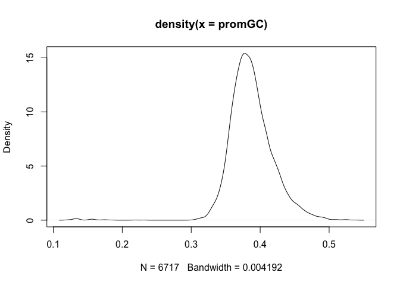

**Course 5 -&gt; Bioconductor for Genomic Data Science**

Course link:
<https://www.coursera.org/learn/bioconductor?specialization=genomic-data-science>

Course GitHub page:
<http://kasperdanielhansen.github.io/genbioconductor/>

---

- [GRanges](#granges)
  - [IRanges](#iranges)
    - [findOverlaps()](#findoverlaps)
  - [GRanges and the GenomicRanges Package](#granges-and-the-genomicranges-package)
  - [Seqinfo](#seqinfo)
    - [Filtering ranges by seqname/chromosome](#filtering-ranges-by-seqnamechromosome)
  - [GRanges Usage](#granges-usage)
    - [The capital DataFrame](#the-capital-dataframe)
    - [GRanges metadata columns](#granges-metadata-columns)
    - [findOverlaps()](#findoverlaps-1)
    - [makeGRangesFromDataFrame()](#makegrangesfromdataframe)
- [AnnotationHub](#annotationhub)
- [Biostrings and BSgenome](#biostrings-and-bsgenome)
  - [Basic intro to the two packages](#basic-intro-to-the-two-packages)
  - [Biostrings: matching](#biostrings-matching)
  - [The Views object](#the-views-object)
  - [GenomicRanges: Rle (run-length-encoded) vectors](#genomicranges-rle-run-length-encoded-vectors)
  - [GenomicRanges: \_Lists](#genomicranges-_lists)
    - [GRangesList](#grangeslist)
  - [GenomicFeatures and TxDb](#genomicfeatures-and-txdb)
    - [TxDb objects](#txdb-objects)
  - [rtracklayer and importing data](#rtracklayer-and-importing-data)
- [Representing data in Bioconductor](#representing-data-in-bioconductor)
  - [ExpressionSet](#expressionset)
  - [SummarizedExperiment](#summarizedexperiment)
  - [GEOquery](#geoquery)
  - [biomaRt](#biomart)
  - [The S4 System](#the-s4-system)
    - [S4 classes](#s4-classes)
    - [S4 methods](#s4-methods)
- [Getting data into Bioconductor](#getting-data-into-bioconductor)
  - [ShortRead](#shortread)
    - [Rsamtools](#rsamtools)
  - [Quick skim: microarray data](#quick-skim-microarray-data)
  - [Differential analysis](#differential-analysis)
    - [Borrowing information across genes](#borrowing-information-across-genes)
    - [An example two-group comparison using limma](#an-example-two-group-comparison-using-limma)
    - [Simplified RNA-seq differential analysis workflow](#simplified-rna-seq-differential-analysis-workflow)

---

> `BiocManager::install("name")` to install a package inside
> Bioconductor!!!!

## GRanges

**GRanges is a data structure for storing genomic intervals in R**. The
key insight is that many entities in genomics can be thought of
intervals or sets of intervals (of integers). The functionality of
GRanges is provided by two packages: GenomicRanges and IRanges.

### IRanges

The IRanges object contains integer intervals, **each called a range**.
Three arguments for construction: start, end, and width (one of them can
be inferred given the other two).

    library(IRanges)
    ir1 <- IRanges(start = c(1,4,5), end = c(3,5,20))
    print(ir1)

    ## IRanges object with 3 ranges and 0 metadata columns:
    ##           start       end     width
    ##       <integer> <integer> <integer>
    ##   [1]         1         3         3
    ##   [2]         4         5         2
    ##   [3]         5        20        16

    print(class(ir1))

    ## [1] "IRanges"
    ## attr(,"package")
    ## [1] "IRanges"

    # Accessing the start positions of these intervals (ranges)
    print(start(ir1))

    ## [1] 1 4 5

    width(ir1) <- 1 # Note that it's an interger interval so the width of one range should be (end - start +1).
    print(ir1)

    ## IRanges object with 3 ranges and 0 metadata columns:
    ##           start       end     width
    ##       <integer> <integer> <integer>
    ##   [1]         1         1         1
    ##   [2]         4         4         1
    ##   [3]         5         5         1

    # IRanges can have names like any other vector. And since IRanges is a vector-like object (tho it looks like a matrix sadly; it's 'vector'-like under the R context), they don't have a dimension but instead have a length, which is the number of ranges it has. 
    names(ir1) = paste("A", 1:3, sep='') 
    ir1

    ## IRanges object with 3 ranges and 0 metadata columns:
    ##          start       end     width
    ##      <integer> <integer> <integer>
    ##   A1         1         1         1
    ##   A2         4         4         1
    ##   A3         5         5         1

    dim(ir1)

    ## NULL

    length(ir1) # Equal to the number of ranges

    ## [1] 3

    ir1['A2'] # Accessing a range by its name (just like accessing an element in a vector)

    ## IRanges object with 1 range and 0 metadata columns:
    ##          start       end     width
    ##      <integer> <integer> <integer>
    ##   A2         4         4         1

    c(ir1,ir1) # Concatenating multiple IRanges, again, just like doing so to any vectors.

    ## IRanges object with 6 ranges and 0 metadata columns:
    ##          start       end     width
    ##      <integer> <integer> <integer>
    ##   A1         1         1         1
    ##   A2         4         4         1
    ##   A3         5         5         1
    ##   A1         1         1         1
    ##   A2         4         4         1
    ##   A3         5         5         1

A **normal IRanges**: (easier to be understood using a plot) created by
`reduce(IRanges)`, a **minimal representation** of the IRanges viewed as
a set of integers, with each integer only occurring in a single range as
few ranges present as possible. With this concept in mind we can more
easily think of operations to multiple IRanges like `union` (equivalent
to first concatenating the IRanges together and then `reduce()` that new
object), `intersect`, and `setdiff`.

<https://kasperdanielhansen.github.io/genbioconductor/html/IRanges_Basic.html#normal-iranges>

These functions (and the concept of normal IRanges; this *flattened*
feeling) are very useful using eg.
`sum(width(union(GRanges1, GRanges2, ignore.strand = TRUE)))` to quickly
see how much the genomic entities of interest span, as demonstrated in a
demo later on.

    ir2 <- IRanges(start = c(4,5,9,24), end = c(5,20,13,26))
    ir2

    ## IRanges object with 4 ranges and 0 metadata columns:
    ##           start       end     width
    ##       <integer> <integer> <integer>
    ##   [1]         4         5         2
    ##   [2]         5        20        16
    ##   [3]         9        13         5
    ##   [4]        24        26         3

    reduce(ir2)

    ## IRanges object with 2 ranges and 0 metadata columns:
    ##           start       end     width
    ##       <integer> <integer> <integer>
    ##   [1]         4        20        17
    ##   [2]        24        26         3

    ir1

    ## IRanges object with 3 ranges and 0 metadata columns:
    ##          start       end     width
    ##      <integer> <integer> <integer>
    ##   A1         1         1         1
    ##   A2         4         4         1
    ##   A3         5         5         1

    union(ir1,ir2)

    ## IRanges object with 3 ranges and 0 metadata columns:
    ##           start       end     width
    ##       <integer> <integer> <integer>
    ##   [1]         1         1         1
    ##   [2]         4        20        17
    ##   [3]        24        26         3

    intersect(ir1,ir2)

    ## IRanges object with 1 range and 0 metadata columns:
    ##           start       end     width
    ##       <integer> <integer> <integer>
    ##   [1]         4         5         2

    # How the two sets differed.
    setdiff(ir1,ir2)

    ## IRanges object with 1 range and 0 metadata columns:
    ##           start       end     width
    ##       <integer> <integer> <integer>
    ##   [1]         1         1         1

    setdiff(ir2, ir1)

    ## IRanges object with 2 ranges and 0 metadata columns:
    ##           start       end     width
    ##       <integer> <integer> <integer>
    ##   [1]         6        20        15
    ##   [2]        24        26         3

Resizing IRanges:

    ir1

    ## IRanges object with 3 ranges and 0 metadata columns:
    ##          start       end     width
    ##      <integer> <integer> <integer>
    ##   A1         1         1         1
    ##   A2         4         4         1
    ##   A3         5         5         1

    resize(ir1, width = 3, fix = 'start')

    ## IRanges object with 3 ranges and 0 metadata columns:
    ##          start       end     width
    ##      <integer> <integer> <integer>
    ##   A1         1         3         3
    ##   A2         4         6         3
    ##   A3         5         7         3

    resize(ir1, width = 3, fix = 'center') # This is more useful

    ## IRanges object with 3 ranges and 0 metadata columns:
    ##          start       end     width
    ##      <integer> <integer> <integer>
    ##   A1         0         2         3
    ##   A2         3         5         3
    ##   A3         4         6         3

#### findOverlaps()

Allow us to relate sets of IRanges to each other. (different from the
`intersect` function above, which requires to think of IRanges as
flattened (?) sets of integers)

    ir1

    ## IRanges object with 3 ranges and 0 metadata columns:
    ##          start       end     width
    ##      <integer> <integer> <integer>
    ##   A1         1         1         1
    ##   A2         4         4         1
    ##   A3         5         5         1

    ir2

    ## IRanges object with 4 ranges and 0 metadata columns:
    ##           start       end     width
    ##       <integer> <integer> <integer>
    ##   [1]         4         5         2
    ##   [2]         5        20        16
    ##   [3]         9        13         5
    ##   [4]        24        26         3

    # Note that the returned 'Hits' indicate in which specific range (its index) of the two IRanges objects this overlap is found.
    findOverlaps(query = ir1, subject = ir2)

    ## Hits object with 3 hits and 0 metadata columns:
    ##       queryHits subjectHits
    ##       <integer>   <integer>
    ##   [1]         2           1
    ##   [2]         3           1
    ##   [3]         3           2
    ##   -------
    ##   queryLength: 3 / subjectLength: 4

    # Counts how many overlaps found in that specific range
    countOverlaps(query = ir1, subject = ir2)

    ## A1 A2 A3 
    ##  0  1  2

    countOverlaps(subject = ir1, query = ir2)

    ## [1] 2 1 0 0

    nearest(ir2, subject = ir1) # Returns which ranges in the 'subject' are nearest to the corresponding ranges of the IRanges object in the first argument 

    ## [1] 2 2 3 3

### GRanges and the GenomicRanges Package

`GRanges()` is the GRanges constructor, which is very similar to
`IRanges()`; it also has to do with chromosomes (in ‘seqnames’) and +/-
strands (’\*’ means it’s either unknown or the entity is on both
strands).

    library(GenomicRanges)
    gr = GRanges(seqnames = c("chr1"), strand = c("+","-","+","*"), ranges = IRanges(start = c(1,1,5,3), width = 3))
    gr

    ## GRanges object with 4 ranges and 0 metadata columns:
    ##       seqnames    ranges strand
    ##          <Rle> <IRanges>  <Rle>
    ##   [1]     chr1       1-3      +
    ##   [2]     chr1       1-3      -
    ##   [3]     chr1       5-7      +
    ##   [4]     chr1       3-5      *
    ##   -------
    ##   seqinfo: 1 sequence from an unspecified genome; no seqlengths

*New operations* are now involved due to the opposite directions of two
strands.

    gr

    ## GRanges object with 4 ranges and 0 metadata columns:
    ##       seqnames    ranges strand
    ##          <Rle> <IRanges>  <Rle>
    ##   [1]     chr1       1-3      +
    ##   [2]     chr1       1-3      -
    ##   [3]     chr1       5-7      +
    ##   [4]     chr1       3-5      *
    ##   -------
    ##   seqinfo: 1 sequence from an unspecified genome; no seqlengths

    flank(gr, width = 5) # Note the difference for ranges on different strands!!

    ## GRanges object with 4 ranges and 0 metadata columns:
    ##       seqnames    ranges strand
    ##          <Rle> <IRanges>  <Rle>
    ##   [1]     chr1      -4-0      +
    ##   [2]     chr1       4-8      -
    ##   [3]     chr1       0-4      +
    ##   [4]     chr1      -2-2      *
    ##   -------
    ##   seqinfo: 1 sequence from an unspecified genome; no seqlengths

    promoters(gr) # Default is upstream 2000 bp and downstream 200 bp of our interval (our range).

    ## GRanges object with 4 ranges and 0 metadata columns:
    ##       seqnames    ranges strand
    ##          <Rle> <IRanges>  <Rle>
    ##   [1]     chr1 -1999-200      +
    ##   [2]     chr1 -196-2003      -
    ##   [3]     chr1 -1995-204      +
    ##   [4]     chr1 -1997-202      *
    ##   -------
    ##   seqinfo: 1 sequence from an unspecified genome; no seqlengths

    gaps(gr) # Returns all intervals not covered by our IRanges; we haven't set the length of the chromosome (the seqlengths) yet so it assumes that the end of the interval is the end of the full seq. Here we can infer that the genomic coordinates are 1-based.

    ## GRanges object with 2 ranges and 0 metadata columns:
    ##       seqnames    ranges strand
    ##          <Rle> <IRanges>  <Rle>
    ##   [1]     chr1         4      +
    ##   [2]     chr1       1-2      *
    ##   -------
    ##   seqinfo: 1 sequence from an unspecified genome; no seqlengths

In later demos we will retrieve GRanges after querying genes of interest
from AnnotationHub. For a GRanges that contains a super large collection
of ranges, we can use functions for a quick overview (but here we’ll
still use our `gr` to illustrate the use of these functions)

    summary(width(gr))

    ##    Min. 1st Qu.  Median    Mean 3rd Qu.    Max. 
    ##       3       3       3       3       3       3

    summary(end(gr))

    ##    Min. 1st Qu.  Median    Mean 3rd Qu.    Max. 
    ##     3.0     3.0     4.0     4.5     5.5     7.0

    # Counts occurrences of values
    table(end(gr))

    ## 
    ## 3 5 7 
    ## 2 1 1

    table(gr$score)

    ## < table of extent 0 >

    table(table(gr$score))

    ## < table of extent 0 >

### Seqinfo

    gr = GRanges(seqnames = c("chr1"), strand = c("+","-","+","*"), ranges = IRanges(start = c(1,1,5,3), width = 3))
    seqinfo(gr) # Returns a data.frame

    ## Seqinfo object with 1 sequence from an unspecified genome; no seqlengths:
    ##   seqnames seqlengths isCircular genome
    ##   chr1             NA         NA   <NA>

    seqlengths(gr) = c("chr1" = 10)
    seqlevels(gr)

    ## [1] "chr1"

    seqinfo(gr)

    ## Seqinfo object with 1 sequence from an unspecified genome:
    ##   seqnames seqlengths isCircular genome
    ##   chr1             10         NA   <NA>

    gaps(gr)

    ## GRanges object with 5 ranges and 0 metadata columns:
    ##       seqnames    ranges strand
    ##          <Rle> <IRanges>  <Rle>
    ##   [1]     chr1         4      +
    ##   [2]     chr1      8-10      +
    ##   [3]     chr1      4-10      -
    ##   [4]     chr1       1-2      *
    ##   [5]     chr1      6-10      *
    ##   -------
    ##   seqinfo: 1 sequence from an unspecified genome

    # Here we try to change the chromosome of the GRanges. This will return an error since it has recorded there's a single chr.
    # seqnames(gr) = c("chr1","chr2","chr1","chr2")
    # So we change the seqlevels
    seqlevels(gr) = c("chr1","chr2")
    seqnames(gr) = c("chr1","chr2","chr1","chr2")
    gr

    ## GRanges object with 4 ranges and 0 metadata columns:
    ##       seqnames    ranges strand
    ##          <Rle> <IRanges>  <Rle>
    ##   [1]     chr1       1-3      +
    ##   [2]     chr2       1-3      -
    ##   [3]     chr1       5-7      +
    ##   [4]     chr2       3-5      *
    ##   -------
    ##   seqinfo: 2 sequences from an unspecified genome

    # Sorting according to seqlevels
    sort(gr)

    ## GRanges object with 4 ranges and 0 metadata columns:
    ##       seqnames    ranges strand
    ##          <Rle> <IRanges>  <Rle>
    ##   [1]     chr1       1-3      +
    ##   [2]     chr1       5-7      +
    ##   [3]     chr2       1-3      -
    ##   [4]     chr2       3-5      *
    ##   -------
    ##   seqinfo: 2 sequences from an unspecified genome

    seqlevels(gr) = c("chr2","chr1")
    sort(gr)

    ## GRanges object with 4 ranges and 0 metadata columns:
    ##       seqnames    ranges strand
    ##          <Rle> <IRanges>  <Rle>
    ##   [1]     chr2       1-3      -
    ##   [2]     chr2       3-5      *
    ##   [3]     chr1       1-3      +
    ##   [4]     chr1       5-7      +
    ##   -------
    ##   seqinfo: 2 sequences from an unspecified genome

Setting the genome. Here we also get a copy of our current GRanges
object and set that copy’s genome differently. In this case, functions
like `findOverlaps` won’t allow us to operate since they are from
**incompatible genomes**.

    gr2 <- gr
    genome(gr) = "hg19"
    genome(gr2) = "hg18"
    gr2

    ## GRanges object with 4 ranges and 0 metadata columns:
    ##       seqnames    ranges strand
    ##          <Rle> <IRanges>  <Rle>
    ##   [1]     chr1       1-3      +
    ##   [2]     chr2       1-3      -
    ##   [3]     chr1       5-7      +
    ##   [4]     chr2       3-5      *
    ##   -------
    ##   seqinfo: 2 sequences from hg18 genome

    # findOverlaps(gr,gr2) 
    # Output: '...sequences chr2, chr1 have incompatible genomes: ...'

#### Filtering ranges by seqname/chromosome

When some of the seqlevels to drop from the GRanges are in use
(i.e. have ranges on them), the ranges on these sequences need to be
removed before the seqlevels can be dropped. This is called *pruning*.

The ‘pruning.mode’ argument is “error” by default, which raises an error
when we try to drop a seqlevel that is still in use.

When set to “coarse”, the length of the GRanges will be reduced (due to
decreased number of ranges; recall, we mentioned earlier the
‘vector-like’ property of GRanges objects, and their ‘length’ is just
their number of ranges). Other arguments are “fine” and “tidy”.

    gr2 <- gr
    gr2

    ## GRanges object with 4 ranges and 0 metadata columns:
    ##       seqnames    ranges strand
    ##          <Rle> <IRanges>  <Rle>
    ##   [1]     chr1       1-3      +
    ##   [2]     chr2       1-3      -
    ##   [3]     chr1       5-7      +
    ##   [4]     chr2       3-5      *
    ##   -------
    ##   seqinfo: 2 sequences from hg19 genome

    # seqlevels(gr2, force = TRUE) = "chr1" this is used in the course demo but seems to be deprecated rn.

    seqlevels(gr2, pruning.mode="coarse") = "chr1" 
    gr2

    ## GRanges object with 2 ranges and 0 metadata columns:
    ##       seqnames    ranges strand
    ##          <Rle> <IRanges>  <Rle>
    ##   [1]     chr1       1-3      +
    ##   [2]     chr1       5-7      +
    ##   -------
    ##   seqinfo: 1 sequence from hg19 genome

    # Another way is to directly use the functions.
    gr2 <- gr
    dropSeqlevels(gr2, "chr2", pruning.mode="coarse") 

    ## GRanges object with 2 ranges and 0 metadata columns:
    ##       seqnames    ranges strand
    ##          <Rle> <IRanges>  <Rle>
    ##   [1]     chr1       1-3      +
    ##   [2]     chr1       5-7      +
    ##   -------
    ##   seqinfo: 1 sequence from hg19 genome

    gr2 <- gr
    # Which is just equivalent to:
    keepSeqlevels(gr2, "chr1", pruning.mode="coarse")

    ## GRanges object with 2 ranges and 0 metadata columns:
    ##       seqnames    ranges strand
    ##          <Rle> <IRanges>  <Rle>
    ##   [1]     chr1       1-3      +
    ##   [2]     chr1       5-7      +
    ##   -------
    ##   seqinfo: 1 sequence from hg19 genome

    # We can also drop weird-looking choromosome names, and filter only the chromosomes with standard names
    gr2 = GRanges(seqnames = c("chr1","chrIDK","chr725J"), strand = c("+","-","+"), ranges = IRanges(start = 2:4, width = 2))
    gr2

    ## GRanges object with 3 ranges and 0 metadata columns:
    ##       seqnames    ranges strand
    ##          <Rle> <IRanges>  <Rle>
    ##   [1]     chr1       2-3      +
    ##   [2]   chrIDK       3-4      -
    ##   [3]  chr725J       4-5      +
    ##   -------
    ##   seqinfo: 3 sequences from an unspecified genome; no seqlengths

    keepStandardChromosomes(gr2, pruning.mode="coarse")

    ## GRanges object with 1 range and 0 metadata columns:
    ##       seqnames    ranges strand
    ##          <Rle> <IRanges>  <Rle>
    ##   [1]     chr1       2-3      +
    ##   -------
    ##   seqinfo: 1 sequence from an unspecified genome; no seqlengths

Different sources have different chromosome styles. To harmonize:

    newStyle <- mapSeqlevels(seqnames = seqlevels(gr), style = "NCBI")
    newStyle

    ## chr2 chr1 
    ##  "2"  "1"

    gr2 <- renameSeqlevels(gr, newStyle) 
    gr2

    ## GRanges object with 4 ranges and 0 metadata columns:
    ##       seqnames    ranges strand
    ##          <Rle> <IRanges>  <Rle>
    ##   [1]        1       1-3      +
    ##   [2]        2       1-3      -
    ##   [3]        1       5-7      +
    ##   [4]        2       3-5      *
    ##   -------
    ##   seqinfo: 2 sequences from hg19 genome

### GRanges Usage

#### The capital DataFrame

We get an IRanges that’s **a single column** so we can do the standard
subsetting and use the dollar `$` operator as we are used to, and still
get the expanded IRanges object.

    df = DataFrame(ir = ir1, score = rnorm(3))
    df

    ## DataFrame with 3 rows and 2 columns
    ##           ir     score
    ##    <IRanges> <numeric>
    ## A1         1 -0.216123
    ## A2         4 -1.096738
    ## A3         5 -0.416987

    df[1,1] 

    ## IRanges object with 1 range and 0 metadata columns:
    ##          start       end     width
    ##      <integer> <integer> <integer>
    ##   A1         1         1         1

    df$ir

    ## IRanges object with 3 ranges and 0 metadata columns:
    ##          start       end     width
    ##      <integer> <integer> <integer>
    ##   A1         1         1         1
    ##   A2         4         4         1
    ##   A3         5         5         1

The classic `data.frame` (lowercase), on the other hand, still returns
*three different columns for IRanges* and doesn’t rlly keep things
together.

    classic_df = data.frame(ir = ir1, score = rnorm(3))
    classic_df

    ##   ir.start ir.end ir.width ir.names      score
    ## 1        1      1        1       A1  0.6642165
    ## 2        4      4        1       A2  1.5888794
    ## 3        5      5        1       A3 -1.1730831

#### GRanges metadata columns

Additional columns to the GRanges object. We can set the ‘score’
metadata by `values(GRanges)` and add a DataFrame.

    values(gr) = DataFrame(score = rnorm(4))
    gr

    ## GRanges object with 4 ranges and 1 metadata column:
    ##       seqnames    ranges strand |       score
    ##          <Rle> <IRanges>  <Rle> |   <numeric>
    ##   [1]     chr1       1-3      + | -1.53497713
    ##   [2]     chr2       1-3      - | -1.92138811
    ##   [3]     chr1       5-7      + |  0.00890572
    ##   [4]     chr2       3-5      * |  0.14052891
    ##   -------
    ##   seqinfo: 2 sequences from hg19 genome

    mcols(gr)

    ## DataFrame with 4 rows and 1 column
    ##         score
    ##     <numeric>
    ## 1 -1.53497713
    ## 2 -1.92138811
    ## 3  0.00890572
    ## 4  0.14052891

    # We (arbitrarily) set a new metadata column
    gr$score2 <- gr$score / 20
    gr

    ## GRanges object with 4 ranges and 2 metadata columns:
    ##       seqnames    ranges strand |       score       score2
    ##          <Rle> <IRanges>  <Rle> |   <numeric>    <numeric>
    ##   [1]     chr1       1-3      + | -1.53497713 -0.076748856
    ##   [2]     chr2       1-3      - | -1.92138811 -0.096069406
    ##   [3]     chr1       5-7      + |  0.00890572  0.000445286
    ##   [4]     chr2       3-5      * |  0.14052891  0.007026445
    ##   -------
    ##   seqinfo: 2 sequences from hg19 genome

#### findOverlaps()

Pretty similar to IRanges, tho these are **strand-specific**!! Or add
`ignore.strand = TRUE`.

    gr3 = GRanges(seqnames = c("chr1"), strand = c("*","*","-","+"), ranges = IRanges(start = c(1,2,3,4), width = 3))
    gr

    ## GRanges object with 4 ranges and 2 metadata columns:
    ##       seqnames    ranges strand |       score       score2
    ##          <Rle> <IRanges>  <Rle> |   <numeric>    <numeric>
    ##   [1]     chr1       1-3      + | -1.53497713 -0.076748856
    ##   [2]     chr2       1-3      - | -1.92138811 -0.096069406
    ##   [3]     chr1       5-7      + |  0.00890572  0.000445286
    ##   [4]     chr2       3-5      * |  0.14052891  0.007026445
    ##   -------
    ##   seqinfo: 2 sequences from hg19 genome

    gr3

    ## GRanges object with 4 ranges and 0 metadata columns:
    ##       seqnames    ranges strand
    ##          <Rle> <IRanges>  <Rle>
    ##   [1]     chr1       1-3      *
    ##   [2]     chr1       2-4      *
    ##   [3]     chr1       3-5      -
    ##   [4]     chr1       4-6      +
    ##   -------
    ##   seqinfo: 1 sequence from an unspecified genome; no seqlengths

    findOverlaps(gr, gr3)

    ## Hits object with 3 hits and 0 metadata columns:
    ##       queryHits subjectHits
    ##       <integer>   <integer>
    ##   [1]         1           1
    ##   [2]         1           2
    ##   [3]         3           4
    ##   -------
    ##   queryLength: 4 / subjectLength: 4

    findOverlaps(gr, gr3, ignore.strand = TRUE) # This allows intervals on the positive strand to have overlaps with those on the negative strand.

    ## Hits object with 5 hits and 0 metadata columns:
    ##       queryHits subjectHits
    ##       <integer>   <integer>
    ##   [1]         1           1
    ##   [2]         1           2
    ##   [3]         1           3
    ##   [4]         3           3
    ##   [5]         3           4
    ##   -------
    ##   queryLength: 4 / subjectLength: 4

    subsetByOverlaps(gr, gr3)

    ## GRanges object with 2 ranges and 2 metadata columns:
    ##       seqnames    ranges strand |       score       score2
    ##          <Rle> <IRanges>  <Rle> |   <numeric>    <numeric>
    ##   [1]     chr1       1-3      + | -1.53497713 -0.076748856
    ##   [2]     chr1       5-7      + |  0.00890572  0.000445286
    ##   -------
    ##   seqinfo: 2 sequences from hg19 genome

    subsetByOverlaps(gr3, gr)

    ## GRanges object with 3 ranges and 0 metadata columns:
    ##       seqnames    ranges strand
    ##          <Rle> <IRanges>  <Rle>
    ##   [1]     chr1       1-3      *
    ##   [2]     chr1       2-4      *
    ##   [3]     chr1       4-6      +
    ##   -------
    ##   seqinfo: 1 sequence from an unspecified genome; no seqlengths

#### makeGRangesFromDataFrame()

If we have classic data.frames that look like GRanges.

    df2 = data.frame(chr = "chr1", start = 1:3, end = 4:6, score = rnorm(3))
    makeGRangesFromDataFrame(df2) # Additional columns get dropped by default, but we can keep them using arguments.

    ## GRanges object with 3 ranges and 0 metadata columns:
    ##       seqnames    ranges strand
    ##          <Rle> <IRanges>  <Rle>
    ##   [1]     chr1       1-4      *
    ##   [2]     chr1       2-5      *
    ##   [3]     chr1       3-6      *
    ##   -------
    ##   seqinfo: 1 sequence from an unspecified genome; no seqlengths

    makeGRangesFromDataFrame(df2, keep.extra.columns = TRUE)

    ## GRanges object with 3 ranges and 1 metadata column:
    ##       seqnames    ranges strand |     score
    ##          <Rle> <IRanges>  <Rle> | <numeric>
    ##   [1]     chr1       1-4      * |   1.14532
    ##   [2]     chr1       2-5      * |   0.58574
    ##   [3]     chr1       3-6      * |  -1.00867
    ##   -------
    ##   seqinfo: 1 sequence from an unspecified genome; no seqlengths

## AnnotationHub

AnnotationHub is a package that acts as an **interface** to online
genomic resources. You create a hub (initialize the AnnotationHub
object), which is a local database of large collections of publicly
available genomic datasets. You can query this local database (which is
actually like subsetting in vectors by `[]`) and you can retrieve the
data you want by `[[]]`.

// Some of the following lines executed for too long so I annotated many
of them

    library(AnnotationHub)

    ## Loading required package: BiocFileCache

    ## Loading required package: dbplyr

    ah = AnnotationHub()
    ah

    ## AnnotationHub with 70637 records
    ## # snapshotDate(): 2025-04-08
    ## # $dataprovider: Ensembl, BroadInstitute, UCSC, ftp://ftp.ncbi.nlm.nih.gov/g...
    ## # $species: Homo sapiens, Mus musculus, Drosophila melanogaster, Rattus norv...
    ## # $rdataclass: GRanges, TwoBitFile, BigWigFile, EnsDb, Rle, OrgDb, ChainFile...
    ## # additional mcols(): taxonomyid, genome, description,
    ## #   coordinate_1_based, maintainer, rdatadateadded, preparerclass, tags,
    ## #   rdatapath, sourceurl, sourcetype 
    ## # retrieve records with, e.g., 'object[["AH5012"]]' 
    ## 
    ##              title                                   
    ##   AH5012   | Chromosome Band                         
    ##   AH5013   | STS Markers                             
    ##   AH5014   | FISH Clones                             
    ##   AH5015   | Recomb Rate                             
    ##   AH5016   | ENCODE Pilot                            
    ##   ...        ...                                     
    ##   AH121712 | Data.table for PubMed Author Information
    ##   AH121713 | Data.table for PMC                      
    ##   AH121714 | Data.table for MeSH (Descriptor)        
    ##   AH121715 | Data.table for MeSH (Qualifier)         
    ##   AH121716 | Data.table for MeSH (SCR)

    ah[1]

    ## AnnotationHub with 1 record
    ## # snapshotDate(): 2025-04-08
    ## # names(): AH5012
    ## # $dataprovider: UCSC
    ## # $species: Homo sapiens
    ## # $rdataclass: GRanges
    ## # $rdatadateadded: 2013-03-26
    ## # $title: Chromosome Band
    ## # $description: GRanges object from UCSC track 'Chromosome Band'
    ## # $taxonomyid: 9606
    ## # $genome: hg19
    ## # $sourcetype: UCSC track
    ## # $sourceurl: rtracklayer://hgdownload.cse.ucsc.edu/goldenpath/hg19/database...
    ## # $sourcesize: NA
    ## # $tags: c("cytoBand", "UCSC", "track", "Gene", "Transcript",
    ## #   "Annotation") 
    ## # retrieve record with 'object[["AH5012"]]'

    # Since there's so much data we can narrow the scope down:
    # ah2 = subset(ah, species == "Homo sapiens")

    query(ah, pattern = "H3K4me3")

    ## AnnotationHub with 2028 records
    ## # snapshotDate(): 2025-04-08
    ## # $dataprovider: BroadInstitute, UCSC, Haemcode, ENCODE, NA
    ## # $species: Homo sapiens, Mus musculus
    ## # $rdataclass: GRanges, BigWigFile
    ## # additional mcols(): taxonomyid, genome, description,
    ## #   coordinate_1_based, maintainer, rdatadateadded, preparerclass, tags,
    ## #   rdatapath, sourceurl, sourcetype 
    ## # retrieve records with, e.g., 'object[["AH23256"]]' 
    ## 
    ##              title                                                        
    ##   AH23256  | wgEncodeBroadHistoneGm12878H3k4me3StdPk.broadPeak.gz         
    ##   AH23273  | wgEncodeBroadHistoneH1hescH3k4me3StdPk.broadPeak.gz          
    ##   AH23297  | wgEncodeBroadHistoneHelas3H3k4me3StdPk.broadPeak.gz          
    ##   AH23311  | wgEncodeBroadHistoneHepg2H3k4me3StdPk.broadPeak.gz           
    ##   AH23324  | wgEncodeBroadHistoneHmecH3k4me3StdPk.broadPeak.gz            
    ##   ...        ...                                                          
    ##   AH46851  | UW.Fetal_Thymus.H3K4me3.H-24644.Histone.DS21539.gappedPeak.gz
    ##   AH116723 | TENET_10_cancer_panel_promoter_regions                       
    ##   AH116727 | ENCODE_dELS_regions                                          
    ##   AH116728 | ENCODE_pELS_regions                                          
    ##   AH116729 | ENCODE_PLS_regions

    # Or even query by a specific cell line
    q = query(ah, pattern = c("H3K4me3", "Gm12878"))
    # The 'snapshotDate' actually matches the version of Bioconductor we are using

    # Retrieving the GRanges object of interest
    # genes = ah[["AH23324"]]

    # display(ah) doesn't work... the function could not be found. deprecated i guess,,, so sad..
    # This function is supposed to allow us to use AnnotationHub with a spreadsheet-like interface. We assign the return value to a new variable because we can then go to the spreadsheet-like interface and manually select the records to send them back into R. 
    #ah_selected = display(ah) # The spreadsheet-like interface opens up, and then we can search and select the records of interest...

The demo features querying and then retrieving data from AnnotationHub.
After the genomic data of interest (namely, H3K4me3 peaks and RefSeq
data (non-redundant!) in the human genome) is retrieved (**as GRanges
objects**), we can use the functions learned above to carry out analysis
(Fisher’s exact test) to see whether **trimethylation (H3K4me3) is
enriched in promoter regions** (apply the `promoters()` function we
illustrated earlier to extract the GRanges for only promoters from the
entire RefSeq genomic data). Apply `findOverlaps`, `intersect`, etc.

// This is so very upsetting but for the first time after so long i felt
like my cnbo memories for molecular biology got back T\_T.

## Biostrings and BSgenome

### Basic intro to the two packages

**Biostrings**: a package that contains functionality for representing
and manipulating biological strings and biodata.

-   There’s also a DNAStringSet (like a list with each element being a
    DNAString), each DNAString doesn’t have to have the same width, but
    they have to only contain characters in the IUPAC code.

<!-- -->

    library(Biostrings)

    ## Loading required package: XVector

    ## 
    ## Attaching package: 'Biostrings'

    ## The following object is masked from 'package:base':
    ## 
    ##     strsplit

    dna1 = DNAString("ACGT-G")
    dna1[2:4]

    ## 3-letter DNAString object
    ## seq: CGT

    dna_set = DNAStringSet(c("ACG", "ACTGTGTG", "GTAC"))
    dna_set

    ## DNAStringSet object of length 3:
    ##     width seq
    ## [1]     3 ACG
    ## [2]     8 ACTGTGTG
    ## [3]     4 GTAC

    IUPAC_CODE_MAP

    ##      A      C      G      T      M      R      W      S      Y      K      V 
    ##    "A"    "C"    "G"    "T"   "AC"   "AG"   "AT"   "CG"   "CT"   "GT"  "ACG" 
    ##      H      D      B      N 
    ##  "ACT"  "AGT"  "CGT" "ACGT"

    dna_set[2] # Still a DNAStringSet object (like a list with length 1)

    ## DNAStringSet object of length 1:
    ##     width seq
    ## [1]     8 ACTGTGTG

    dna_set[[2]] # A DNAString object

    ## 8-letter DNAString object
    ## seq: ACTGTGTG

    names(dna_set) = paste0('seq',1:3)
    sort(dna_set)

    ## DNAStringSet object of length 3:
    ##     width seq                                               names               
    ## [1]     3 ACG                                               seq1
    ## [2]     8 ACTGTGTG                                          seq2
    ## [3]     4 GTAC                                              seq3

    # Reversion: this only means reverse in ordering; use the second function to find the sequence's reverse complement. 
    reverse(dna_set)

    ## DNAStringSet object of length 3:
    ##     width seq                                               names               
    ## [1]     3 GCA                                               seq1
    ## [2]     8 GTGTGTCA                                          seq2
    ## [3]     4 CATG                                              seq3

    reverseComplement(dna_set)

    ## DNAStringSet object of length 3:
    ##     width seq                                               names               
    ## [1]     3 CGT                                               seq1
    ## [2]     8 CACACAGT                                          seq2
    ## [3]     4 GTAC                                              seq3

    rev(dna1)

    ## 6-letter DNAString object
    ## seq: G-TGCA

    alphabetFrequency(dna_set)

    ##      A C G T M R W S Y K V H D B N - + .
    ## [1,] 1 1 1 0 0 0 0 0 0 0 0 0 0 0 0 0 0 0
    ## [2,] 1 1 3 3 0 0 0 0 0 0 0 0 0 0 0 0 0 0
    ## [3,] 1 1 1 1 0 0 0 0 0 0 0 0 0 0 0 0 0 0

    letterFrequency(dna_set, letters="GC") # default is OR (`|`)

    ##      G|C
    ## [1,]   2
    ## [2,]   4
    ## [3,]   2

    dinucleotideFrequency((dna_set))

    ##      AA AC AG AT CA CC CG CT GA GC GG GT TA TC TG TT
    ## [1,]  0  1  0  0  0  0  1  0  0  0  0  0  0  0  0  0
    ## [2,]  0  1  0  0  0  0  0  1  0  0  0  2  0  0  3  0
    ## [3,]  0  1  0  0  0  0  0  0  0  0  0  1  1  0  0  0

    # consensusMatrix: tells us how many elements/strings have a specific nucleotide of that position. See how it differed to alphabetFrequency()!
    consensusMatrix(dna_set)

    ##   [,1] [,2] [,3] [,4] [,5] [,6] [,7] [,8]
    ## A    2    0    1    0    0    0    0    0
    ## C    0    2    0    1    0    0    0    0
    ## G    1    0    1    1    0    1    0    1
    ## T    0    1    1    0    1    0    1    0
    ## M    0    0    0    0    0    0    0    0
    ## R    0    0    0    0    0    0    0    0
    ## W    0    0    0    0    0    0    0    0
    ## S    0    0    0    0    0    0    0    0
    ## Y    0    0    0    0    0    0    0    0
    ## K    0    0    0    0    0    0    0    0
    ## V    0    0    0    0    0    0    0    0
    ## H    0    0    0    0    0    0    0    0
    ## D    0    0    0    0    0    0    0    0
    ## B    0    0    0    0    0    0    0    0
    ## N    0    0    0    0    0    0    0    0
    ## -    0    0    0    0    0    0    0    0
    ## +    0    0    0    0    0    0    0    0
    ## .    0    0    0    0    0    0    0    0

**BSgenome**: a package for dealing with and representing **full
genomes**.

    library(BSgenome)

    ## Loading required package: BiocIO

    ## Loading required package: rtracklayer

    ## 
    ## Attaching package: 'rtracklayer'

    ## The following object is masked from 'package:AnnotationHub':
    ## 
    ##     hubUrl

    available.genomes() # Lists all the genomes that you can directly download from the Bioconductor website.

    ##   [1] "BSgenome.Alyrata.JGI.v1"                           
    ##   [2] "BSgenome.Amellifera.BeeBase.assembly4"             
    ##   [3] "BSgenome.Amellifera.NCBI.AmelHAv3.1"               
    ##   [4] "BSgenome.Amellifera.UCSC.apiMel2"                  
    ##   [5] "BSgenome.Amellifera.UCSC.apiMel2.masked"           
    ##   [6] "BSgenome.Aofficinalis.NCBI.V1"                     
    ##   [7] "BSgenome.Athaliana.TAIR.04232008"                  
    ##   [8] "BSgenome.Athaliana.TAIR.TAIR9"                     
    ##   [9] "BSgenome.Btaurus.UCSC.bosTau3"                     
    ##  [10] "BSgenome.Btaurus.UCSC.bosTau3.masked"              
    ##  [11] "BSgenome.Btaurus.UCSC.bosTau4"                     
    ##  [12] "BSgenome.Btaurus.UCSC.bosTau4.masked"              
    ##  [13] "BSgenome.Btaurus.UCSC.bosTau6"                     
    ##  [14] "BSgenome.Btaurus.UCSC.bosTau6.masked"              
    ##  [15] "BSgenome.Btaurus.UCSC.bosTau8"                     
    ##  [16] "BSgenome.Btaurus.UCSC.bosTau9"                     
    ##  [17] "BSgenome.Btaurus.UCSC.bosTau9.masked"              
    ##  [18] "BSgenome.Carietinum.NCBI.v1"                       
    ##  [19] "BSgenome.Celegans.UCSC.ce10"                       
    ##  [20] "BSgenome.Celegans.UCSC.ce11"                       
    ##  [21] "BSgenome.Celegans.UCSC.ce2"                        
    ##  [22] "BSgenome.Celegans.UCSC.ce6"                        
    ##  [23] "BSgenome.Cfamiliaris.UCSC.canFam2"                 
    ##  [24] "BSgenome.Cfamiliaris.UCSC.canFam2.masked"          
    ##  [25] "BSgenome.Cfamiliaris.UCSC.canFam3"                 
    ##  [26] "BSgenome.Cfamiliaris.UCSC.canFam3.masked"          
    ##  [27] "BSgenome.Cjacchus.UCSC.calJac3"                    
    ##  [28] "BSgenome.Cjacchus.UCSC.calJac4"                    
    ##  [29] "BSgenome.CneoformansVarGrubiiKN99.NCBI.ASM221672v1"
    ##  [30] "BSgenome.Creinhardtii.JGI.v5.6"                    
    ##  [31] "BSgenome.Dmelanogaster.UCSC.dm2"                   
    ##  [32] "BSgenome.Dmelanogaster.UCSC.dm2.masked"            
    ##  [33] "BSgenome.Dmelanogaster.UCSC.dm3"                   
    ##  [34] "BSgenome.Dmelanogaster.UCSC.dm3.masked"            
    ##  [35] "BSgenome.Dmelanogaster.UCSC.dm6"                   
    ##  [36] "BSgenome.Drerio.UCSC.danRer10"                     
    ##  [37] "BSgenome.Drerio.UCSC.danRer11"                     
    ##  [38] "BSgenome.Drerio.UCSC.danRer5"                      
    ##  [39] "BSgenome.Drerio.UCSC.danRer5.masked"               
    ##  [40] "BSgenome.Drerio.UCSC.danRer6"                      
    ##  [41] "BSgenome.Drerio.UCSC.danRer6.masked"               
    ##  [42] "BSgenome.Drerio.UCSC.danRer7"                      
    ##  [43] "BSgenome.Drerio.UCSC.danRer7.masked"               
    ##  [44] "BSgenome.Dvirilis.Ensembl.dvircaf1"                
    ##  [45] "BSgenome.Ecoli.NCBI.20080805"                      
    ##  [46] "BSgenome.Gaculeatus.UCSC.gasAcu1"                  
    ##  [47] "BSgenome.Gaculeatus.UCSC.gasAcu1.masked"           
    ##  [48] "BSgenome.Ggallus.UCSC.galGal3"                     
    ##  [49] "BSgenome.Ggallus.UCSC.galGal3.masked"              
    ##  [50] "BSgenome.Ggallus.UCSC.galGal4"                     
    ##  [51] "BSgenome.Ggallus.UCSC.galGal4.masked"              
    ##  [52] "BSgenome.Ggallus.UCSC.galGal5"                     
    ##  [53] "BSgenome.Ggallus.UCSC.galGal6"                     
    ##  [54] "BSgenome.Gmax.NCBI.Gmv40"                          
    ##  [55] "BSgenome.Hsapiens.1000genomes.hs37d5"              
    ##  [56] "BSgenome.Hsapiens.NCBI.GRCh38"                     
    ##  [57] "BSgenome.Hsapiens.NCBI.T2T.CHM13v2.0"              
    ##  [58] "BSgenome.Hsapiens.UCSC.hg17"                       
    ##  [59] "BSgenome.Hsapiens.UCSC.hg17.masked"                
    ##  [60] "BSgenome.Hsapiens.UCSC.hg18"                       
    ##  [61] "BSgenome.Hsapiens.UCSC.hg18.masked"                
    ##  [62] "BSgenome.Hsapiens.UCSC.hg19"                       
    ##  [63] "BSgenome.Hsapiens.UCSC.hg19.masked"                
    ##  [64] "BSgenome.Hsapiens.UCSC.hg38"                       
    ##  [65] "BSgenome.Hsapiens.UCSC.hg38.dbSNP151.major"        
    ##  [66] "BSgenome.Hsapiens.UCSC.hg38.dbSNP151.minor"        
    ##  [67] "BSgenome.Hsapiens.UCSC.hg38.masked"                
    ##  [68] "BSgenome.Hsapiens.UCSC.hs1"                        
    ##  [69] "BSgenome.Mdomestica.UCSC.monDom5"                  
    ##  [70] "BSgenome.Mfascicularis.NCBI.5.0"                   
    ##  [71] "BSgenome.Mfascicularis.NCBI.6.0"                   
    ##  [72] "BSgenome.Mfuro.UCSC.musFur1"                       
    ##  [73] "BSgenome.Mmulatta.UCSC.rheMac10"                   
    ##  [74] "BSgenome.Mmulatta.UCSC.rheMac2"                    
    ##  [75] "BSgenome.Mmulatta.UCSC.rheMac2.masked"             
    ##  [76] "BSgenome.Mmulatta.UCSC.rheMac3"                    
    ##  [77] "BSgenome.Mmulatta.UCSC.rheMac3.masked"             
    ##  [78] "BSgenome.Mmulatta.UCSC.rheMac8"                    
    ##  [79] "BSgenome.Mmusculus.UCSC.mm10"                      
    ##  [80] "BSgenome.Mmusculus.UCSC.mm10.masked"               
    ##  [81] "BSgenome.Mmusculus.UCSC.mm39"                      
    ##  [82] "BSgenome.Mmusculus.UCSC.mm8"                       
    ##  [83] "BSgenome.Mmusculus.UCSC.mm8.masked"                
    ##  [84] "BSgenome.Mmusculus.UCSC.mm9"                       
    ##  [85] "BSgenome.Mmusculus.UCSC.mm9.masked"                
    ##  [86] "BSgenome.Osativa.MSU.MSU7"                         
    ##  [87] "BSgenome.Ppaniscus.UCSC.panPan1"                   
    ##  [88] "BSgenome.Ppaniscus.UCSC.panPan2"                   
    ##  [89] "BSgenome.Ptroglodytes.UCSC.panTro2"                
    ##  [90] "BSgenome.Ptroglodytes.UCSC.panTro2.masked"         
    ##  [91] "BSgenome.Ptroglodytes.UCSC.panTro3"                
    ##  [92] "BSgenome.Ptroglodytes.UCSC.panTro3.masked"         
    ##  [93] "BSgenome.Ptroglodytes.UCSC.panTro5"                
    ##  [94] "BSgenome.Ptroglodytes.UCSC.panTro6"                
    ##  [95] "BSgenome.Rnorvegicus.UCSC.rn4"                     
    ##  [96] "BSgenome.Rnorvegicus.UCSC.rn4.masked"              
    ##  [97] "BSgenome.Rnorvegicus.UCSC.rn5"                     
    ##  [98] "BSgenome.Rnorvegicus.UCSC.rn5.masked"              
    ##  [99] "BSgenome.Rnorvegicus.UCSC.rn6"                     
    ## [100] "BSgenome.Rnorvegicus.UCSC.rn7"                     
    ## [101] "BSgenome.Scerevisiae.UCSC.sacCer1"                 
    ## [102] "BSgenome.Scerevisiae.UCSC.sacCer2"                 
    ## [103] "BSgenome.Scerevisiae.UCSC.sacCer3"                 
    ## [104] "BSgenome.Sscrofa.UCSC.susScr11"                    
    ## [105] "BSgenome.Sscrofa.UCSC.susScr3"                     
    ## [106] "BSgenome.Sscrofa.UCSC.susScr3.masked"              
    ## [107] "BSgenome.Tgondii.ToxoDB.7.0"                       
    ## [108] "BSgenome.Tguttata.UCSC.taeGut1"                    
    ## [109] "BSgenome.Tguttata.UCSC.taeGut1.masked"             
    ## [110] "BSgenome.Tguttata.UCSC.taeGut2"                    
    ## [111] "BSgenome.Vvinifera.URGI.IGGP12Xv0"                 
    ## [112] "BSgenome.Vvinifera.URGI.IGGP12Xv2"                 
    ## [113] "BSgenome.Vvinifera.URGI.IGGP8X"

    library("BSgenome.Scerevisiae.UCSC.sacCer2") # Install the package first using BiocManager.
    # When we load a genome package, we get a BSgenome object back that's the name of the species. 
    Scerevisiae

    ## | BSgenome object for Yeast
    ## | - organism: Saccharomyces cerevisiae
    ## | - provider: UCSC
    ## | - genome: sacCer2
    ## | - release date: June 2008
    ## | - 18 sequence(s):
    ## |     chrI    chrII   chrIII  chrIV   chrV    chrVI   chrVII  chrVIII chrIX  
    ## |     chrX    chrXI   chrXII  chrXIII chrXIV  chrXV   chrXVI  chrM    2micron
    ## | 
    ## | Tips: call 'seqnames()' on the object to get all the sequence names, call
    ## | 'seqinfo()' to get the full sequence info, use the '$' or '[[' operator to
    ## | access a given sequence, see '?BSgenome' for more information.

    seqinfo(Scerevisiae)

    ## Seqinfo object with 18 sequences (2 circular) from sacCer2 genome:
    ##   seqnames seqlengths isCircular  genome
    ##   chrI         230208      FALSE sacCer2
    ##   chrII        813178      FALSE sacCer2
    ##   chrIII       316617      FALSE sacCer2
    ##   chrIV       1531919      FALSE sacCer2
    ##   chrV         576869      FALSE sacCer2
    ##   ...             ...        ...     ...
    ##   chrXIV       784333      FALSE sacCer2
    ##   chrXV       1091289      FALSE sacCer2
    ##   chrXVI       948062      FALSE sacCer2
    ##   chrM          85779       TRUE sacCer2
    ##   2micron        6318       TRUE sacCer2

    # Use the '$' or '[[]]' operator to access a given sequence (chromosome)
    Scerevisiae$chrI # So this returns a DNAString object, to which we can apply the DNAString functions learned previously

    ## 230208-letter DNAString object
    ## seq: CCACACCACACCCACACACCCACACACCACACCACA...GGTGTGTGGGTGTGGTGTGGGTGTGGTGTGTGTGGG

    letterFrequency(Scerevisiae$chrI, "GC", as.prob = TRUE)

    ##       G|C 
    ## 0.3927361

We might also want to calculate the GC content for every sequence (every
DNAString object) in the full genome (the BSgenome object). We can do
something similar to `lapply` using the function `bsapply`.

-   `bsapply` is slightly different because behind the scenes when you
    run it, it’ll load and unload the different genomes as we need them.

-   We start off by setting up a new BSParams object, which **contains
    the function we’re going to apply and the BSgenome object we’re
    going to apply it to**. Then we can just run `bsapply` on the
    BSParams object.

<!-- -->

    param = new(Class = "BSParams", X = Scerevisiae, FUN = letterFrequency)
    bsapply(param, "GC", as.prob = TRUE)

    ## $chrI
    ##       G|C 
    ## 0.3927361 
    ## 
    ## $chrII
    ##       G|C 
    ## 0.3834425 
    ## 
    ## $chrIII
    ##       G|C 
    ## 0.3853173 
    ## 
    ## $chrIV
    ##       G|C 
    ## 0.3790664 
    ## 
    ## $chrV
    ##       G|C 
    ## 0.3850805 
    ## 
    ## $chrVI
    ##       G|C 
    ## 0.3873284 
    ## 
    ## $chrVII
    ##       G|C 
    ## 0.3806115 
    ## 
    ## $chrVIII
    ##       G|C 
    ## 0.3849439 
    ## 
    ## $chrIX
    ##       G|C 
    ## 0.3890153 
    ## 
    ## $chrX
    ##       G|C 
    ## 0.3837346 
    ## 
    ## $chrXI
    ##       G|C 
    ## 0.3807134 
    ## 
    ## $chrXII
    ##       G|C 
    ## 0.3847641 
    ## 
    ## $chrXIII
    ##      G|C 
    ## 0.382038 
    ## 
    ## $chrXIV
    ##       G|C 
    ## 0.3863691 
    ## 
    ## $chrXV
    ##       G|C 
    ## 0.3816065 
    ## 
    ## $chrXVI
    ##       G|C 
    ## 0.3806407 
    ## 
    ## $chrM
    ##       G|C 
    ## 0.1710908 
    ## 
    ## $`2micron`
    ##       G|C 
    ## 0.3898386

    sum(unlist(bsapply(param, "GC"))) / sum(seqlengths(Scerevisiae))

    ## [1] 0.3814872

### Biostrings: matching

    # Matching a sequence against another sequence (matching two DNAString objects), returns a Views object
    dna2 <- DNAString("ACGGGCAG")
    matchPattern(pattern = dna2, subject = Scerevisiae$chrI)

    ## Views on a 230208-letter DNAString subject
    ## subject: CCACACCACACCCACACACCCACACACCACACCA...TGTGTGGGTGTGGTGTGGGTGTGGTGTGTGTGGG
    ## views:
    ##       start   end width
    ##   [1] 34484 34491     8 [ACGGGCAG]
    ##   [2] 62434 62441     8 [ACGGGCAG]

    countPattern(pattern = dna2, subject = Scerevisiae$chrI)

    ## [1] 2

    # Matching a sequence against a set of chromosomes/sequences, returns a GRanges object
    vmatchPattern(pattern = dna2, Scerevisiae)

    ## GRanges object with 102 ranges and 0 metadata columns:
    ##         seqnames        ranges strand
    ##            <Rle>     <IRanges>  <Rle>
    ##     [1]     chrI   34484-34491      +
    ##     [2]     chrI   62434-62441      +
    ##     [3]     chrI   44674-44681      -
    ##     [4]     chrI 107279-107286      -
    ##     [5]    chrII 133492-133499      +
    ##     ...      ...           ...    ...
    ##    [98]   chrXVI 173651-173658      -
    ##    [99]   chrXVI 375045-375052      -
    ##   [100]   chrXVI 385410-385417      -
    ##   [101]   chrXVI 504270-504277      -
    ##   [102]   chrXVI 823355-823362      -
    ##   -------
    ##   seqinfo: 18 sequences (2 circular) from sacCer2 genome

**Other matching functions**:

-   `matchPdict()` for finding all the matches of a set of patterns
    (‘dictionary’, built by taking in **a set of short reads** of the
    same length) in a reference sequence or set of reference sequences
    (the subject; the full genome).

-   `matchPWM()` allows us to search the genome for eg. binding motifs
    for given transcription factors. PWM stands for position weight
    matrix, a probabilistic representation; using a PWM, any given
    sequence can be quantitatively scored against the motif model

-   `pairwiseAlignment()` allows to map *millions of reads* against **a
    short sequence such as a gene**. It’s impossible to use global/local
    alignment when you map up against the entire genome, but very useful
    as long as you align them up to a very small section of the genome
    eg. just a gene.

`TrimLRPatterns()`: trims off specific patterns on the left and the
right of a DNAStringSet

### The Views object

Pretty much like merging an IRanges (not a GRanges since no seqinfo) and
a DNAStringSet object. **We can run the functions for a DNAStringSet on
Views** eg. `alphabetFrequency()`, etc.

    vi <- matchPattern(pattern = dna2, subject = Scerevisiae$chrI)
    vi

    ## Views on a 230208-letter DNAString subject
    ## subject: CCACACCACACCCACACACCCACACACCACACCA...TGTGTGGGTGTGGTGTGGGTGTGGTGTGTGTGGG
    ## views:
    ##       start   end width
    ##   [1] 34484 34491     8 [ACGGGCAG]
    ##   [2] 62434 62441     8 [ACGGGCAG]

    ranges(vi)

    ## IRanges object with 2 ranges and 0 metadata columns:
    ##           start       end     width
    ##       <integer> <integer> <integer>
    ##   [1]     34484     34491         8
    ##   [2]     62434     62441         8

    alphabetFrequency(vi)

    ##      A C G T M R W S Y K V H D B N - + .
    ## [1,] 2 2 4 0 0 0 0 0 0 0 0 0 0 0 0 0 0 0
    ## [2,] 2 2 4 0 0 0 0 0 0 0 0 0 0 0 0 0 0 0

Views are very powerful in representing short sequences **of a bigger
object**. All we need to stall is coordinates rather than the actual
sequence. So, a View basically consists of a a set of coordinates **plus
an object they link onto**. This means we can do things like *shifting
the View (on the bigger object)*.

    shift(vi, 10)

    ## Views on a 230208-letter DNAString subject
    ## subject: CCACACCACACCCACACACCCACACACCACACCA...TGTGTGGGTGTGGTGTGGGTGTGGTGTGTGTGGG
    ## views:
    ##       start   end width
    ##   [1] 34494 34501     8 [TCAACATT]
    ##   [2] 62444 62451     8 [TTGGTCGG]

    gr4 = vmatchPattern(pattern = dna2, Scerevisiae)
    # We can create a Views like this: (remember? A Views is just like IRanges + DNAStringSet so we include the full genome (obtained as a BSgenome object; $each_chr is a DNAString) in the first argument to provide DNAString data)
    gr4

    ## GRanges object with 102 ranges and 0 metadata columns:
    ##         seqnames        ranges strand
    ##            <Rle>     <IRanges>  <Rle>
    ##     [1]     chrI   34484-34491      +
    ##     [2]     chrI   62434-62441      +
    ##     [3]     chrI   44674-44681      -
    ##     [4]     chrI 107279-107286      -
    ##     [5]    chrII 133492-133499      +
    ##     ...      ...           ...    ...
    ##    [98]   chrXVI 173651-173658      -
    ##    [99]   chrXVI 375045-375052      -
    ##   [100]   chrXVI 385410-385417      -
    ##   [101]   chrXVI 504270-504277      -
    ##   [102]   chrXVI 823355-823362      -
    ##   -------
    ##   seqinfo: 18 sequences (2 circular) from sacCer2 genome

    vi2 = Views(Scerevisiae, gr4)
    # Note the additional column for DNAStringSet
    vi2 

    ## BSgenomeViews object with 102 views and 0 metadata columns:
    ##         seqnames        ranges strand            dna
    ##            <Rle>     <IRanges>  <Rle> <DNAStringSet>
    ##     [1]     chrI   34484-34491      +     [ACGGGCAG]
    ##     [2]     chrI   62434-62441      +     [ACGGGCAG]
    ##     [3]     chrI   44674-44681      -     [ACGGGCAG]
    ##     [4]     chrI 107279-107286      -     [ACGGGCAG]
    ##     [5]    chrII 133492-133499      +     [ACGGGCAG]
    ##     ...      ...           ...    ...            ...
    ##    [98]   chrXVI 173651-173658      -     [ACGGGCAG]
    ##    [99]   chrXVI 375045-375052      -     [ACGGGCAG]
    ##   [100]   chrXVI 385410-385417      -     [ACGGGCAG]
    ##   [101]   chrXVI 504270-504277      -     [ACGGGCAG]
    ##   [102]   chrXVI 823355-823362      -     [ACGGGCAG]
    ##   -------
    ##   seqinfo: 18 sequences (2 circular) from sacCer2 genome

Recall that we’ve previously retrieved a GRanges object for H3g4me3
peaks in humans when learning AnnotationHub. Here we will use the same
AnnotationHub object initialized earlier to query and retrieve the yeast
*genes* (distinguish this GRanges from the ‘full genome’ BSgenome
object!) and get their promoters, **and then use the DNAStringSet
functions by leveraging the Views object**.

    query(ah, c("sacCer2", "genes"))

    ## AnnotationHub with 2 records
    ## # snapshotDate(): 2025-04-08
    ## # $dataprovider: UCSC
    ## # $species: Saccharomyces cerevisiae
    ## # $rdataclass: GRanges
    ## # additional mcols(): taxonomyid, genome, description,
    ## #   coordinate_1_based, maintainer, rdatadateadded, preparerclass, tags,
    ## #   rdatapath, sourceurl, sourcetype 
    ## # retrieve records with, e.g., 'object[["AH7048"]]' 
    ## 
    ##            title        
    ##   AH7048 | SGD Genes    
    ##   AH7049 | Ensembl Genes

    yeast_genes = ah[["AH7048"]]

    ## loading from cache

    promoters = promoters(yeast_genes)

    ## Warning in valid.GenomicRanges.seqinfo(x, suggest.trim = TRUE): GRanges object contains 37 out-of-bound ranges located on sequences chrI,
    ##   chrV, chrX, chrII, chrIV, chrIX, chrVI, chrXI, chrXV, chrIII, chrVII, chrXII,
    ##   chrXIV, chrXVI, chrVIII, and chrXIII. Note that ranges located on a sequence
    ##   whose length is unknown (NA) or on a circular sequence are not considered
    ##   out-of-bound (use seqlengths() and isCircular() to get the lengths and
    ##   circularity flags of the underlying sequences). You can use trim() to trim
    ##   these ranges. See ?`trim,GenomicRanges-method` for more information.

We can view the ‘promoters’ GRanges to see why there’s this warning of
‘out-of-bound ranges’: many of the ranges are negative (invalid
coordinates). In this case, we can just `trim` anything outside the
sequence length of the genome.

    promoters

    ## GRanges object with 6717 ranges and 5 metadata columns:
    ##          seqnames        ranges strand |        name     score     itemRgb
    ##             <Rle>     <IRanges>  <Rle> | <character> <numeric> <character>
    ##      [1]     chrI 128802-131001      + |     YAL012W         0        <NA>
    ##      [2]     chrI     -1665-534      + |     YAL069W         0        <NA>
    ##      [3]     chrI     -1462-737      + |   YAL068W-A         0        <NA>
    ##      [4]     chrI     1970-4169      - |     YAL068C         0        <NA>
    ##      [5]     chrI      480-2679      + |   YAL067W-A         0        <NA>
    ##      ...      ...           ...    ... .         ...       ...         ...
    ##   [6713]  chrXIII 923601-925800      - |     YMR326C         0        <NA>
    ##   [6714]  2micron     -1748-451      + |      R0010W         0        <NA>
    ##   [6715]  2micron     2809-5008      - |      R0020C         0        <NA>
    ##   [6716]  2micron     1271-3470      + |      R0030W         0        <NA>
    ##   [6717]  2micron     5999-8198      - |      R0040C         0        <NA>
    ##                  thick        blocks
    ##              <IRanges> <IRangesList>
    ##      [1] 130802-131986        1-1185
    ##      [2]       335-649         1-315
    ##      [3]       538-792         1-255
    ##      [4]     1807-2169         1-363
    ##      [5]     2480-2707         1-228
    ##      ...           ...           ...
    ##   [6713] 923492-923800         1-309
    ##   [6714]      252-1523        1-1272
    ##   [6715]     1887-3008        1-1122
    ##   [6716]     3271-3816         1-546
    ##   [6717]     5308-6198         1-891
    ##   -------
    ##   seqinfo: 18 sequences (2 circular) from sacCer2 genome

    promoters = trim(promoters)
    promViews = Views(Scerevisiae, promoters)
    promViews

    ## BSgenomeViews object with 6717 views and 5 metadata columns:
    ##          seqnames        ranges strand                       dna |        name
    ##             <Rle>     <IRanges>  <Rle>            <DNAStringSet> | <character>
    ##      [1]     chrI 128802-131001      + [CGTATCAGGA...CAGTTGCCGC] |     YAL012W
    ##      [2]     chrI         1-534      + [CCACACCACA...CACTCACATC] |     YAL069W
    ##      [3]     chrI         1-737      + [CCACACCACA...CAGAAAAATC] |   YAL068W-A
    ##      [4]     chrI     1970-4169      - [TCTTACTTGC...TCGAAGTTGC] |     YAL068C
    ##      [5]     chrI      480-2679      + [CCACTTCACT...ACAACATTAA] |   YAL067W-A
    ##      ...      ...           ...    ...                       ... .         ...
    ##   [6713]  chrXIII 923601-924429      - [CCCCACACAC...AGAAAATTCA] |     YMR326C
    ##   [6714]  2micron     -1748-451      + [ATTATGAACG...TAAGCAATTC] |      R0010W
    ##   [6715]  2micron     2809-5008      - [TTTCGGAAGC...CGGTAATTGA] |      R0020C
    ##   [6716]  2micron     1271-3470      + [GACAACGTAT...TTCCGCTCAG] |      R0030W
    ##   [6717]  2micron     5999-8198      - [TAGGGATATA...GTAGGCCGTA] |      R0040C
    ##              score     itemRgb         thick        blocks
    ##          <numeric> <character>     <IRanges> <IRangesList>
    ##      [1]         0        <NA> 130802-131986        1-1185
    ##      [2]         0        <NA>       335-649         1-315
    ##      [3]         0        <NA>       538-792         1-255
    ##      [4]         0        <NA>     1807-2169         1-363
    ##      [5]         0        <NA>     2480-2707         1-228
    ##      ...       ...         ...           ...           ...
    ##   [6713]         0        <NA> 923492-923800         1-309
    ##   [6714]         0        <NA>      252-1523        1-1272
    ##   [6715]         0        <NA>     1887-3008        1-1122
    ##   [6716]         0        <NA>     3271-3816         1-546
    ##   [6717]         0        <NA>     5308-6198         1-891
    ##   -------
    ##   seqinfo: 18 sequences (2 circular) from sacCer2 genome

    # Then we use a DNAStringSet function to find the GC content specifically for promoter regions. 
    promGC = letterFrequency(promViews, "GC", as.prob = TRUE) # This will return probabilities for all of the 6717 ranges,,,, so we can visualize the overall GC content by plotting the density!!!
    plot(density(promGC)) # The center is almost at 0.38, which is similar to our previously-calculated GC content for yeast's full genome. 

### GenomicRanges: Rle (run-length-encoded) vectors

An Rle vector is a *compressed* representation of a very long vector
(especially if there are multiple consecutive elements with the same
value, like where the signal is *only non-zero in a small part of the
genome*, eg. in ChIPSeq). This class is great for representing
genome-wide sequence coverage (i.e. the number of reads overlapping each
base)

    rl <- Rle(c(1,1,1,1,2,2,3,3,2,2))
    rl

    ## numeric-Rle of length 10 with 4 runs
    ##   Lengths: 4 2 2 2
    ##   Values : 1 2 3 2

    runLength(rl)

    ## [1] 4 2 2 2

    runValue(rl)

    ## [1] 1 2 3 2

    num_vec = as.numeric(rl)

    # aggregate(): calculate across **a set of pre-specified genomic ranges** (by the IRanges) on a coverage vector (the Rle vector). 
    ir3 <- IRanges(start = c(3,4,6), width = 3)
    ir3

    ## IRanges object with 3 ranges and 0 metadata columns:
    ##           start       end     width
    ##       <integer> <integer> <integer>
    ##   [1]         3         5         3
    ##   [2]         4         6         3
    ##   [3]         6         8         3

    aggregate(rl, ir3, FUN = mean)

    ## [1] 1.333333 1.666667 2.666667

    # The first element of this output is equivalent to: (remember the first range in the IRanges ir1 is just 3-5)
    mean(num_vec[3:5])

    ## [1] 1.333333

    # The second line is the same, etc.
    mean(num_vec[4:6])

    ## [1] 1.666667

    # We can also convert an IRanges to a Rle by the coverage() function. This counts, for each integer, **how many** ranges overlap the integer.
    rl2 <- coverage(ir3) 
    rl2 

    ## integer-Rle of length 8 with 4 runs
    ##   Lengths: 2 1 3 2
    ##   Values : 0 1 2 1

    as.numeric(rl2)

    ## [1] 0 0 1 2 2 2 1 1

    # We can select high coverage regions by:
    slice(rl2, 2)

    ## Views on a 8-length Rle subject
    ## 
    ## views:
    ##     start end width
    ## [1]     4   6     3 [2 2 2]

We mentioned how this vector representation is very useful when we have
an extremely long genomic sequence. We can instantiate a Views, but in a
Rle instead of in the full genome (which we did before with the yeast
genome).

    vi3 = Views(subject = rl, ir3)
    vi3

    ## Views on a 10-length Rle subject
    ## 
    ## views:
    ##     start end width
    ## [1]     3   5     3 [1 1 2]
    ## [2]     4   6     3 [1 2 2]
    ## [3]     6   8     3 [2 3 3]

    # with Views you can now (again) apply functions, which is very similar to using aggregate()
    mean(vi3)

    ## [1] 1.333333 1.666667 2.666667

We can do basically the same things for GRanges just like what we did on
IRanges. Constructing Rle from GRanges often involves RleList where each
element of the list is a chromosome.

    gr

    ## GRanges object with 4 ranges and 2 metadata columns:
    ##       seqnames    ranges strand |       score       score2
    ##          <Rle> <IRanges>  <Rle> |   <numeric>    <numeric>
    ##   [1]     chr1       1-3      + | -1.53497713 -0.076748856
    ##   [2]     chr2       1-3      - | -1.92138811 -0.096069406
    ##   [3]     chr1       5-7      + |  0.00890572  0.000445286
    ##   [4]     chr2       3-5      * |  0.14052891  0.007026445
    ##   -------
    ##   seqinfo: 2 sequences from hg19 genome

    rl3 <- coverage(gr)
    rl3

    ## RleList of length 2
    ## $chr2
    ## integer-Rle of length 5 with 3 runs
    ##   Lengths: 2 1 2
    ##   Values : 1 2 1
    ## 
    ## $chr1
    ## integer-Rle of length 10 with 4 runs
    ##   Lengths: 3 1 3 3
    ##   Values : 1 0 1 0

    vi4 = Views(rl3, GRanges(c("chr2","chr1"), ranges = IRanges(start = 2:3, end = 4:5)))
    vi4

    ## RleViewsList object of length 2:
    ## $chr2
    ## Views on a 5-length Rle subject
    ## 
    ## views:
    ##     start end width
    ## [1]     2   4     3 [1 2 1]
    ## 
    ## $chr1
    ## Views on a 10-length Rle subject
    ## 
    ## views:
    ##     start end width
    ## [1]     3   5     3 [1 0 1]

We don’t just have Rle vectors of integers. We can also have those of
logicals, or even characters. In fact, if we look at a GRanges…

    gr

    ## GRanges object with 4 ranges and 2 metadata columns:
    ##       seqnames    ranges strand |       score       score2
    ##          <Rle> <IRanges>  <Rle> |   <numeric>    <numeric>
    ##   [1]     chr1       1-3      + | -1.53497713 -0.076748856
    ##   [2]     chr2       1-3      - | -1.92138811 -0.096069406
    ##   [3]     chr1       5-7      + |  0.00890572  0.000445286
    ##   [4]     chr2       3-5      * |  0.14052891  0.007026445
    ##   -------
    ##   seqinfo: 2 sequences from hg19 genome

…we can immediately spot that columns like `GRanges$seqnames` and
`GRanges$strands` are Rle-typed. This is because, say, we often have all
the ranges in chr1 *next to each other*, tho the `gr` used here for
illustration doesn’t. I prob just created it randomly.

### GenomicRanges: \_Lists

We’ve already come across these xxLists (where ‘xx’ is some class)
earlier, like ‘RleList’. They’re basically similar to a normal list in
R.

I was reading the [lecture
notes](http://kasperdanielhansen.github.io/genbioconductor/html/GenomicRanges_Lists.html)
provided by the lecturer and this is just soo extremely funny lolol:

#### GRangesList

An important usecase specifically for GRangesList is the representation
of a set of transcripts. Each transcript is an element in the
GRangesList and the exons of the transcript is represented as a GRanges
(in which each exon is a range).

    gL <- GRangesList(gr1 = gr, gr2 = gr3)
    gL

    ## GRangesList object of length 2:
    ## $gr1
    ## GRanges object with 4 ranges and 2 metadata columns:
    ##       seqnames    ranges strand |       score       score2
    ##          <Rle> <IRanges>  <Rle> |   <numeric>    <numeric>
    ##   [1]     chr1       1-3      + | -1.53497713 -0.076748856
    ##   [2]     chr2       1-3      - | -1.92138811 -0.096069406
    ##   [3]     chr1       5-7      + |  0.00890572  0.000445286
    ##   [4]     chr2       3-5      * |  0.14052891  0.007026445
    ##   -------
    ##   seqinfo: 2 sequences from hg19 genome
    ## 
    ## $gr2
    ## GRanges object with 4 ranges and 2 metadata columns:
    ##       seqnames    ranges strand |     score    score2
    ##          <Rle> <IRanges>  <Rle> | <numeric> <numeric>
    ##   [1]     chr1       1-3      * |        NA        NA
    ##   [2]     chr1       2-4      * |        NA        NA
    ##   [3]     chr1       3-5      - |        NA        NA
    ##   [4]     chr1       4-6      + |        NA        NA
    ##   -------
    ##   seqinfo: 2 sequences from hg19 genome

    # A number of standard GRanges functions work, but returns other_classLists
    start(gL)

    ## IntegerList of length 2
    ## [["gr1"]] 1 1 5 3
    ## [["gr2"]] 1 2 3 4

    seqnames(gL)

    ## RleList of length 2
    ## $gr1
    ## factor-Rle of length 4 with 4 runs
    ##   Lengths:    1    1    1    1
    ##   Values : chr1 chr2 chr1 chr2
    ## Levels(2): chr2 chr1
    ## 
    ## $gr2
    ## factor-Rle of length 4 with 1 run
    ##   Lengths:    4
    ##   Values : chr1
    ## Levels(2): chr2 chr1

    # elementLengths(gL) # This is equivalent to sapply(gL, length) which is slow in comparison; raises an error: Error in elementLengths(gL) : could not find function "elementLengths"
    shift(gL, 10)

    ## Warning in valid.GenomicRanges.seqinfo(x, suggest.trim = TRUE): GRanges object contains 6 out-of-bound ranges located on sequence chr1. Note
    ##   that ranges located on a sequence whose length is unknown (NA) or on a
    ##   circular sequence are not considered out-of-bound (use seqlengths() and
    ##   isCircular() to get the lengths and circularity flags of the underlying
    ##   sequences). You can use trim() to trim these ranges. See
    ##   ?`trim,GenomicRanges-method` for more information.
    ## Warning in valid.GenomicRanges.seqinfo(x, suggest.trim = TRUE): GRanges object contains 6 out-of-bound ranges located on sequence chr1. Note
    ##   that ranges located on a sequence whose length is unknown (NA) or on a
    ##   circular sequence are not considered out-of-bound (use seqlengths() and
    ##   isCircular() to get the lengths and circularity flags of the underlying
    ##   sequences). You can use trim() to trim these ranges. See
    ##   ?`trim,GenomicRanges-method` for more information.

    ## GRangesList object of length 2:
    ## $gr1
    ## GRanges object with 4 ranges and 2 metadata columns:
    ##       seqnames    ranges strand |       score       score2
    ##          <Rle> <IRanges>  <Rle> |   <numeric>    <numeric>
    ##   [1]     chr1     11-13      + | -1.53497713 -0.076748856
    ##   [2]     chr2     11-13      - | -1.92138811 -0.096069406
    ##   [3]     chr1     15-17      + |  0.00890572  0.000445286
    ##   [4]     chr2     13-15      * |  0.14052891  0.007026445
    ##   -------
    ##   seqinfo: 2 sequences from hg19 genome
    ## 
    ## $gr2
    ## GRanges object with 4 ranges and 2 metadata columns:
    ##       seqnames    ranges strand |     score    score2
    ##          <Rle> <IRanges>  <Rle> | <numeric> <numeric>
    ##   [1]     chr1     11-13      * |        NA        NA
    ##   [2]     chr1     12-14      * |        NA        NA
    ##   [3]     chr1     13-15      - |        NA        NA
    ##   [4]     chr1     14-16      + |        NA        NA
    ##   -------
    ##   seqinfo: 2 sequences from hg19 genome

`findOverlaps` for GRangesLists considers each element as a union of
ranges, so we get an overlap if *any range in the list* overlaps, but
the ‘Hits’ returned (see below, only 1 and 2) are only the indices for
the GRangesLists elements.

    findOverlaps(gL, gr3)

    ## Hits object with 7 hits and 0 metadata columns:
    ##       queryHits subjectHits
    ##       <integer>   <integer>
    ##   [1]         1           1
    ##   [2]         1           2
    ##   [3]         1           4
    ##   [4]         2           1
    ##   [5]         2           2
    ##   [6]         2           3
    ##   [7]         2           4
    ##   -------
    ##   queryLength: 2 / subjectLength: 4

### GenomicFeatures and TxDb

The GenomicFeatures package contains functionality for **transcript
database or TxDb objects**. ‘tx’ under this context all refers to
transcript.

#### TxDb objects

Extract basic quantities: `genes()`, `transcripts()`, `cds()`,
`exons()`, `microRNAs()`, `tRNAs()`, `promoters()`. We can extract
quantities and groups by using `_By()` functions eg.
`transcriptsBy(by = c("gene", "exon", "cds"))`

    library(TxDb.Hsapiens.UCSC.hg19.knownGene)

    ## Loading required package: GenomicFeatures

    ## Loading required package: AnnotationDbi

    ## Loading required package: Biobase

    ## Welcome to Bioconductor
    ## 
    ##     Vignettes contain introductory material; view with
    ##     'browseVignettes()'. To cite Bioconductor, see
    ##     'citation("Biobase")', and for packages 'citation("pkgname")'.

    ## 
    ## Attaching package: 'Biobase'

    ## The following object is masked from 'package:AnnotationHub':
    ## 
    ##     cache

    txdb <- TxDb.Hsapiens.UCSC.hg19.knownGene
    txdb

    ## TxDb object:
    ## # Db type: TxDb
    ## # Supporting package: GenomicFeatures
    ## # Data source: UCSC
    ## # Genome: hg19
    ## # Organism: Homo sapiens
    ## # Taxonomy ID: 9606
    ## # UCSC Table: knownGene
    ## # Resource URL: http://genome.ucsc.edu/
    ## # Type of Gene ID: Entrez Gene ID
    ## # Full dataset: yes
    ## # miRBase build ID: GRCh37
    ## # transcript_nrow: 82960
    ## # exon_nrow: 289969
    ## # cds_nrow: 237533
    ## # Db created by: GenomicFeatures package from Bioconductor
    ## # Creation time: 2015-10-07 18:11:28 +0000 (Wed, 07 Oct 2015)
    ## # GenomicFeatures version at creation time: 1.21.30
    ## # RSQLite version at creation time: 1.0.0
    ## # DBSCHEMAVERSION: 1.1

    genes(txdb)

    ##   403 genes were dropped because they have exons located on both strands of the
    ##   same reference sequence or on more than one reference sequence, so cannot be
    ##   represented by a single genomic range.
    ##   Use 'single.strand.genes.only=FALSE' to get all the genes in a GRangesList
    ##   object, or use suppressMessages() to suppress this message.

    ## GRanges object with 23056 ranges and 1 metadata column:
    ##         seqnames              ranges strand |     gene_id
    ##            <Rle>           <IRanges>  <Rle> | <character>
    ##       1    chr19   58858172-58874214      - |           1
    ##      10     chr8   18248755-18258723      + |          10
    ##     100    chr20   43248163-43280376      - |         100
    ##    1000    chr18   25530930-25757445      - |        1000
    ##   10000     chr1 243651535-244006886      - |       10000
    ##     ...      ...                 ...    ... .         ...
    ##    9991     chr9 114979995-115095944      - |        9991
    ##    9992    chr21   35736323-35743440      + |        9992
    ##    9993    chr22   19023795-19109967      - |        9993
    ##    9994     chr6   90539619-90584155      + |        9994
    ##    9997    chr22   50961997-50964905      - |        9997
    ##   -------
    ##   seqinfo: 93 sequences (1 circular) from hg19 genome

    gr <- GRanges(seqnames = "chr1", strand = "+", ranges = IRanges(start = 11874, end = 14409))
    subsetByOverlaps(exons(txdb), gr)

    ## GRanges object with 6 ranges and 1 metadata column:
    ##       seqnames      ranges strand |   exon_id
    ##          <Rle>   <IRanges>  <Rle> | <integer>
    ##   [1]     chr1 11874-12227      + |         1
    ##   [2]     chr1 12595-12721      + |         2
    ##   [3]     chr1 12613-12721      + |         3
    ##   [4]     chr1 12646-12697      + |         4
    ##   [5]     chr1 13221-14409      + |         5
    ##   [6]     chr1 13403-14409      + |         6
    ##   -------
    ##   seqinfo: 93 sequences (1 circular) from hg19 genome

    # Recall that GRangesList effectively represents a set of transcripts
    subsetByOverlaps(exonsBy(txdb, by = "tx"), gr)

    ## GRangesList object of length 3:
    ## $`1`
    ## GRanges object with 3 ranges and 3 metadata columns:
    ##       seqnames      ranges strand |   exon_id   exon_name exon_rank
    ##          <Rle>   <IRanges>  <Rle> | <integer> <character> <integer>
    ##   [1]     chr1 11874-12227      + |         1        <NA>         1
    ##   [2]     chr1 12613-12721      + |         3        <NA>         2
    ##   [3]     chr1 13221-14409      + |         5        <NA>         3
    ##   -------
    ##   seqinfo: 93 sequences (1 circular) from hg19 genome
    ## 
    ## $`2`
    ## GRanges object with 3 ranges and 3 metadata columns:
    ##       seqnames      ranges strand |   exon_id   exon_name exon_rank
    ##          <Rle>   <IRanges>  <Rle> | <integer> <character> <integer>
    ##   [1]     chr1 11874-12227      + |         1        <NA>         1
    ##   [2]     chr1 12595-12721      + |         2        <NA>         2
    ##   [3]     chr1 13403-14409      + |         6        <NA>         3
    ##   -------
    ##   seqinfo: 93 sequences (1 circular) from hg19 genome
    ## 
    ## $`3`
    ## GRanges object with 3 ranges and 3 metadata columns:
    ##       seqnames      ranges strand |   exon_id   exon_name exon_rank
    ##          <Rle>   <IRanges>  <Rle> | <integer> <character> <integer>
    ##   [1]     chr1 11874-12227      + |         1        <NA>         1
    ##   [2]     chr1 12646-12697      + |         4        <NA>         2
    ##   [3]     chr1 13221-14409      + |         5        <NA>         3
    ##   -------
    ##   seqinfo: 93 sequences (1 circular) from hg19 genome

### rtracklayer and importing data

The rtracklayer package contains functions for **importing and exporting
data** to (UCSC) Genome Browser. This includes functionality for parsing
file formats associated with the browser such as BED, Wig, BigBed and
BigWig.

A Wig file is a representation of signals/numeric quantity along the
genome. BigWig contains a single vector across the entire genome, but
it’s compressed and easy to extract the values for a given region. One
way to get a BigWig file is by using AnnotationHub.

It took too long, so i won’t run it again…

    table(ah$rdataclass)
    # For those that `rdataclass == "GRanges"`, they are usually directly constructed from BED files with the seqinfo information fully populated.
    # But we'll look at BigWig files rn.
    ah.bw <- subset(ah, rdataclass == "BigWigFile" & species == "Homo sapiens")
    ah.bw
    bw <- ah.bw[[1]]
    bw

When we retrieve it we get a file name, **ready for use by `import()` to
read the data into our memory**. The `format` argument specifies the
format type (“BigWig” or “BED”) and `which` is like filtering the BigWig
by a specified GRanges. The output data type is a GRanges per default,
but using the `as` argument we can have as=“Rle” and a few other
options.

The `import` failed when I was actually running the former code chunk
and this one: “UCSC library operation failed.”

    gr.chr22 = import(bw, which=GRanges("chr22", ranges=IRanges(1,10^8)))
    gr.chr22
    gr.rle = import(bw, which=GRanges("chr22", ranges=IRanges(1,10^8)), as="Rle")

`liftOver()` function in the rtracklayer package allows us to convert
between different genomes (eg. hg19 &lt;-&gt; hg18). We’ll need the
‘chain’ file describing the conversion.

    ah.chain <- subset(ah, rdataclass == "ChainFile" & species == "Homo sapiens")
    query(ah.chain, c("hg18", "hg19"))
    chain <- ah.chain[ah.chain$title == "hg19ToHg18.over.chain.gz"]
    chain <- chain["hg19ToHg18.over.chain.gz"]
    gr.hg18 <- liftOver(gr, chain)
    gr.hg18

This converts a GRanges into a GRangesList because a single range may be
split into multiple intervals in the other genome.

## Representing data in Bioconductor

-   **Basic data types: experimental data, metadata, annotation**.

    -   Annotating is the process of giving context to experimental data
        using external information, usually thought as linking our
        experimental data to various online databases.

-   Raw data (unprocessed) -&gt; pre-processed data -&gt; results
    through statistical analysis.

**Data container**: after we obtained raw data from various means, we
preprocess it according to the specific way it was obtained (eg. the
sequencing technology/instrument). Then we put the pre-processed data
into a common data container, which would make analysis a lot easier.

### ExpressionSet

One of the most important data containers in Bioconductor for
representing an expression experiment (eg. RNA-seq). In context of the
‘basic data types’:

-   We think of the **expression matrix** as really *raw experimental
    data* (note that, the representation of this matrix is very
    different (feels like it’s transposed) from other tabular data like
    design matrices), the **phenotype data** and the **feature data**
    are *metadata* on the experiment. All these three dataframes or
    matrices fit together into something we call an ExpressionSet
    (**these are the *three essential matrices* in bioinformatics**).
    When we have multiple expression matrices, it’s called an **eSet**.
    This can be useful for representing experiments where there are
    multiple channels, etc.

An example of an ExpressionSet object is the `ALL` **experiment
package** that **contains a dataset for an experiment**, accessed by
`data(ALL)` after it’s imported. The core of the ExpressionSet object
are two matrices:

-   The `exprs` matrix (the expression matrix) containing the 12625 gene
    expression measurements on the 128 samples (a 12625 by 128 numeric
    matrix). To subset, simply use `exprs(ALL)[1:4, 1:4]`.

    -   Note that if you subset the *ExperimentSet* itself rather than
        the expression *matrix* via `ALL[1:4, 1:4]`, it will still
        return an ExperimentSet object.

-   The `pData` data.frame containing *phenotype data* on the samples.
    Similar to any other data.frame, we can access individual columns of
    the `pData` df using the `$` operator. Alongside phenotype data
    (which is info on the samples), we can also access the feature data
    (info on the features/genes).

### SummarizedExperiment

A SummarizedExperiment object (from the GenomicRanges package) is an
extension of the ExpressionSet class (so still a data container with
very similar representations) to include GRanges. Recall after querying
and accessing data from TCGA, the returned RangedSummarizedExperiemnt
object was just similar to one of these, where we extracted the counts
and TPM data!!!

Similar to the `ALL` dataset for an ExperimentSet, for illustration here
we use another example dataset for an RNA-seq experiment stored in the
`airway` package.

-   **Metadata: `colData` contains phenotype (sample) information, like
    `pData` for ExpressionSet. It returns a capital DataFrame instead of
    a classical data.frame. `rowData` contains info about features eg.
    genes.**

-   The measurement matrices (basically the same as expression matrices
    but broader) are accessed by `assay` and `assays`. A
    SummarizedExperiment can contain multiple measurement matrices (all
    of the same dimension). We get all of them by `assays` and a single
    one by `assay(object, assay_name)` where we can see the names after
    printing the object or by using `assayNames`.

<!-- -->

    library(GenomicRanges)
    library(airway)
    data(airway)
    airway

    ## class: RangedSummarizedExperiment 
    ## dim: 63677 8 
    ## metadata(1): ''
    ## assays(1): counts
    ## rownames(63677): ENSG00000000003 ENSG00000000005 ... ENSG00000273492
    ##   ENSG00000273493
    ## rowData names(10): gene_id gene_name ... seq_coord_system symbol
    ## colnames(8): SRR1039508 SRR1039509 ... SRR1039520 SRR1039521
    ## colData names(9): SampleName cell ... Sample BioSample

    rowData(airway)

    ## DataFrame with 63677 rows and 10 columns
    ##                         gene_id     gene_name  entrezid   gene_biotype
    ##                     <character>   <character> <integer>    <character>
    ## ENSG00000000003 ENSG00000000003        TSPAN6        NA protein_coding
    ## ENSG00000000005 ENSG00000000005          TNMD        NA protein_coding
    ## ENSG00000000419 ENSG00000000419          DPM1        NA protein_coding
    ## ENSG00000000457 ENSG00000000457         SCYL3        NA protein_coding
    ## ENSG00000000460 ENSG00000000460      C1orf112        NA protein_coding
    ## ...                         ...           ...       ...            ...
    ## ENSG00000273489 ENSG00000273489 RP11-180C16.1        NA      antisense
    ## ENSG00000273490 ENSG00000273490        TSEN34        NA protein_coding
    ## ENSG00000273491 ENSG00000273491  RP11-138A9.2        NA        lincRNA
    ## ENSG00000273492 ENSG00000273492    AP000230.1        NA        lincRNA
    ## ENSG00000273493 ENSG00000273493  RP11-80H18.4        NA        lincRNA
    ##                 gene_seq_start gene_seq_end              seq_name seq_strand
    ##                      <integer>    <integer>           <character>  <integer>
    ## ENSG00000000003       99883667     99894988                     X         -1
    ## ENSG00000000005       99839799     99854882                     X          1
    ## ENSG00000000419       49551404     49575092                    20         -1
    ## ENSG00000000457      169818772    169863408                     1         -1
    ## ENSG00000000460      169631245    169823221                     1          1
    ## ...                        ...          ...                   ...        ...
    ## ENSG00000273489      131178723    131182453                     7         -1
    ## ENSG00000273490       54693789     54697585 HSCHR19LRC_LRC_J_CTG1          1
    ## ENSG00000273491      130600118    130603315          HG1308_PATCH          1
    ## ENSG00000273492       27543189     27589700                    21          1
    ## ENSG00000273493       58315692     58315845                     3          1
    ##                 seq_coord_system        symbol
    ##                        <integer>   <character>
    ## ENSG00000000003               NA        TSPAN6
    ## ENSG00000000005               NA          TNMD
    ## ENSG00000000419               NA          DPM1
    ## ENSG00000000457               NA         SCYL3
    ## ENSG00000000460               NA      C1orf112
    ## ...                          ...           ...
    ## ENSG00000273489               NA RP11-180C16.1
    ## ENSG00000273490               NA        TSEN34
    ## ENSG00000273491               NA  RP11-138A9.2
    ## ENSG00000273492               NA    AP000230.1
    ## ENSG00000273493               NA  RP11-80H18.4

    assays(airway)

    ## List of length 1
    ## names(1): counts

    head(assay(airway, "counts"))

    ##                 SRR1039508 SRR1039509 SRR1039512 SRR1039513 SRR1039516
    ## ENSG00000000003        679        448        873        408       1138
    ## ENSG00000000005          0          0          0          0          0
    ## ENSG00000000419        467        515        621        365        587
    ## ENSG00000000457        260        211        263        164        245
    ## ENSG00000000460         60         55         40         35         78
    ## ENSG00000000938          0          0          2          0          1
    ##                 SRR1039517 SRR1039520 SRR1039521
    ## ENSG00000000003       1047        770        572
    ## ENSG00000000005          0          0          0
    ## ENSG00000000419        799        417        508
    ## ENSG00000000457        331        233        229
    ## ENSG00000000460         63         76         60
    ## ENSG00000000938          0          0          0

The new thing is that SummarizedExperiment allows for the `rowRanges`
(or accessed by `GRanges`) data representing the different features. It
returns a GRangesList, with **every element of the list (a GRanges
object) being a feature (a gene) and every range inside the feature
being an exon)**.

Since these are (or contain) GRanges we can basically do all the
corresponding operations on them.

    rowRanges(airway)

    ## GRangesList object of length 63677:
    ## $ENSG00000000003
    ## GRanges object with 17 ranges and 2 metadata columns:
    ##        seqnames            ranges strand |   exon_id       exon_name
    ##           <Rle>         <IRanges>  <Rle> | <integer>     <character>
    ##    [1]        X 99883667-99884983      - |    667145 ENSE00001459322
    ##    [2]        X 99885756-99885863      - |    667146 ENSE00000868868
    ##    [3]        X 99887482-99887565      - |    667147 ENSE00000401072
    ##    [4]        X 99887538-99887565      - |    667148 ENSE00001849132
    ##    [5]        X 99888402-99888536      - |    667149 ENSE00003554016
    ##    ...      ...               ...    ... .       ...             ...
    ##   [13]        X 99890555-99890743      - |    667156 ENSE00003512331
    ##   [14]        X 99891188-99891686      - |    667158 ENSE00001886883
    ##   [15]        X 99891605-99891803      - |    667159 ENSE00001855382
    ##   [16]        X 99891790-99892101      - |    667160 ENSE00001863395
    ##   [17]        X 99894942-99894988      - |    667161 ENSE00001828996
    ##   -------
    ##   seqinfo: 722 sequences (1 circular) from an unspecified genome
    ## 
    ## ...
    ## <63676 more elements>

    start(airway)

    ## IntegerList of length 63677
    ## [["ENSG00000000003"]] 99883667 99885756 99887482 ... 99891605 99891790 99894942
    ## [["ENSG00000000005"]] 99839799 99840228 99848621 ... 99852501 99854013 99854505
    ## [["ENSG00000000419"]] 49551404 49551404 49551433 ... 49574900 49574900 49574900
    ## [["ENSG00000000457"]] 169818772 169821804 169822215 ... 169862929 169863148
    ## [["ENSG00000000460"]] 169631245 169652610 169652897 ... 169821931 169821931
    ## [["ENSG00000000938"]] 27938575 27938803 27938811 ... 27961576 27961576 27961576
    ## [["ENSG00000000971"]] 196621008 196621186 196621186 ... 196716241 196716241
    ## [["ENSG00000001036"]] 143815948 143817763 143818089 ... 143832548 143832548
    ## [["ENSG00000001084"]] 53362139 53362139 53362940 ... 53428915 53429548 53481684
    ## [["ENSG00000001167"]] 41040684 41040722 41046768 ... 41062135 41065096 41065096
    ## ...
    ## <63667 more elements>

    gr <- GRanges(seqnames = "1", ranges = IRanges(start = 1, end = 10^7))
    subsetByOverlaps(airway, gr)

    ## class: RangedSummarizedExperiment 
    ## dim: 329 8 
    ## metadata(1): ''
    ## assays(1): counts
    ## rownames(329): ENSG00000007923 ENSG00000008128 ... ENSG00000272512
    ##   ENSG00000273443
    ## rowData names(10): gene_id gene_name ... seq_coord_system symbol
    ## colnames(8): SRR1039508 SRR1039509 ... SRR1039520 SRR1039521
    ## colData names(9): SampleName cell ... Sample BioSample

### GEOquery

NCBI Gene Expression Omnibus (GEO) is organised as **samples which are
grouped into series**. For bigger experiments there are both SubSeries
and SuperSeries. A SuperSeries is all the experiments for a single
paper; a SuperSeries can be decomposed into SubSeries which are
*different technologies*.

Data submitted to GEO can be both “raw” and “processed”.

-   For gene expression data, **processed** data is normalized and
    quantified, typically at the gene level, and is usually provided in
    the form of a gene by sample matrix.

-   **Raw** data can be anything, from sequencing reads to microarray
    image files, eg. for a RNA-seq dataset you may even have *different
    states* of “raw” data: FASTQ files (raw reads), BAM files (aligned
    reads), gene by sample expression matrix (unnormalized) and gene by
    sample expression matrix (normalized).

GEO has series identifiers (like GSE19486, aka accession number) and
sample identiers (GSM486297). A user is almost always interested in all
the samples in a given series, so we start by downloading data from GEO
using an accession number.

This runs for too long… shouldn’t let it knit

    library(GEOquery)
    eList <- getGEO("GSE11675")
    class(eList) # It returns a list since we might get multiple SubSeries where each element is an ExpressionSet. 
    eData <- eList[[1]]
    eData

However, what we got here (by `getGEO(GEO_accession_number)`) was
processed data. Users often want access to more raw data. This is called
“*supplementary files*” in GEO terms and
`getGEOSuppFiles(GEO_accession_number)` goes online and gets it for us.

### biomaRt

“Biomart” is a flexible **interface** to a biological database (kinda
like AnnotationHub) and then to multiple datasets inside the database
(aka the **mart**).

There is one main function for **querying** in the package biomaRt:
`getBM()` (get Biomart). It retrives data from a Biomart based on this
query, which consists of 3 things: “attributes” (eg. gene names),
“filters” and “values” (actual values of the assigned “filters”). A
major part of using biomaRt is figuring out which attributes and which
filters to use. We can get a description of this using
`listAttributes()` and `listFilters()`.

### The S4 System

NOTE THAT in R, **S4 classes and S4 methods are completely separated
concepts** unlike the relationship between methods and classes in other
object-oriented programming languages (eg. Java and Python).

S3, S4, S5, etc. are just multiple object-oriented programming (OOP)
systems that we can choose from in R.

#### S4 classes

S4 classes provides a way of representing complicated data structures
that also link between different data structures. We have used this a
lot already, eg. ExpressionSets and SummarizedExperiments.

In Base R (which mainly uses *the S3 system*), we can make any object
into any class. However, an S3 object is essentially a list **with a
class attribute on it** (`class()` for getting/setting), which means
**we can assign any class to any list, which is nonsense**.

S4 classes have a formal definition and formal validity checking. To the
end user, this guarantees **validity of the object** instead of some
weird nonsense list that does not look like other objects of the same
class at all (as in S3).

    class(airway)

    ## [1] "RangedSummarizedExperiment"
    ## attr(,"package")
    ## [1] "SummarizedExperiment"

    isS4(airway)

    ## [1] TRUE

    # Get help (also returns the help page for the constructor function since their names are the same)
    ?SummarizedExperiment
    class?SummarizedExperiment
    getClass("SummarizedExperiment")

    ## Class "SummarizedExperiment" [package "SummarizedExperiment"]
    ## 
    ## Slots:
    ##                                                                               
    ## Name:            colData            assays             NAMES   elementMetadata
    ## Class:         DataFrame    Assays_OR_NULL character_OR_NULL         DataFrame
    ##                         
    ## Name:           metadata
    ## Class:              list
    ## 
    ## Extends: 
    ## Class "RectangularData", directly
    ## Class "Vector", directly
    ## Class "Annotated", by class "Vector", distance 2
    ## Class "vector_OR_Vector", by class "Vector", distance 2
    ## 
    ## Known Subclasses: 
    ## Class "RangedSummarizedExperiment", directly, with explicit coerce

**Data inside an S4 class are organized into slots. We access slots by
using either ‘@’ or the `slots()`**. Although the `@` operation is the
way to access (and extract) data in the course I was having to deal with
TCGA, it is recommended that as a user we should use the accessor
functions eg. `assays(airway)` rather than directly accessing like
`airway@assays`.

    airway@assays

    ## An object of class "SimpleAssays"
    ## Slot "data":
    ## List of length 1
    ## names(1): counts

    assays(airway)

    ## List of length 1
    ## names(1): counts

    head(assay(airway, "counts")) # recall, assay(object, "name")

    ##                 SRR1039508 SRR1039509 SRR1039512 SRR1039513 SRR1039516
    ## ENSG00000000003        679        448        873        408       1138
    ## ENSG00000000005          0          0          0          0          0
    ## ENSG00000000419        467        515        621        365        587
    ## ENSG00000000457        260        211        263        164        245
    ## ENSG00000000460         60         55         40         35         78
    ## ENSG00000000938          0          0          2          0          1
    ##                 SRR1039517 SRR1039520 SRR1039521
    ## ENSG00000000003       1047        770        572
    ## ENSG00000000005          0          0          0
    ## ENSG00000000419        799        417        508
    ## ENSG00000000457        331        233        229
    ## ENSG00000000460         63         76         60
    ## ENSG00000000938          0          0          0

Class inheritance is used when you define a new class which “is almost
like this other class but with a little twist”. Eg. ExpressionSet
inherits from eSet (it “twists” by adding a single `exprs()` accessor
function for the `@experimentData` slot in the class), and
RangedSummarizedExperiment inherits from SummarizedExperiment (as shown
under “Known Subclasses” above).

#### S4 methods

We can think of a S4 method as a simple function but **can look at its
arguments and decide what to do accordingly**. One way to mimic a method
is by a function definition like the following:

    mimicMethod <- function(x) {
        if (is(x, "matrix"))
            method1(x)
        if (is(x, "data.frame"))
            method2(x)
        if (is(x, "IRanges"))
            method3(x)
    }

Eg. `as.data.frame` redefined from the BiocGenerics package:

    base::as.data.frame # The original Base R function rather than the redirected/masked one.

    ## function (x, row.names = NULL, optional = FALSE, ...) 
    ## {
    ##     if (is.null(x)) 
    ##         return(as.data.frame(list()))
    ##     UseMethod("as.data.frame")
    ## }
    ## <bytecode: 0x132e8a0a8>
    ## <environment: namespace:base>

    showMethods("as.data.frame") # Shows the different values of input it can take, called "signatures"

    ## Function: as.data.frame (package BiocGenerics)
    ## x="ANY"
    ## x="Array"
    ## x="AsIs"
    ##     (inherited from: x="ANY")
    ## x="Bimap"
    ## x="BSgenomeViews"
    ## x="character"
    ##     (inherited from: x="ANY")
    ## x="DataFrame"
    ## x="DFrame"
    ##     (inherited from: x="DataFrame")
    ## x="factor"
    ##     (inherited from: x="ANY")
    ## x="GAlignmentPairs"
    ## x="GAlignments"
    ## x="GenomicRanges"
    ## x="GPos"
    ## x="GroupedIRanges"
    ## x="Hits"
    ## x="IPos"
    ## x="IPosRanges"
    ## x="List"
    ## x="logical"
    ##     (inherited from: x="ANY")
    ## x="OverlapEncodings"
    ## x="Pairs"
    ## x="Rle"
    ## x="Seqinfo"
    ## x="Vector"
    ## x="XStringSet"
    ## x="XStringViews"

    getMethod(f = "as.data.frame", signature = "DataFrame") # Shows the actual method for the specified input type/signature

    ## Method Definition:
    ## 
    ## function (x, row.names = NULL, optional = FALSE, ...) 
    ## {
    ##     .local <- function (x, row.names = NULL, optional = FALSE, 
    ##         make.names = TRUE, ..., stringsAsFactors = FALSE) 
    ##     {
    ##         if (!isTRUEorFALSE(make.names)) 
    ##             stop("'make.names' must be TRUE or FALSE")
    ##         if (length(list(...))) 
    ##             warning("arguments in '...' ignored")
    ##         if (!identical(stringsAsFactors, FALSE)) 
    ##             stop("'stringsAsFactors' not supported")
    ##         if (is.null(row.names)) {
    ##             row.names <- rownames(x)
    ##             if (is.null(row.names)) {
    ##                 if (ncol(x) == 0L) 
    ##                   row.names <- seq_len(nrow(x))
    ##             }
    ##             else {
    ##                 if (make.names) 
    ##                   row.names <- make.unique(row.names)
    ##             }
    ##         }
    ##         else {
    ##             row.names <- as.character(row.names)
    ##             if (make.names) 
    ##                 row.names <- make.names(row.names, unique = TRUE)
    ##             if (length(row.names) != nrow(x)) 
    ##                 stop("row names supplied are of the wrong length")
    ##         }
    ##         old_option <- getOption("stringsAsFactors")
    ##         options(stringsAsFactors = FALSE)
    ##         on.exit(options(stringsAsFactors = old_option))
    ##         x_colnames <- colnames(x)
    ##         df_list <- lapply(setNames(seq_along(x), x_colnames), 
    ##             function(j) {
    ##                 col <- x[[j]]
    ##                 if (is.data.frame(col)) 
    ##                   return(col)
    ##                 if (is(col, "DataFrame")) 
    ##                   return(as.data.frame(col, optional = optional))
    ##                 if (is(col, "List") && pcompareRecursively(col)) 
    ##                   col <- as.list(col)
    ##                 protect <- !is(col, "AsIs") && is.list(col) && 
    ##                   !is.object(col)
    ##                 if (protect) 
    ##                   col <- I(col)
    ##                 df <- as.data.frame(col, optional = optional)
    ##                 if (protect) 
    ##                   df[[1L]] <- unclass(df[[1L]])
    ##                 if (is.null(colnames(col)) && ncol(df) == 1L) 
    ##                   colnames(df) <- x_colnames[[j]]
    ##                 df
    ##             })
    ##         do.call(data.frame, c(df_list, list(row.names = row.names, 
    ##             check.names = !optional, stringsAsFactors = FALSE)))
    ##     }
    ##     .local(x, row.names, optional, ...)
    ## }
    ## <bytecode: 0x133a324a8>
    ## <environment: namespace:S4Vectors>
    ## 
    ## Signatures:
    ##         x          
    ## target  "DataFrame"
    ## defined "DataFrame"

## Getting data into Bioconductor

We’ve seen these convenient data containers like SummarizedExperiment,
but how do we actually get our data in there?

The answer really depends on the file format…

> Bioinformatics has jokingly been referred to as “The Science of
> Inventing New File Formats”.

### ShortRead

A package that contains functionality for reading and examining raw
sequence reads (typically in FASTQ format). One of the first
Bioconductor packages to deal with *low-level* analysis of
high-throughput sequencing data.

`readFastq()` returns a ShortReadQ object. The `ShortReadQ` class is
very similar to a DNAStringSet but it has two sets of strings: **one for
the read nucleotides and one for the base qualities**.

-   ShortRead helps convert the quality scores (i.e. the fourth line of
    the FASTQ format) to the corresponding integer by eg.
    `as(quality(reads), "matrix")[1:2,1:10]`. Recall this
    `as(object, Class)` versatile conversion function from the methods
    package!

#### Rsamtools

Recall what we’ve learned from Course 4!! SAM/BAM formats represent the
reads after they are aligned to the reference genome.

A BAM file can be sorted in multiple ways; if it is sorted according to
genomic location, and then if it is also “indexed”, it is possible (and
can be very useful) to retrieve all reads mapping to a genomic location.
In Rsamtools this is done by the functions `sortBam()` and `indexBam()`.

To read a BAM file, **we must first set up a `BamFile` object to create
a pointer to the file**. Then we read the reads using `scanBam()`.

-   We can use `yieldSize(BamFile_object) <- number` to specify the
    number of alignments per `scanBam()`.

-   We can also use `ScanBamParams()` to select certain reads based on
    the `which` argument for specified genomic regions (via specifying
    GRanges) and the `what` argument.

### Quick skim: microarray data

<figure>

<figcaption aria-hidden="true">Screenshot from course Github
page</figcaption>
</figure>

I also skipped the two lectures on oligo and minfi T\_T.

### Differential analysis

The most common **design** for this is a two-group (case and control)
design with unpaired samples. We want to discover which genes are
differentially expressed between these two groups.

We have a rectangular matrix with samples on columns and features on
rows. This is exactly the data structure represented by an ExpressionSet
or a SummarizedExperiment. A number of different packages allows us to
**fit common types of models for differential analysis** to this data
structure:

-   `limma` (mainly for microarrays) fits linear models (eg. linear
    regression).

-   `edgeR`, `DESeq` and `DESeq2` fit generalized linear models (GLMs)
    based on the negative binomial distribution for raw counts data from
    RNA-seq.

-   A common `limma` (and friends) **workflow** includes:

    -   Defining the design matrix, which encompasses everything we know
        about the design; in this case there are the two groups.

    -   The model is then fitted. This is followed by borrowing strength
        across genes using the empirical Bayes procedure.

    -   **The `topTable()` function outputs the top differentially
        expressed genes**. In a more complicated design, the topTable()
        function would need to be told which comparison of interest to
        summarize.

The primary part of the output is **logFC**: the log fold-change. To
interpret the sign of this quantity (to see whether the gene that is
shown to have a positive value is up-regulated in the control or the
reverse) we have to specify the **reference level**, which is the first
level of the factor that we’ll see below.

Note that in microarrays, data (when we access it using `exprs()` in an
ExperimentSet; processed) is usually already log-transformed. logFC is
actually just doing a *subtraction* between the *log-transformed* values
in the two groups.

#### Borrowing information across genes

This is an important statistical strategy in genomics, specifically in
studies with small sample sizes. **In most gene expression datasets, we
have far fewer samples than we have features/genes**.

-   **Genes in an organism often share similar statistical properties.**

-   These packages (eg. `limma` uses empirical Bayes which assumes a
    prior distribution for variances estimated from all genes) leverage
    such genome-wide patterns to stabilize parameter estimates and
    improve inferences. This ‘borrowing’ is embedded in the
    model-fitting process.

After this ‘borrowing’, the calculated test statistics are called
‘**moderated**’, which is why in Course 6 (part 2 notes) when we plot
the t-stats calculated by `limma` after model fitting (moderated) and by
the simple `genefilter`, they are a bit different.

#### An example two-group comparison using limma

    library(leukemiasEset)
    data(leukemiasEset)
    leukemiasEset

    ## ExpressionSet (storageMode: lockedEnvironment)
    ## assayData: 20172 features, 60 samples 
    ##   element names: exprs, se.exprs 
    ## protocolData
    ##   sampleNames: GSM330151.CEL GSM330153.CEL ... GSM331677.CEL (60 total)
    ##   varLabels: ScanDate
    ##   varMetadata: labelDescription
    ## phenoData
    ##   sampleNames: GSM330151.CEL GSM330153.CEL ... GSM331677.CEL (60 total)
    ##   varLabels: Project Tissue ... Subtype (5 total)
    ##   varMetadata: labelDescription
    ## featureData: none
    ## experimentData: use 'experimentData(object)'
    ## Annotation: genemapperhgu133plus2

    table(leukemiasEset$LeukemiaType)

    ## 
    ## ALL AML CLL CML NoL 
    ##  12  12  12  12  12

    # We only extract data for the ALL type and normal controls (NoL, 'not leukemia')
    ourData <- leukemiasEset[, leukemiasEset$LeukemiaType %in% c("ALL", "NoL")]
    ourData$LeukemiaType <- factor(ourData$LeukemiaType) # So ALL (which is the first level) is our reference level -> the level for control group. Positive values in the logFC output means the corresponding genes **are up-regulated in the experimental group, compared to the control group**.
    ourData$LeukemiaType

    ##  [1] ALL ALL ALL ALL ALL ALL ALL ALL ALL ALL ALL ALL NoL NoL NoL NoL NoL NoL NoL
    ## [20] NoL NoL NoL NoL NoL
    ## Levels: ALL NoL

    design <- model.matrix(~ ourData$LeukemiaType) # Recall that this sets 'ourData$LeukemiaType' as the variable!
    design

    ##    (Intercept) ourData$LeukemiaTypeNoL
    ## 1            1                       0
    ## 2            1                       0
    ## 3            1                       0
    ## 4            1                       0
    ## 5            1                       0
    ## 6            1                       0
    ## 7            1                       0
    ## 8            1                       0
    ## 9            1                       0
    ## 10           1                       0
    ## 11           1                       0
    ## 12           1                       0
    ## 13           1                       1
    ## 14           1                       1
    ## 15           1                       1
    ## 16           1                       1
    ## 17           1                       1
    ## 18           1                       1
    ## 19           1                       1
    ## 20           1                       1
    ## 21           1                       1
    ## 22           1                       1
    ## 23           1                       1
    ## 24           1                       1
    ## attr(,"assign")
    ## [1] 0 1
    ## attr(,"contrasts")
    ## attr(,"contrasts")$`ourData$LeukemiaType`
    ## [1] "contr.treatment"

Let’s look at the design matrix where each record is a sample. Here, the
0s and 1s in the two fields are simply labels/binary indicators which
group each sample belongs to. The actual difference values are
calculated by the **linear model’s coefficients, not the design matrix
itself**!!!!

-   The ‘intercept’ (β0) represents the **average gene expression for a
    given gene across all ALL samples (baseline expression of the
    reference group)**, and β1 is the **difference in expression level**
    from the NoL group to the ALL group. If a gene isn’t differentially
    expressed, this would be 0.

And then we do a limma model fit. It’s still so simple and similar to
fitting a ML model in sklearn, since all we have to do is just apply the
function…

    library(limma)

    ## 
    ## Attaching package: 'limma'

    ## The following object is masked from 'package:BiocGenerics':
    ## 
    ##     plotMA

    fit <- lmFit(ourData, design)
    fit <- eBayes(fit)
    topTable(fit) # Other fields include the t-statistic and the p-value, etc. 

    ## Removing intercept from test coefficients

    ##                    logFC  AveExpr        t      P.Value    adj.P.Val        B
    ## ENSG00000163751 4.089587 5.819472 22.51729 9.894742e-18 1.733025e-13 30.15253
    ## ENSG00000104043 4.519488 5.762115 21.98550 1.718248e-17 1.733025e-13 29.65066
    ## ENSG00000008394 5.267835 7.482490 20.08250 1.374231e-16 9.240332e-13 27.73589
    ## ENSG00000165140 3.206807 6.560163 19.41855 2.959391e-16 1.492421e-12 27.02056
    ## ENSG00000204103 4.786273 7.774809 19.04041 4.628812e-16 1.867448e-12 26.60138
    ## ENSG00000145569 2.845963 5.958707 18.46886 9.239404e-16 3.067090e-12 25.95084
    ## ENSG00000038427 5.047670 6.496822 18.35375 1.064328e-15 3.067090e-12 25.81729
    ## ENSG00000173391 4.282498 5.293222 17.89645 1.881511e-15 4.744229e-12 25.27803
    ## ENSG00000138449 5.295928 6.999716 17.79655 2.134448e-15 4.784010e-12 25.15836
    ## ENSG00000105352 2.521351 7.054018 17.62423 2.657074e-15 5.359850e-12 24.95031

#### Simplified RNA-seq differential analysis workflow

We’ll still use the airway dataset, in which data is stored as a
SummarizedExperiment object.

The main variable of interest here is dex which takes on levels trt
(treated) and untrt (untreated). We use `relevel()` to set the untrt
level as reference (i.e. control group) since this is much easier to
interpret gene up/down-regulation.

    airway

    ## class: RangedSummarizedExperiment 
    ## dim: 63677 8 
    ## metadata(1): ''
    ## assays(1): counts
    ## rownames(63677): ENSG00000000003 ENSG00000000005 ... ENSG00000273492
    ##   ENSG00000273493
    ## rowData names(10): gene_id gene_name ... seq_coord_system symbol
    ## colnames(8): SRR1039508 SRR1039509 ... SRR1039520 SRR1039521
    ## colData names(9): SampleName cell ... Sample BioSample

    head(assay(airway))

    ##                 SRR1039508 SRR1039509 SRR1039512 SRR1039513 SRR1039516
    ## ENSG00000000003        679        448        873        408       1138
    ## ENSG00000000005          0          0          0          0          0
    ## ENSG00000000419        467        515        621        365        587
    ## ENSG00000000457        260        211        263        164        245
    ## ENSG00000000460         60         55         40         35         78
    ## ENSG00000000938          0          0          2          0          1
    ##                 SRR1039517 SRR1039520 SRR1039521
    ## ENSG00000000003       1047        770        572
    ## ENSG00000000005          0          0          0
    ## ENSG00000000419        799        417        508
    ## ENSG00000000457        331        233        229
    ## ENSG00000000460         63         76         60
    ## ENSG00000000938          0          0          0

    airway$dex

    ## [1] untrt trt   untrt trt   untrt trt   untrt trt  
    ## Levels: trt untrt

    airway$dex <- relevel(airway$dex, "untrt")
    airway$dex

    ## [1] untrt trt   untrt trt   untrt trt   untrt trt  
    ## Levels: untrt trt

We will use **edgeR** and **DESeq2** packages to run the differential
analysis separately. Both require us to **first put the data into a data
container** since they do not directly work with a SummarizedExperiment
object. For

**DESeq2**: much simpler than in edgeR.

    library(airway)
    data(airway)
    library(DESeq2)
    # Puts the data into a DESeqDataSet container
    setOldClass("ExpData") # to circumvent the very recent error... the error wasn't there when I was still taking the course but it can't properly execute and knit anymore in May
    dds <- DESeqDataSet(airway, design = ~ dex)

    # Extremely simple fitting
    dds <- DESeq(dds)

    ## estimating size factors

    ## estimating dispersions

    ## gene-wise dispersion estimates

    ## mean-dispersion relationship

    ## final dispersion estimates

    ## fitting model and testing

    # Get the results (even simpler,,,)
    res <- results(dds)
    # Note that the results aren't ordered so we do that according to the adjusted p-value. 
    res <- res[order(res$padj),]
    res

    ## log2 fold change (MLE): dex untrt vs trt 
    ## Wald test p-value: dex untrt vs trt 
    ## DataFrame with 63677 rows and 6 columns
    ##                  baseMean log2FoldChange     lfcSE      stat       pvalue
    ##                 <numeric>      <numeric> <numeric> <numeric>    <numeric>
    ## ENSG00000152583   997.440       -4.60253 0.2117708  -21.7335 9.89036e-105
    ## ENSG00000148175 11193.719       -1.45147 0.0848249  -17.1113  1.22198e-65
    ## ENSG00000179094   776.597       -3.18386 0.2015154  -15.7996  3.13247e-56
    ## ENSG00000134686  2737.982       -1.38714 0.0915842  -15.1461  8.04404e-52
    ## ENSG00000125148  3656.253       -2.20344 0.1474087  -14.9478  1.60924e-50
    ## ...                   ...            ...       ...       ...          ...
    ## ENSG00000273489  0.275899      -1.545747   3.52279 -0.438785     0.660818
    ## ENSG00000273490  0.000000             NA        NA        NA           NA
    ## ENSG00000273491  0.000000             NA        NA        NA           NA
    ## ENSG00000273492  0.105978       0.540707   3.53381  0.153010     0.878391
    ## ENSG00000273493  0.106142       0.540707   3.53381  0.153010     0.878391
    ##                         padj
    ##                    <numeric>
    ## ENSG00000152583 1.83812e-100
    ## ENSG00000148175  1.13553e-61
    ## ENSG00000179094  1.94056e-52
    ## ENSG00000134686  3.73746e-48
    ## ENSG00000125148  5.98154e-47
    ## ...                      ...
    ## ENSG00000273489           NA
    ## ENSG00000273490           NA
    ## ENSG00000273491           NA
    ## ENSG00000273492           NA
    ## ENSG00000273493           NA

------------------------------------------------------------------------

**edgeR**: so complex.

    library(edgeR)
    # Also puts into a container, tho this one is much less efficient
    dge <- DGEList(counts = assay(airway, "counts"),
                   group = airway$dex)

Then we proceed as follows… O\_O

    # $samples (the phenotype data) can't be readily set when we create the DGEList object,,
    dge$samples <- merge(dge$samples,
                         as.data.frame(colData(airway)),
                         by = 0)
    dge$genes <- data.frame(name = names(rowRanges(airway)),
                            stringsAsFactors = FALSE)

    dge <- calcNormFactors(dge)

    # We set up the design matrix and estimate the dispersion (variance).
    design <- model.matrix(~dge$samples$group)
    dge <- estimateGLMCommonDisp(dge, design)
    dge <- estimateGLMTagwiseDisp(dge, design)

    # Now we do the fit, similar to limma
    fit <- glmFit(dge, design)

    # After model fitting... test time! 
    # The description of the function is: "Given gene-wise generalized linear model fits, conduct **likelihood ratio tests** for a given coefficient or coefficient contrast."
    lrt <- glmLRT(fit, coef = 2)
    topTags(lrt) # Extract the top hits

    ## Coefficient:  dge$samples$groupuntrt 
    ##                            name      logFC   logCPM       LR       PValue
    ## ENSG00000152583 ENSG00000152583  -4.584952 5.536758 286.3965 3.032129e-64
    ## ENSG00000179593 ENSG00000179593 -10.100345 1.663884 180.1177 4.568028e-41
    ## ENSG00000109906 ENSG00000109906  -7.128577 4.164217 170.6604 5.307950e-39
    ## ENSG00000250978 ENSG00000250978  -6.166269 1.405150 168.8572 1.314558e-38
    ## ENSG00000179094 ENSG00000179094  -3.167788 5.177666 161.6348 4.971441e-37
    ## ENSG00000189221 ENSG00000189221  -3.289112 6.769370 138.9111 4.606056e-32
    ## ENSG00000120129 ENSG00000120129  -2.932939 7.310875 137.0461 1.178199e-31
    ## ENSG00000101347 ENSG00000101347  -3.842550 9.207551 131.4672 1.956855e-30
    ## ENSG00000096060 ENSG00000096060  -3.921841 6.899072 123.3973 1.141438e-28
    ## ENSG00000178695 ENSG00000178695   2.515219 6.959338 122.9711 1.414932e-28
    ##                          FDR
    ## ENSG00000152583 1.930769e-59
    ## ENSG00000179593 1.454391e-36
    ## ENSG00000109906 1.126648e-34
    ## ENSG00000250978 2.092677e-34
    ## ENSG00000179094 6.331329e-33
    ## ENSG00000189221 4.888330e-28
    ## ENSG00000120129 1.071774e-27
    ## ENSG00000101347 1.557583e-26
    ## ENSG00000096060 8.075927e-25
    ## ENSG00000178695 9.009862e-25

i want to see how the top differentially expressed genes found by the
two methods overlapped :O

    # rownames(head(res, n=10))
    # rownames(topTags(lrt))

    intersect(rownames(head(res)), rownames(topTags(lrt)))

    ## [1] "ENSG00000152583" "ENSG00000179094" "ENSG00000120129"

ok cool only three,,,
