Course link:
<https://www.coursera.org/learn/statistical-genomics?specialization=genomic-data-science>

## Getting started…

#### Experimental design

-   Replicates:

    -   Technical replicates: same sample, but the exact same technical
        processing is repeated for separate times. You can have
        different kinds of these since the processes contain multiple
        steps. Accounts for variability due to measurements.

    -   Biological replicates: different people/organisms/samples taken
        from different tissues. Accounts for natural biological
        variability.

-   Power: the likelihood of correctly rejecting the null hypothesis
    (1 - likelihood of Type II error/false negative).

    -   Typically set at 80%, which helps determine sample size to use.

    -   Calculations are based on made-up assumptions.

-   Confounding and randomization.

### Exploratory analysis

Simply means exploring the data when you first accessed a dataset.

-   `table()` is a useful way for checking data in the **three tables
    (phenotype data, expression data, and feature data**; extracted
    using the commands learned in Course 5 for the corresponding type of
    data container).

-   `summary()` to show the statistics.

-   Check missing values: `is.na`, eg. `sum(is.na(edata))`

    -   Include NA in table: `table(pdata$age,useNA="ifany")`

-   Check dimensions of the three tables by `dim()`.

After we’ve gone through the variables and checked eg. no missing values
and all the dimensions match up, we can start plotting: this is
considered the best and most widely used way to do exploratory analysis.

#### Plotting

    library(Biobase)

    ## Loading required package: BiocGenerics

    ## Loading required package: generics

    ## 
    ## Attaching package: 'generics'

    ## The following objects are masked from 'package:base':
    ## 
    ##     as.difftime, as.factor, as.ordered, intersect, is.element, setdiff,
    ##     setequal, union

    ## 
    ## Attaching package: 'BiocGenerics'

    ## The following objects are masked from 'package:stats':
    ## 
    ##     IQR, mad, sd, var, xtabs

    ## The following objects are masked from 'package:base':
    ## 
    ##     anyDuplicated, aperm, append, as.data.frame, basename, cbind,
    ##     colnames, dirname, do.call, duplicated, eval, evalq, Filter, Find,
    ##     get, grep, grepl, is.unsorted, lapply, Map, mapply, match, mget,
    ##     order, paste, pmax, pmax.int, pmin, pmin.int, Position, rank,
    ##     rbind, Reduce, rownames, sapply, saveRDS, table, tapply, unique,
    ##     unsplit, which.max, which.min

    ## Welcome to Bioconductor
    ## 
    ##     Vignettes contain introductory material; view with
    ##     'browseVignettes()'. To cite Bioconductor, see
    ##     'citation("Biobase")', and for packages 'citation("pkgname")'.

    # Load dataset
    con = url("http://bowtie-bio.sourceforge.net/recount/ExpressionSets/bodymap_eset.RData")
    load(file=con)
    close(con)
    bm = bodymap.eset
    pdata=pData(bm)
    edata=exprs(bm)
    fdata = fData(bm)

    summary(edata) # Very skewed since apparently most genes aren't housekeeping and have very low expression levels. 

    ##    ERS025098           ERS025092          ERS025085          ERS025088        
    ##  Min.   :      0.0   Min.   :     0.0   Min.   :     0.0   Min.   :      0.0  
    ##  1st Qu.:      0.0   1st Qu.:     0.0   1st Qu.:     0.0   1st Qu.:      0.0  
    ##  Median :      0.0   Median :     0.0   Median :     0.0   Median :      0.0  
    ##  Mean   :    455.6   Mean   :   361.1   Mean   :   399.3   Mean   :    445.6  
    ##  3rd Qu.:      0.0   3rd Qu.:     0.0   3rd Qu.:     0.0   3rd Qu.:      0.0  
    ##  Max.   :1584528.0   Max.   :499802.0   Max.   :808641.0   Max.   :1014579.0  
    ##    ERS025089         ERS025082         ERS025081           ERS025096        
    ##  Min.   :      0   Min.   :      0   Min.   :      0.0   Min.   :      0.0  
    ##  1st Qu.:      0   1st Qu.:      0   1st Qu.:      0.0   1st Qu.:      0.0  
    ##  Median :      0   Median :      0   Median :      0.0   Median :      0.0  
    ##  Mean   :    445   Mean   :    509   Mean   :    430.4   Mean   :    557.5  
    ##  3rd Qu.:      0   3rd Qu.:      0   3rd Qu.:      0.0   3rd Qu.:      0.0  
    ##  Max.   :1415741   Max.   :2484692   Max.   :1356643.0   Max.   :3517964.0  
    ##    ERS025099          ERS025086          ERS025084          ERS025087     
    ##  Min.   :     0.0   Min.   :     0.0   Min.   :     0.0   Min.   :     0  
    ##  1st Qu.:     0.0   1st Qu.:     0.0   1st Qu.:     0.0   1st Qu.:     0  
    ##  Median :     0.0   Median :     0.0   Median :     0.0   Median :     0  
    ##  Mean   :   445.5   Mean   :   370.7   Mean   :   592.1   Mean   :  1097  
    ##  3rd Qu.:     0.0   3rd Qu.:     0.0   3rd Qu.:     0.0   3rd Qu.:     0  
    ##  Max.   :572374.0   Max.   :458168.0   Max.   :287539.0   Max.   :519683  
    ##    ERS025093           ERS025083          ERS025095           ERS025097        
    ##  Min.   :      0.0   Min.   :     0.0   Min.   :      0.0   Min.   :      0.0  
    ##  1st Qu.:      0.0   1st Qu.:     0.0   1st Qu.:      0.0   1st Qu.:      0.0  
    ##  Median :      0.0   Median :     0.0   Median :      0.0   Median :      0.0  
    ##  Mean   :    997.7   Mean   :   434.7   Mean   :    479.6   Mean   :    540.1  
    ##  3rd Qu.:      0.0   3rd Qu.:     0.0   3rd Qu.:      0.0   3rd Qu.:      0.0  
    ##  Max.   :1332827.0   Max.   :626824.0   Max.   :1605570.0   Max.   :1888083.0  
    ##    ERS025094          ERS025090          ERS025091        
    ##  Min.   :     0.0   Min.   :     0.0   Min.   :      0.0  
    ##  1st Qu.:     0.0   1st Qu.:     0.0   1st Qu.:      0.0  
    ##  Median :     0.0   Median :     0.0   Median :      0.0  
    ##  Mean   :   518.5   Mean   :   465.3   Mean   :    530.1  
    ##  3rd Qu.:     0.0   3rd Qu.:     0.0   3rd Qu.:      0.0  
    ##  Max.   :776623.0   Max.   :535410.0   Max.   :1221921.0

    boxplot(edata) # Skewed indeed, most of the data points are down at 0.

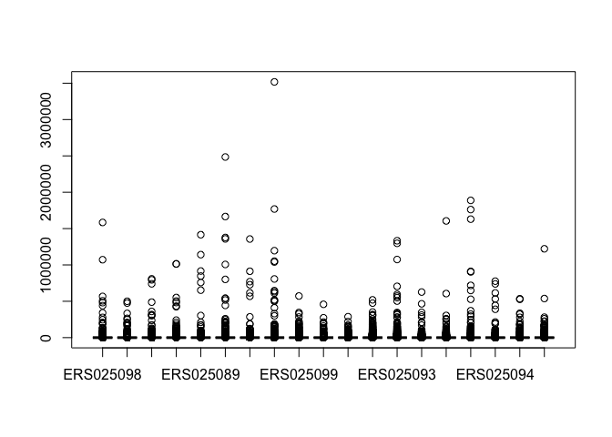

    # So we would want to take the log transform of the data. Again, plus one due to the presence of the 0 values.
    boxplot(log2(edata+1),range=0)

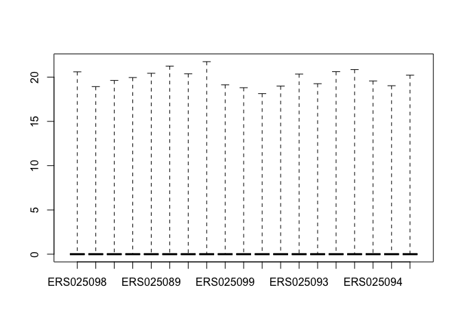

    # Plot two histograms side by side: split up the screen so that it has one row and two columns of plots.
    par(mfrow=c(1,2)) # par(): used to set or query graphical parameters
    hist(log2(edata[,1]+1),col=4) 
    hist(log2(edata[,2]+1),col=2)

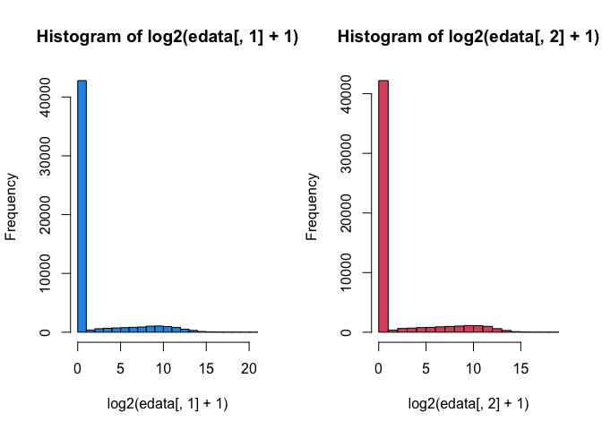

    # Density plot: similar to a histogram but a line graph
    par(mfrow=c(1,1))
    plot(density(log2(edata[,1]+1)),col=4) # Calculate the density first
    lines(density(log2(edata[,2]+1)),col=2) # Overlay the other line rather than overwriting the entire plot

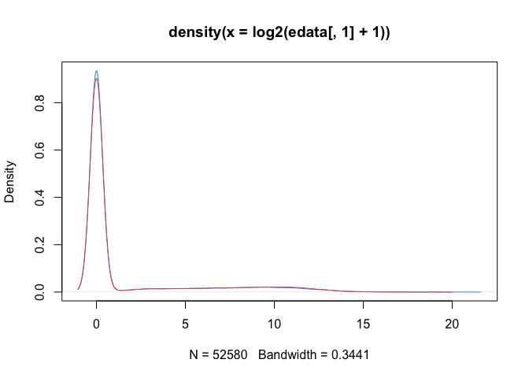

    # This overlay allows us to check whether the distributions of samples are similar.

#### Q-Q plot

Another way to compare the distribution between two samples is by
plotting a Q-Q plot (**quantile–quantile plot**, tho Q-Q looks like a
kaomoji…): *a point (x, y) on the plot corresponds to one of the
quantiles of the second distribution plotted against the same quantile
of the first distribution*.

-   If the two distributions being compared are similar, the points in
    the Q–Q plot will approximately lie on the identity line y = x. So
    we plot this line as well by the `abline()` function.

<!-- -->

    qqplot(log2(edata[,1]+1),log2(edata[,2]+1),col=3)
    abline(c(0,1)) # y = ax + b; note that the intercept (b) is the first argument and the slope (a) is the second

#### MA plot

An application of a Bland-Altman plot for visual representation of
genomic data. The plot visualizes the differences between measurements
taken in two samples, by transforming the data onto **M (log ratio) and
A (average expression, since it’s obtained by averaging the two
log-transformed values)** scales to see if there are any
intensity-specific biases.

Its original application was for microarray data, where an underlying
assumption is that *most of the genes would not see any change in their
expression (not differentially expressed); therefore, the majority of
the points on the y-axis (M, which just represents `logFC`) would be
located at 0*, since log(1) is 0. If this is not the case, then a
**normalization** method should be applied to the data before
statistical analysis. Likewise, this can be used to compare data from
eg. two replicates, etc.

    mm = log2(edata[,1]+1) - log2(edata[,2]+1)
    aa = log2(edata[,1]+1) + log2(edata[,2]+1)
    plot(aa,mm,col=4)

There is a fan-like triangular pattern on the left. This occurs because:
for a gene if the expression in one sample is near-zero but not in the
other sample, which means either `log2(edata[,1]+1)` or
`log2(edata[,2]+1)` ≈ 0, we get `mm ≈ -aa` or `mm ≈ aa`, and thus these
points cluster on these two lines.

#### Data filtering

We can filter out these features (genes) with a low expression to get an
idea of what the actual distribution looks like. We **convert the
dataset into a data.frame to apply the `filter()` function** from the
dplyr package and only keep the rows that have a mean expression level
greater than 1.

    edata = as.data.frame(edata)
    filt_edata = filter(edata,rowMeans(edata) > 1) # Now reduced from 52580 rows to only 12276
    boxplot(as.matrix(log2(filt_edata+1)),col=4) # And the box plot looks much better (note that we have to transform the data.frame back to a matrix to do the plotting!!) 

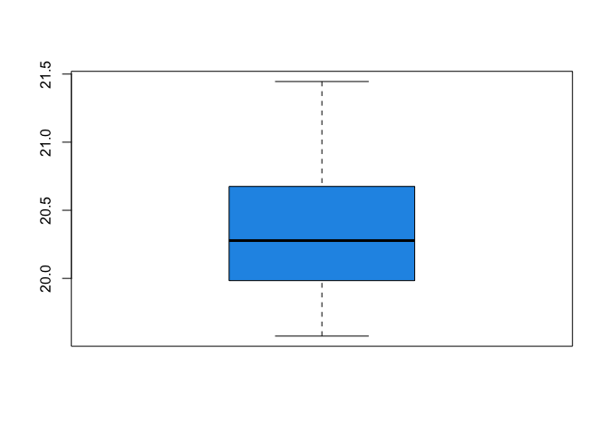

For this filtering step, especially when dealing with genomic data, note
that **sometimes the median is more robust than the mean** (so use
`rowMedians` to filter rather than `rowMeans`) since while the vast
majority of values are near-zero there might be some gigantic values
(recall the maximum value from the `summary()` we did above!!) that
affect the mean but not the median.

#### Data consistency check

In the third part of the exploration of a dataset, we can check for
consistency using some kind of external data available, such as
chromosomal information from another dataset (matched using ENSEMBL IDs)
to eg. make sure that the men and women are correctly labeled in our
current data by looking at expression on the Y chromosome. Again we can
generate a box plot for both genders to compare this expression.
`boxplot(colSums(edata_y) ~ pdata$gender)`.

We might also want to visualize the expression matrix, which can be done
by creating a heat map (since it’s a multivariate plot). **Here’s
another way to filter the features**, again only keeping the genes whose
expression levels are high enough.

    ematrix = as.matrix(edata)[rowMeans(edata) > 30000,]
    heatmap(ematrix)

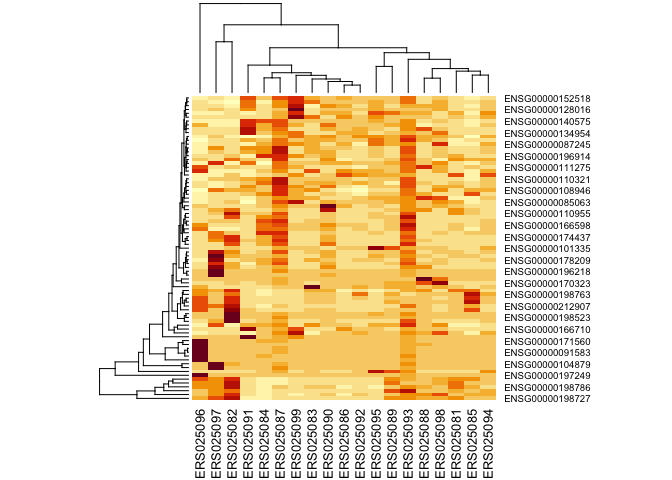

    # We can turn off the automatic clustering by adding the  `Rowv=NA` and `Colv=NA` arguments in the heatmap() function.

#### Reminder on the plot() function

From the previous code chunks we used the `plot()` function to output a
line graph and a scatter plot, without explicitly setting any arguments
like `type = 'l'`. So I got a bit confused,,,, but turned out that the
default output of this function depend on the **class of input**:

-   Numeric vectors: creates **a scatter plot with points** plotted at
    the corresponding (x, y) coordinates *or against its index*.

-   A factor: creates a bar graph, showing the counts for each level of
    the factor.

-   A factor and a numeric vector: box plot of the numeric vector and
    the levels of the factor.

-   Formula-style input eg. `plot(y ~ x)`: usually also a scatter plot.

-   A dataframe: a correlation plot of all dataframe columns (more than
    two).

-   Other **specific objects** (eg. some classes we’ve encountered)

    -   A density object: as shown above, a probability density curve
        (line plot).

    -   A hclust (hierarchical clustering) object: as shown below,
        creates a dendrogram.

    -   Time series: a time series plot; date and a vector: a time-based
        plot (just like the scatter plot created using two vectors).

### Transforming data

Often to visualize or model genomic data is we need to make some data
transformations that put it on a *scale that’s more appropriate or
easier to interpret*.

#### Log transformations and histograms

-   Log transformation: a common transformation for highly skewed data;
    easier to visualize the distribution. But do remember to plus one (a
    small number like this won’t affect the big counts anyway), or the
    minimum would be `-Inf` (undefined, since it’s taking the log of 0).

<!-- -->

    hist(edata[,1])

    # Note that after transformation we can actually see data on the right-hand side as well!!!!! Clear contrast between these two plots.
    hist(log(edata[,1]+1))

    # We can also *zoom in* to focus on other parts of the distribution (by setting `xlim` and `ylim`) and thus ignore those zeros. 
    hist(log(edata[,1]+1),breaks=100, xlim=c(1,15),ylim=c(0,400))

    # We can also use a histogram to count how many rows have zero/non-zero values:
    hist(rowSums(edata==0))

-   Log-2 transformation: common when we want to **compare two values**
    (`logFC`).

**Other transforms**:

-   [Variance stabilizing
    transforms](https://en.wikipedia.org/wiki/Variance-stabilizing_transformation)
    which seek to remove a mean variance relationship among the data

-   [Box-Cox transforms](https://en.wikipedia.org/wiki/Power_transform)
    which seek to make the data approximately Normally distributed

-   [rlog
    transform](http://rpackages.ianhowson.com/bioc/DESeq2/man/rlog.html) -
    unique to genomics count data, this is a regularized version of the
    log transform that seeks to minimize differences at low count
    levels.

### Clustering

This is also one of the most commonly used tools for exploratory
analysis of genomic data. Can be useful for exploring multivariate
relationships. However, must be treated with caution in terms of:

-   Scaling of the data!!

-   Outliers

-   Starting values in k-means (in this case, defining the number of
    clusters (k) also matters).

Clusters can be easily overinterpreted, so we have to keep in mind the
relationships when looking at them.

#### Hierarchical clustering and fancy dendrograms

We find the two points that are closest together (measured by their
distance/norm, eg. Euclidean norm, which can be obtained by the `dict()`
function (compares *rows*!!) from the stats package), connect them
together, and merge them (usually by just taking the average of them) so
that we can regard them as a new data point, and the same process
continues.

**Cluster dendrogram**: this is just the thingy shown automatically when
we plot a heat map, constructed by connecting the points that are
closest in distance.

    # We first do filtering and then data transformation.
    edata2 = edata[rowMeans(edata) > 5000,]
    edata2 = log2(edata2 + 1)

    # Calculates the distance between *rows* so we have to transpose the matrix to compare between the samples (which are originally columns)
    dist1 = dist(t(edata2))
    dist1

    ##           ERS025098 ERS025092 ERS025085 ERS025088 ERS025089 ERS025082 ERS025081
    ## ERS025092  47.83454                                                            
    ## ERS025085  83.96220  77.54223                                                  
    ## ERS025088  52.34542  61.39250  86.94737                                        
    ## ERS025089  46.68212  46.77265  73.16788  58.31017                              
    ## ERS025082  86.75159  80.83051  88.75160  71.99587  79.45885                    
    ## ERS025081  71.05994  63.21369  76.65367  77.80793  60.62444  89.12446          
    ## ERS025096 103.83113 102.17843 105.85568 112.79204 103.45186 116.60888  88.02845
    ## ERS025099  57.02675  50.93496  86.40210  68.68676  53.76118  88.76296  66.06906
    ## ERS025086  51.75235  39.17648  80.98108  54.08224  48.90812  74.52476  67.95134
    ## ERS025084  99.71989  97.27087 111.50972  87.44926  95.20849  97.83349  92.97540
    ## ERS025087 117.34448 115.63130 133.79183 104.16750 113.03830 118.52652 112.89021
    ## ERS025093 112.33075 110.15115 128.04004  98.37916 107.32375 110.80959 107.59375
    ## ERS025083  57.81901  48.50112  73.38989  64.35612  47.07506  80.53871  59.79530
    ## ERS025095  58.80015  54.58770  82.38348  65.18464  45.91571  85.73765  62.64854
    ## ERS025097  95.16362  92.35075  98.79747  75.04964  89.42727  67.22592 101.20114
    ## ERS025094  67.78771  59.91701  82.01750  57.73635  58.75552  73.77785  67.51924
    ## ERS025090  78.50388  72.70717  90.64349  56.51921  70.55099  70.21842  76.38506
    ## ERS025091 124.49703 115.97526 117.59068 133.96367 127.93296 137.30302 123.90636
    ##           ERS025096 ERS025099 ERS025086 ERS025084 ERS025087 ERS025093 ERS025083
    ## ERS025092                                                                      
    ## ERS025085                                                                      
    ## ERS025088                                                                      
    ## ERS025089                                                                      
    ## ERS025082                                                                      
    ## ERS025081                                                                      
    ## ERS025096                                                                      
    ## ERS025099 103.83183                                                            
    ## ERS025086 103.76689  45.92130                                                  
    ## ERS025084 122.73463  96.74240  86.12869                                        
    ## ERS025087 146.58517 112.56898 104.07750  45.59098                              
    ## ERS025093 138.62242 107.82539  98.48691  40.54726  16.67730                    
    ## ERS025083 103.15733  53.74561  50.23602  94.26817 111.37489 107.05659          
    ## ERS025095 113.95025  54.95038  52.86539  91.02333 105.29379 101.42571  48.54519
    ## ERS025097 127.23273 101.10251  85.70968 108.33214 126.80170 120.05209  91.94681
    ## ERS025094 111.78740  69.97030  57.69175  69.20467  86.04195  80.51045  54.29446
    ## ERS025090 120.04394  80.59999  64.70507  76.69203  90.98039  85.86444  67.00176
    ## ERS025091 132.80823 119.52176 116.71838 153.93360 173.34058 168.83314 119.05197
    ##           ERS025095 ERS025097 ERS025094 ERS025090
    ## ERS025092                                        
    ## ERS025085                                        
    ## ERS025088                                        
    ## ERS025089                                        
    ## ERS025082                                        
    ## ERS025081                                        
    ## ERS025096                                        
    ## ERS025099                                        
    ## ERS025086                                        
    ## ERS025084                                        
    ## ERS025087                                        
    ## ERS025093                                        
    ## ERS025083                                        
    ## ERS025095                                        
    ## ERS025097  94.59446                              
    ## ERS025094  61.11209  83.09611                    
    ## ERS025090  71.25648  69.01914  54.13557          
    ## ERS025091 130.16308 140.39229 132.76351 138.47040

    ## Visualize the distance matrix; we try to make it pretty this time by setting a color ramp!! We also add a color scale 
    colramp = colorRampPalette(c(4,"white",2))(9)
    heatmap(as.matrix(dist1),col=colramp,Colv=NA,Rowv=NA)

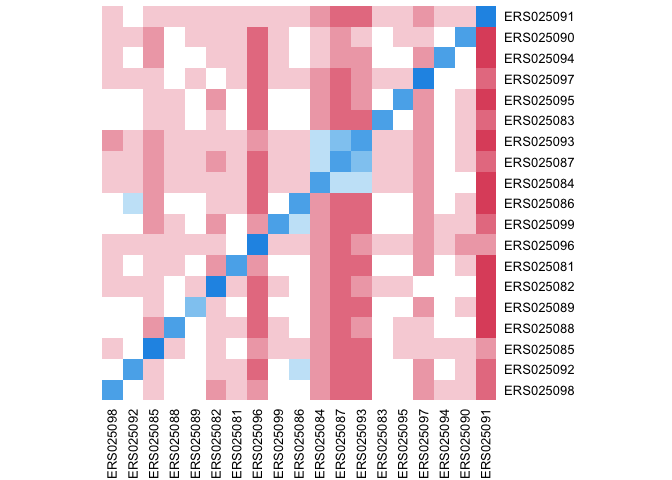

    # Performing clustering
    hclust1 = hclust(dist1)
    hclust1

    ## 
    ## Call:
    ## hclust(d = dist1)
    ## 
    ## Cluster method   : complete 
    ## Distance         : euclidean 
    ## Number of objects: 19

    class(hclust1)

    ## [1] "hclust"

Plotting dendrograms!!

    plot(hclust1)

    # We can also force all of the leaves to terminate at the same spot
    plot(hclust1,hang=-1)

    # We can also color the dendrogram either into a fixed number of group
    dend = as.dendrogram(hclust1)
    library(dendextend)

    ## 
    ## ---------------------
    ## Welcome to dendextend version 1.19.0
    ## Type citation('dendextend') for how to cite the package.
    ## 
    ## Type browseVignettes(package = 'dendextend') for the package vignette.
    ## The github page is: https://github.com/talgalili/dendextend/
    ## 
    ## Suggestions and bug-reports can be submitted at: https://github.com/talgalili/dendextend/issues
    ## You may ask questions at stackoverflow, use the r and dendextend tags: 
    ##   https://stackoverflow.com/questions/tagged/dendextend
    ## 
    ##  To suppress this message use:  suppressPackageStartupMessages(library(dendextend))
    ## ---------------------

    ## 
    ## Attaching package: 'dendextend'

    ## The following object is masked from 'package:generics':
    ## 
    ##     prune

    ## The following object is masked from 'package:stats':
    ## 
    ##     cutree

    dend = color_labels(hclust1,4,col=1:4)
    plot(dend) 

    # Or color them directly with labels_colors() setter
    labels_colors(dend) = c(rep(1,10),rep(2,9))
    plot(dend)

#### K-means

The same as in ML. Guessing k centers -&gt; assigning data points to
closest centers by calculating distance to it -&gt; iteratively
recalculate the center of each cluster for optimization -&gt; assign
again -&gt; …

    kmeans1 = kmeans(edata2,centers=3) # Here we specified the numbers (k) of centers to be 3
    names(kmeans1) # To check the dataframe

    ## [1] "cluster"      "centers"      "totss"        "withinss"     "tot.withinss"
    ## [6] "betweenss"    "size"         "iter"         "ifault"

    matplot(t(kmeans1$centers),col=1:3,type="l",lwd=3)

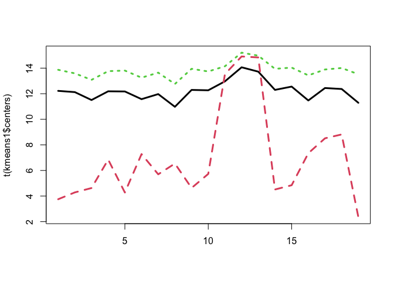

    table(kmeans1$cluster) # See how many data points belong to each cluster

    ## 
    ##   1   2   3 
    ## 739  63 396

    heatmap(as.matrix(edata)[order(kmeans1$cluster),],col=colramp,Colv=NA,Rowv=NA)

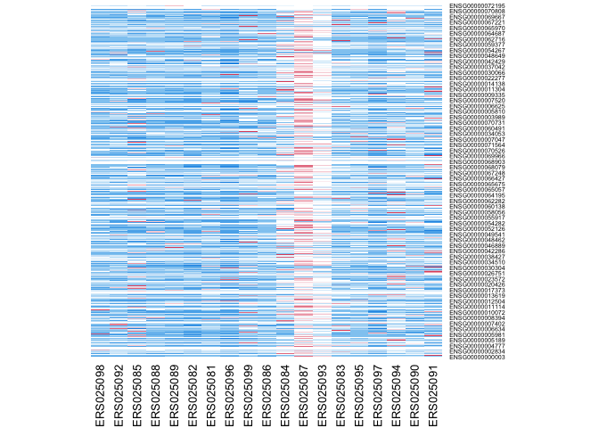

## Preprocessing

### Dimension reduction

Suppose we have a multivariate matrix X. We want to find:

-   A new set of multivariate variables that are uncorrelated with each
    other and explain as much of the variability across rows or columns
    as possible.

-   Or, to find the best matrix that’s an approximation to the original
    matrix (explains the original data) but has a lower rank or fewer
    variables.

These two goals are a little bit different. One is statistical, and the
other is data compression or mathematical, but it turns out that they
can have very similar solutions:

#### SVD and PCA

There are many other common decompositions, but here we only cover PCA
(via SVD). Recalling further maths ;\_;

**PCA is essentially SVD applied to a column-wise mean-centered
(standardized, to focus on covariance structure) data matrix.** That’s
why when we applied the `svd()` function for *SVD* in the code chunks
below we first mean-centered the columns of the data manually!! If we
don’t do that, the first singular value will always be the mean level,
which will always explain the most variation in genomic experiment;
however, we actually want to see variation between samples or between
genes. In the latter code chunk where we first used `prcomp(edata)`,
that’s the actual function for PCA rather than SVD so it didn’t require
us to do the manual mean-centering step.

-   Due to the orthogonality of both the left- and right-singular
    vectors, the patterns are uncorrelated! So each component can
    capture distinct pattern in the data X!!

    -   The left-singular vectors (columns of U) tell us about patterns
        that exist **across different rows** of the dataset, while the
        right-singular vectors (in V^T) tell us about patterns across
        columns. The singular values in D represent how much of the
        variance is explained by the patterns. (Recall
        eigendecomposition!!)

-   If we take the i-th element of D (di, i.e. the i-th
    singular value), square it, and divide it by the sum of all elements
    of D, we get the **percentage of the data X’s total variance
    explained by the i-th component**. (Since di^2 just
    corresponds to the i-th eigenvalue of XX^T (or the other way
    around), and eigenvalues just represent magnitude of variance in
    PCA)

-   Recall that in PCA we aim to find the directions of maximal variance
    -&gt; finding the first PCs.

<!-- -->

    # The actual PCA is done by subtracting the column means rather than the row means (see in the following code chunks for svd2), but this is commonly done (if we want to compare the **samples**...?) and sometimes the output is called 'PCs' interchangeably, like below. 
    edata2 = edata[rowMeans(edata) > 100,]
    edata2 = log2(edata2 + 1)
    edata2_centered = edata2 - rowMeans(edata2) # 1198 x 19
    svd1 = svd(edata2_centered)
    names(svd1)

    ## [1] "d" "u" "v"

    dim(svd1$u) # Its 19 columns represent patterns **across rows** 

    ## [1] 8166   19

    svd1$d # In descending order

    ##  [1] 4.828903e+02 2.824593e+02 2.442758e+02 2.314542e+02 2.056687e+02
    ##  [6] 1.579589e+02 1.532732e+02 1.363589e+02 1.294646e+02 1.283984e+02
    ## [11] 1.257261e+02 1.160238e+02 1.056679e+02 9.917618e+01 9.259704e+01
    ## [16] 8.201552e+01 7.819993e+01 1.944986e+01 6.336720e-13

    plot(svd1$d,ylab="Singular value",col=4)

    plot(svd1$d^2/sum(svd1$d^2),ylab="Percent Variance Explained",col=4)

    par(mfrow=c(1,2))
    plot(svd1$v[,1],col=4,ylab="1st PC") # Well, no, these two are actually not the PCs (which are the columns of UD) but rather the *loadings* for PC1 and PC2 since we're taking the columns of V.
    plot(svd1$v[,2],col=4,ylab="2nd PC")

    par(mfrow=c(1,1))

    # A very common plot is to plot PC1 versus PC2 to see if there are any "clusters" or "groups", and color them by different covariates in the phenotype data.
    # In the course lecture the covariate examined was `pdata$study` but that column isn't present in my pdata aaaaa, so just for illustration I used gender here which shows no relationship with the clustering,,,,,
    plot(svd1$v[,1],svd1$v[,2],ylab="2nd PC",
         xlab="1st PC",col=as.numeric(pdata$gender))

    # Another common plot is to make boxplots comparing the PC for different levels of known covariates (don't forget to show the actual data by plotting the jittered points!!).
    # Again I used the irrelevant '$gender' just for illustration for the plotting syntax :(, so sad.
    boxplot(svd1$v[,1] ~ pdata$gender,border=c(1,2))
    points(svd1$v[,1] ~ jitter(as.numeric(pdata$gender)),col=as.numeric(pdata$study))

    # Note that jitter() adds **horizontal** noise, which is why it's applied at the 'x' slot in the 'y ~ x' formula argument.

    # This is by directly applying the function for PCA rather than standardizing by hand and then use SVD.
    pc1 = prcomp(edata2)
    plot(pc1$rotation[,1],svd1$v[,1])

    # Here we obtain the actual PCs by mean-centering for columns rather than rows, as in the previous code chunk...
    edata2_centered2 = t(t(edata2) - colMeans(edata2))
    svd2 = svd(edata2_centered2)
    # And we can confirm that results for these two operations are now identical, since the line y = x is fitted. 
    plot(pc1$rotation[,1],svd2$v[,1],col=4)
    abline(c(0,1)) # At least I remembered the syntax of this function ;_;  it's so upsetting when everything learned gets forgotten and just slips away so soon...

    edata_outlier = edata2_centered
    edata_outlier[1,] = edata2_centered[1,] * 10000
    svd3 = svd(edata_outlier)
    par(mfrow=c(1,2))
    plot(svd1$v[,1],col=1,main="Without outlier")
    plot(svd3$v[,1],col=2,main="With outlier")

    # Results of both decompositions don't match

### Preprocessing and normalization

-   Preprocessing is the step where we take the raw data and turn it
    into a set of data that we can actually do statistical modeling on.

    -   Normalization is the step where we try to make samples have
        appropriate distribution or common distribution (eg. the result
        of quantile normalization).

These are highly platform- and problem-dependent. But overall we want to
make sure that there aren’t bulk differences between samples, especially
due to technology.

#### Quantile normalization

<https://en.wikipedia.org/wiki/Quantile_normalization>

Most suitable for cases when there’s large variability **within groups**
(eg. due to **technical variability** or batch effects within groups)
but small variability **across groups**.

-   When there’s small variability within groups yet large variability
    across groups and we want to identify the global *biological
    variability* rather than technical variability, **don’t** use
    quantile normalization, which will sadly force the distribution to
    be exactly the same.

<!-- -->

    edata2 = log2(edata + 1)
    edata2 = edata2[rowMeans(edata2) > 3, ]
    colramp = colorRampPalette(c(3,"white",2))(20)
    plot(density(edata2[,1]),col=colramp[1],lwd=3,ylim=c(0,.30)) # `lwd` stands for line width, and the parameter here sets the line three times thicker than default. 
    # **Loop over the 19 samples and add lines that overlay on top of the line plot**.
    for(i in 2:19){lines(density(edata2[,i]),lwd=3,col=colramp[i])}

    # Looks like technical variability. So we'll then use quantile normalization.

    # Quantile normalization using the preprocessCore package
    library(preprocessCore)
    norm_edata = normalize.quantiles(as.matrix(edata2))

    # Plot again.
    # Quantiles for the very low/high values are difficult to match up, so often we'll see a little bit (well...) variation in these values. But for the most part... the distributions lay exactly on top of each other:
    plot(density(norm_edata[,1]),col=colramp[1],lwd=3,ylim=c(0,.20))
    for(i in 2:19){lines(density(norm_edata[,i]),lwd=3,col=colramp[i])}

The cool thing is that even though we’ve done quantile normalization and
normalized out the total distribution to be exactly the same, we haven’t
removed biological variability in expression patterns. So if we do a PCA
on the normalized data, we can still see the clustering pattern for
`$study`. Sadly, similar to the previous section, that column is no
longer accessible T\_T.

## Statistical modeling

### Linear models

Y = b0 + b1X + e, where b0 is the intercept, b1 is the slope, and *e is
the random noise: everything we didn’t measure*. Fitting is
optimizing/minimizing the MSE between Y and (b0 + b1X).

When dealing with non-continuous covariates (categorical covariates),
use beta coefficients and categorical labels (binary indicators, 0/1,
**one 0/1 label assigned to each level**). In the following code chunk,
we’ll see that R **automatically converts categorical data to these
binary labels**. This is SO much more convenient than what i learned in
sklearn, which requires you to manually convert them :O

#### Linear regression in R

Some terms:

-   **Estimates**: weights/coefficients beta. `lm_model$coefficients`

-   **Residuals**: errors, the vertical distance between the observed
    value (y) and the fitted value (y-hat) on the same x.
    `lm_model$residuals`

<!-- -->

    # Suppose we want to ask: what is the relationship between gene expression (y) and age (x)?
    library(limma)

    ## 
    ## Attaching package: 'limma'

    ## The following object is masked from 'package:BiocGenerics':
    ## 
    ##     plotMA

    library(edge)
    lm1 = lm(as.matrix(edata)[1,] ~ pdata$age)
    library(broom)
    tidy(lm1) # tidy(): turns an object of other classes (eg. an 'lm' object (**a fitted model**) here, supported by the brook package) into a tidy tibble

    ## # A tibble: 2 × 5
    ##   term        estimate std.error statistic   p.value
    ##   <chr>          <dbl>     <dbl>     <dbl>     <dbl>
    ## 1 (Intercept)   2188.     403.        5.43 0.0000888
    ## 2 pdata$age      -23.2      6.39     -3.64 0.00269

    plot(pdata$age,as.matrix(edata)[1,])
    abline(c(lm1$coeff[1],lm1$coeff[2]), col=4,lwd=3)

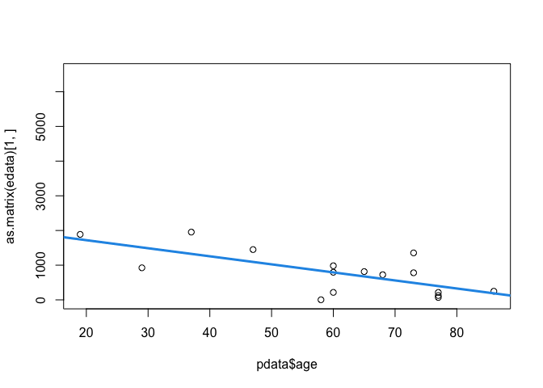

    # We also want to find the relationship between gene expression and gender (which I have already plotted due to the $study error Q_Q). Unlike age, which is a quantitative covariate, gender right now is a factor (non-continuous and categorical), so it has to be converted to the binary indicators 0/1 first. 
    pdata$gender=="M"

    ##  [1] FALSE  TRUE FALSE FALSE FALSE  TRUE FALSE  TRUE  TRUE FALSE    NA    NA
    ## [13]    NA FALSE  TRUE  TRUE  TRUE FALSE  TRUE

    # R actually does this automatically!!!!!! ily R <3 
    lm2 = lm(as.matrix(edata)[1,] ~ pdata$gender)
    tidy(lm2)

    ## # A tibble: 2 × 5
    ##   term          estimate std.error statistic p.value
    ##   <chr>            <dbl>     <dbl>     <dbl>   <dbl>
    ## 1 (Intercept)       837       229.     3.66  0.00258
    ## 2 pdata$genderM    -106.      324.    -0.326 0.749

    model.matrix(~pdata$gender)

    ##    (Intercept) pdata$genderM
    ## 1            1             0
    ## 2            1             1
    ## 3            1             0
    ## 4            1             0
    ## 5            1             0
    ## 6            1             1
    ## 7            1             0
    ## 8            1             1
    ## 9            1             1
    ## 10           1             0
    ## 14           1             0
    ## 15           1             1
    ## 16           1             1
    ## 17           1             1
    ## 18           1             0
    ## 19           1             1
    ## attr(,"assign")
    ## [1] 0 1
    ## attr(,"contrasts")
    ## attr(,"contrasts")$`pdata$gender`
    ## [1] "contr.treatment"

Recall from Course 5 (in `limma` I think, which just leverages linear
models) that there’s the concept ‘reference level’, which is just the
first level in the factor. When we try to print the design matrix it
returns exactly the same rows: intercept and the remaining levels other
than the reference level.

    pdata$gender # F is the first level -> reference level! -> control group

    ##  [1] F    M    F    F    F    M    F    M    M    F    <NA> <NA> <NA> F    M   
    ## [16] M    M    F    M   
    ## Levels: F M

    table(pdata$tissue.type)

    ## 
    ##          adipose          adrenal            brain           breast 
    ##                1                1                1                1 
    ##            colon            heart           kidney            liver 
    ##                1                1                1                1 
    ##             lung        lymphnode          mixture            ovary 
    ##                1                1                3                1 
    ##         prostate  skeletal_muscle           testes          thyroid 
    ##                1                1                1                1 
    ## white_blood_cell 
    ##                1

    pdata$tissue.type == "adipose"

    ##  [1]  TRUE FALSE FALSE FALSE FALSE FALSE FALSE FALSE FALSE FALSE FALSE FALSE
    ## [13] FALSE FALSE FALSE FALSE FALSE FALSE FALSE

    # This leads to **multiple coefficients for one variable** (since one binary label is assigned for each level in the categorical variable)
    tidy(lm(as.matrix(edata)[1,] ~ pdata$tissue.type))

    ## # A tibble: 17 × 5
    ##    term                              estimate std.error statistic p.value
    ##    <chr>                                <dbl>     <dbl>     <dbl>   <dbl>
    ##  1 (Intercept)                         1354.      1018.    1.33    0.315 
    ##  2 pdata$tissue.typeadrenal           -1138.      1440.   -0.790   0.512 
    ##  3 pdata$tissue.typebrain             -1139.      1440.   -0.791   0.512 
    ##  4 pdata$tissue.typebreast             -430.      1440.   -0.299   0.793 
    ##  5 pdata$tissue.typecolon              -629.      1440.   -0.437   0.705 
    ##  6 pdata$tissue.typeheart             -1229       1440.   -0.854   0.483 
    ##  7 pdata$tissue.typekidney             -558.      1440.   -0.388   0.736 
    ##  8 pdata$tissue.typeliver               600.      1440.    0.417   0.717 
    ##  9 pdata$tissue.typelung               -539.      1440.   -0.374   0.744 
    ## 10 pdata$tissue.typelymphnode         -1105       1440.   -0.768   0.523 
    ## 11 pdata$tissue.typemixture            4043.      1175.    3.44    0.0751
    ## 12 pdata$tissue.typeovary                96.0     1440.    0.0667  0.953 
    ## 13 pdata$tissue.typeprostate           -573.      1440.   -0.398   0.729 
    ## 14 pdata$tissue.typeskeletal_muscle   -1285.      1440.   -0.893   0.466 
    ## 15 pdata$tissue.typetestes              534.      1440.    0.371   0.746 
    ## 16 pdata$tissue.typethyroid            -371.      1440.   -0.258   0.821 
    ## 17 pdata$tissue.typewhite_blood_cell  -1351.      1440.   -0.938   0.447

    # Multiple categorical variables (**adjusting for** covariates)
    tidy(lm(as.matrix(edata)[1,] ~ pdata$age + pdata$gender))

    ## # A tibble: 3 × 5
    ##   term          estimate std.error statistic  p.value
    ##   <chr>            <dbl>     <dbl>     <dbl>    <dbl>
    ## 1 (Intercept)     2332.     438.       5.32  0.000139
    ## 2 pdata$age        -23.9      6.49    -3.69  0.00274 
    ## 3 pdata$genderM   -207.     236.      -0.877 0.397

    # Adding *interaction terms* between variabless
    tidy(lm(as.matrix(edata)[1,] ~ pdata$age * pdata$gender))

    ## # A tibble: 4 × 5
    ##   term                    estimate std.error statistic p.value
    ##   <chr>                      <dbl>     <dbl>     <dbl>   <dbl>
    ## 1 (Intercept)               1679.     610.        2.75  0.0175
    ## 2 pdata$age                  -13.5      9.43     -1.43  0.178 
    ## 3 pdata$genderM              913.     793.        1.15  0.272 
    ## 4 pdata$age:pdata$genderM    -18.5     12.5      -1.47  0.167

    index = 1:19
    lm3 = lm(as.matrix(edata)[1,] ~ index)
    plot(index, as.matrix(edata)[1,])

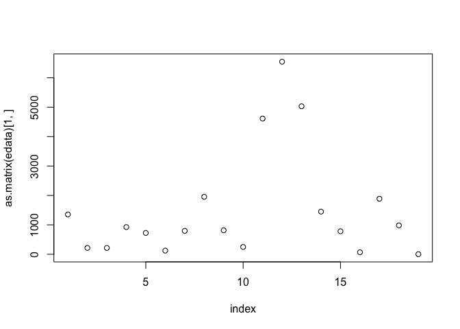

    hist(lm3$residuals)

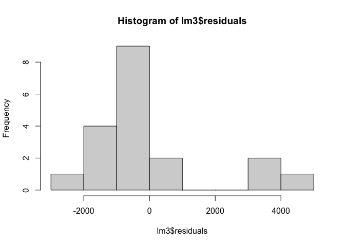

    # Transform the data first to see the residuals
    lm4 = lm(log2(as.matrix(edata)[1,]+1) ~ index)
    hist(lm4$residuals)

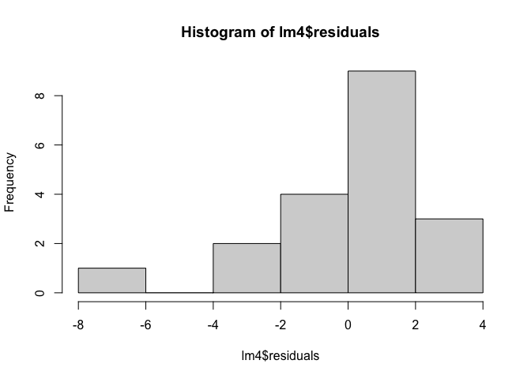

    # When we fit many variables that there are now more coefficients than sample points (underdetermined), R actually makes estimations,,, (without explicitly telling us)
    tidy(lm(log2(as.matrix(edata)[1,]+1) ~ pdata$tissue.type + pdata$age)) # Recall that there are so many levels in $tissue.type, leading to many coefficients (for each level)

    ## # A tibble: 17 × 5
    ##    term                              estimate std.error statistic p.value
    ##    <chr>                                <dbl>     <dbl>     <dbl>   <dbl>
    ##  1 (Intercept)                        10.4          NaN       NaN     NaN
    ##  2 pdata$tissue.typeadrenal           -2.64         NaN       NaN     NaN
    ##  3 pdata$tissue.typebrain             -2.65         NaN       NaN     NaN
    ##  4 pdata$tissue.typebreast            -0.551        NaN       NaN     NaN
    ##  5 pdata$tissue.typecolon             -0.900        NaN       NaN     NaN
    ##  6 pdata$tissue.typeheart             -3.43         NaN       NaN     NaN
    ##  7 pdata$tissue.typekidney            -0.766        NaN       NaN     NaN
    ##  8 pdata$tissue.typeliver              0.529        NaN       NaN     NaN
    ##  9 pdata$tissue.typelung              -0.732        NaN       NaN     NaN
    ## 10 pdata$tissue.typelymphnode         -2.44         NaN       NaN     NaN
    ## 11 pdata$tissue.typeovary              0.0988       NaN       NaN     NaN
    ## 12 pdata$tissue.typeprostate          -0.793        NaN       NaN     NaN
    ## 13 pdata$tissue.typeskeletal_muscle   -4.27         NaN       NaN     NaN
    ## 14 pdata$tissue.typetestes             0.479        NaN       NaN     NaN
    ## 15 pdata$tissue.typethyroid           -0.462        NaN       NaN     NaN
    ## 16 pdata$tissue.typewhite_blood_cell  -8.40         NaN       NaN     NaN
    ## 17 pdata$age                          NA             NA        NA      NA

    colramp = colorRampPalette(1:4)(17)
    plot(lm(as.matrix(edata)[2,] ~ pdata$age)$residuals,col=colramp[as.numeric(pdata$tissue.type)])

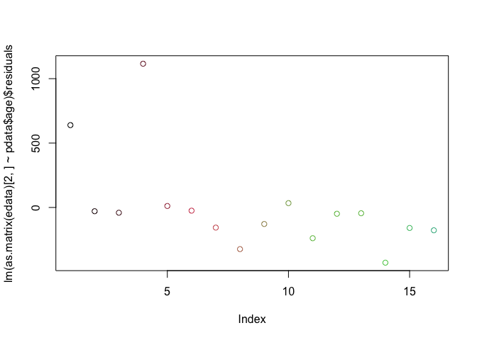

    # as.numeric(pdata$tissue.type) is just 1:17...

#### Fitting many regressions at once and limma revisit

In genomics it’s often the case that we want to fit **many regression
models simultaneously** for many variables (primary/biological variables
and adjustment variables). So instead of Y = b0 + b1X + e with vectors
(and constants for coefficients) we’ll stack these into matrices, so it
would be like matrix multiplication.

Remember in our last few code chunks, the models we fitted (eg. `lm3`)
are all fitted on **one gene** eg. by `as.matrix(edata)[1,]` (one single
row of the expression matrix). Now we use `lm.fit()` and `lmFit` of the
`limma` package to **fit all the selected genes at the same time**, so
we do that many regressions at once. This is why we need the **design
matrix (about the samples and their covariates)**, since these
parameters are exactly the same for every gene/every model we fit. And
then we can fit all of them using `lm.fit`, just like what we did in
Course 5, and it’ll return a *set* of coefficients for each model fitted
for that gene.

    # Using a different dataset
    con =url("http://bowtie-bio.sourceforge.net/recount/ExpressionSets/bottomly_eset.RData")
    load(file=con)
    close(con)
    bot = bottomly.eset
    pdata2=pData(bot)
    edata2=as.matrix(exprs(bot))
    fdata2 = fData(bot)
    ls()

    ##  [1] "aa"               "bm"               "bodymap.eset"     "bot"             
    ##  [5] "bottomly.eset"    "colramp"          "con"              "dend"            
    ##  [9] "dist1"            "edata"            "edata_outlier"    "edata2"          
    ## [13] "edata2_centered"  "edata2_centered2" "ematrix"          "fdata"           
    ## [17] "fdata2"           "filt_edata"       "hclust1"          "i"               
    ## [21] "index"            "kmeans1"          "lm1"              "lm2"             
    ## [25] "lm3"              "lm4"              "mm"               "norm_edata"      
    ## [29] "pc1"              "pdata"            "pdata2"           "svd1"            
    ## [33] "svd2"             "svd3"

    edata2 = log2(edata2 + 1)
    edata2 = edata2[rowMeans(edata2) > 10, ] # actually idk why the filter conditions for gene expression levels always change in every practical session, but imma just stick with it

    # Getting the design matrix!! exactly the same as what we did in Course 5
    design = model.matrix(~ pdata2$strain)

    fit = lm.fit(design,t(edata2)) # lm.fit() rather than lm()
    fit$coefficients[,1] # The coefficient for *each* model fitted is stored in the **columns** of the coefficient matrix

    ##         (Intercept) pdata2$strainDBA/2J 
    ##          10.4116634           0.3478919

    tidy(lm(as.numeric(edata2[1, ]) ~ pdata2$strain)) # Comparing to output a lm(), which is fitting a single model for a single gene. Almost the same.

    ## # A tibble: 2 × 5
    ##   term                estimate std.error statistic  p.value
    ##   <chr>                  <dbl>     <dbl>     <dbl>    <dbl>
    ## 1 (Intercept)           10.4       0.152     68.7  3.10e-24
    ## 2 pdata2$strainDBA/2J    0.348     0.210      1.66 1.13e- 1

    # Fit many regressions with an **adjustment variable** （'strain' is the primary variable of interest; we also adjust for 'lane number', which might contribute to batch effects). 
    design_adj = model.matrix(~ pdata2$strain + as.factor(pdata2$lane.number))
    fit_adj = lm.fit(design_adj,t(edata2))
    fit_adj$coefficients[,1]

    ##                    (Intercept)            pdata2$strainDBA/2J 
    ##                    10.31359781                     0.28934825 
    ## as.factor(pdata2$lane.number)2 as.factor(pdata2$lane.number)3 
    ##                     0.05451431                     0.02502244 
    ## as.factor(pdata2$lane.number)5 as.factor(pdata2$lane.number)6 
    ##                     0.07200502                     0.38038016 
    ## as.factor(pdata2$lane.number)7 as.factor(pdata2$lane.number)8 
    ##                     0.21815863                     0.15103858

    rownames(fit_adj$coefficients)

    ## [1] "(Intercept)"                    "pdata2$strainDBA/2J"           
    ## [3] "as.factor(pdata2$lane.number)2" "as.factor(pdata2$lane.number)3"
    ## [5] "as.factor(pdata2$lane.number)5" "as.factor(pdata2$lane.number)6"
    ## [7] "as.factor(pdata2$lane.number)7" "as.factor(pdata2$lane.number)8"

    # Fit using the limma package (the edge package basically does the same thing)
    fit_limma = lmFit(edata2,design_adj)
    names(fit_limma)

    ##  [1] "coefficients"     "rank"             "assign"           "qr"              
    ##  [5] "df.residual"      "sigma"            "cov.coefficients" "stdev.unscaled"  
    ##  [9] "pivot"            "Amean"            "method"           "design"

    identical(fit_limma$coefficients[1,],fit_adj$coefficients[,1])

    ## [1] TRUE

### Batch effects and confounders

A **batch** refers to **a group of samples** processed together under
the same technical conditions, which can introduce non-biological
variation. Batch effects are thus **non-biological** experimental
variations that can be caused by many confounders eg. lab conditions,
time conducted, etc.

We usually account for batch effects by **adjusting for variables**,
i.e. Y = b0 + b1P + b2B + e, where P is phenotype, the primary variable
we care about (this term becomes zero for null hypothesis), and B
represents batch effects/adjustment variables.

The `sva` package provides methods to deal with this, eg. `ComBat`
(empirical Bayes; requires **known batch labels**), and `SVA` (Surrogate
Variable Analysis) for **unknown** batch effects as it **infers these
hidden confounders (surrogate variables/SVs)** from data.

### Logistic regression

// [Logistic Regression: Understanding odds and
log-odds](https://medium.com/wicds/logistic-regression-understanding-odds-and-log-odds-61aecdc88846):
this is SO EXTREMELY clear and helpful~~ super super grateful sobs

Used in binary classification problems, in which the outcome only takes
two values (0/1) and thus isn’t continuous at all. However, this is
called a ‘*regression*’ (although it indeed is a classification model),
which is supposed to predict a continuous value: **to fit a regression
line, the target variable must be made continuous**.

This is why we need the **log odds**!!!!!

Odds (or *odds ratio*) is just the probability of an event occurring (P)
divided by the probability that it won’t occur (1-P). Taking the log of
this and we get the log odds, which is **nothing but the logit
function**.

**Probability ranges from 0 to 1. Odds range from 0 to `Inf`. Log odds
range from `-Inf` to `Inf`** (Isn’t that already intuitive enough to
explain why log odds are used in fitting the regression line!?)

The **inverse** of `logit()` is just the well-known `sigmoid()`,
i.e. `sigmoid(logit(P)) == P`. So we now know that `logit()` **maps
probabilities to the full range of real numbers**. `sigmoid()` maps
arbitrary real values back to the range \[0,1\]. We can interpret
`sigmoid()` as the generalized form of `logit()`.

Okie now we’ve finally got an idea of the concept (yayyyy). Let’s
consider a case-control study in genomics, where we want to *find the
relationship between two binary variables*: the genotype (C or T,
represented by ‘G’ on the screenshot below) and the condition (case or
control, represented by ‘C’). We use logistic regression and implement
the idea of log odds here:

<figure>

<figcaption aria-hidden="true">Logit in a case-control
study</figcaption>
</figure>

### Regression for counts and GLMs

Now we’ll move away from problems with only a binary output to another
type of regression problem in genomics where the goal is to model counts
(i.e. how many reads covered each gene). Regression for counts data aims
to model the mean count as a function of predictors (eg. treatment,
batch, covariates).

**Since counts data is usually non-continuous, a standard linear
regression (which assumes continuous outcome and normally distributed
errors) is inappropriate**. Thus we use **generalized linear models**
via `glm()`, and we can specify the distribution by setting the `family`
parameter in `glm()` (one application is just logistic regression, where
we use `family="binomial"`).

When regressing counts data:

-   Using a non-Gaussian distribution (eg. Poisson via
    `glm(y ~ x, family = poisson(link = "log"))`; Negative Binomial/NB
    which handles overdispersion (i.e. Var(counts) &gt; Mean(counts))
    via `glm.nb(y ~ x)` supported by the `MASS` package.).

-   Introducing a link function to map between *linear predictor* and
    the possible range of the outcome We use the **log** link function
    here to ensure that predictions of counts are non-negative.

Just like how we can use the `limma` package to fit many linear models
at once, we can use `DESeq2` illustrated earlier in Course 5 to **do
many NB regressions at once**: `fitted_glms = DESeq(design_matrix)` and
then `result_counts = results(fitted_glms)`.
