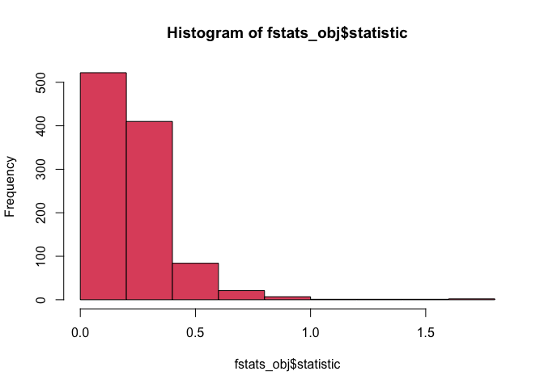
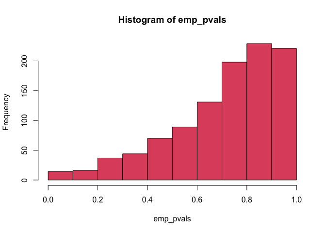
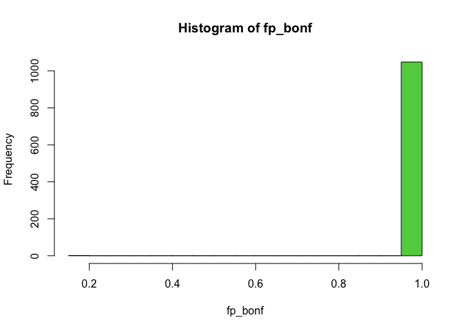

Course link:
<https://www.coursera.org/learn/statistical-genomics?specialization=genomic-data-science>

Continued from Module 3.

---

- [Statistical inference](#statistical-inference)
  - [Comparing model fits under H0/Ha hypotheses and the F-statistic](#comparing-model-fits-under-h0ha-hypotheses-and-the-f-statistic)
  - [Calculating test statistics in R](#calculating-test-statistics-in-r)
  - [Permutation test](#permutation-test)
  - [P-values, multiple testing, and corrections](#p-values-multiple-testing-and-corrections)
- [Other Genomic Experimental Designs](#other-genomic-experimental-designs)
  - [GSEA](#gsea)
  - [eQTL](#eqtl)
  - [Statistical inference vs. prediction](#statistical-inference-vsprediction)
- [The end](#the-end)

---

## Statistical inference

<figure>

<figcaption aria-hidden="true">The central dogma of statistical
inference</figcaption>
</figure>

### Comparing model fits under H0/Ha hypotheses and the F-statistic

As described earlier (in part 1 notes), the model can originally be
expressed as Y = b0 + b1P + b2B + e. This is still the case for Ha,
whereas under H0, we can simplify it to Y = b0 + b2B + e, since **under
H0 we assume that there’s no relationship between the primary
variables** (eg. phenotype, represented by ‘P’ in the expression) **and
the data**.

Now we want to ask, **which model fits better, the one under H0 or the
one under Ha?** Again, this involves optimizing/minimizing overall error
norm. We have the **F-statistic to compare the goodness-of-fit of the
two models**:

<figure>

<figcaption aria-hidden="true">F-stat</figcaption>
</figure>

RSS is just the *residual sum of squares* (i.e. the sum of squared L2
norm of errors). RSS0: RSS under H0; RSS1: RSS
under Ha.

The standardization allows us to come up with a standard form for the
distribution of F-statistic, just like we’re standardizing to SD units
for the t-stat.

**A large F-statistic suggests that Ha fits significantly better than
H0.**

### Calculating test statistics in R

The `genefilter` package lets us compute statistics rapidly for very
simple cases.

    library(Biobase)

    ## Loading required package: BiocGenerics

    ## Loading required package: generics

    ## 
    ## Attaching package: 'generics'

    ## The following objects are masked from 'package:base':
    ## 
    ##     as.difftime, as.factor, as.ordered, intersect, is.element, setdiff,
    ##     setequal, union

    ## 
    ## Attaching package: 'BiocGenerics'

    ## The following objects are masked from 'package:stats':
    ## 
    ##     IQR, mad, sd, var, xtabs

    ## The following objects are masked from 'package:base':
    ## 
    ##     anyDuplicated, aperm, append, as.data.frame, basename, cbind,
    ##     colnames, dirname, do.call, duplicated, eval, evalq, Filter, Find,
    ##     get, grep, grepl, is.unsorted, lapply, Map, mapply, match, mget,
    ##     order, paste, pmax, pmax.int, pmin, pmin.int, Position, rank,
    ##     rbind, Reduce, rownames, sapply, saveRDS, table, tapply, unique,
    ##     unsplit, which.max, which.min

    ## Welcome to Bioconductor
    ## 
    ##     Vignettes contain introductory material; view with
    ##     'browseVignettes()'. To cite Bioconductor, see
    ##     'citation("Biobase")', and for packages 'citation("pkgname")'.

    con =url("http://bowtie-bio.sourceforge.net/recount/ExpressionSets/bottomly_eset.RData")
    load(file=con)
    close(con)
    bot = bottomly.eset
    pdata=pData(bot)
    edata=as.matrix(exprs(bot))
    fdata = fData(bot)

    # Transform and filter the data 
    edata = log2(as.matrix(edata) + 1)
    edata = edata[rowMeans(edata) > 10, ]

    library(genefilter)
    # t-statistic for two-group comparisons
    table(pdata$strain)

    ## 
    ## C57BL/6J   DBA/2J 
    ##       10       11

    tstats_obj = rowttests(edata,pdata$strain)
    names(tstats_obj)

    ## [1] "statistic" "dm"        "p.value"

    hist(tstats_obj$statistic,col=2)

    # F-statistic for multi-group comparisons (the variable has multiple levels)
    table(pdata$lane.number)

    ## 
    ## 1 2 3 5 6 7 8 
    ## 3 3 3 3 3 3 3

    fstats_obj = rowFtests(edata,as.factor(pdata$lane.number))
    names(fstats_obj)

    ## [1] "statistic" "p.value"

    hist(fstats_obj$statistic,col=2)

We can use model-fitting in `limma` and then get the moderated
statistics (we mentioned this in Course 5!! models like `limma` and
`DESeq2` leverage the ‘*borrowing info across genes*’ to stabilize
variance estimates for individual features/genes~~), which is a bit
different from that (unmoderated t-stat) calculated from `genefilter`.
If we want to **adjust for adjustment variables (eg. batch effects,
which includes ‘lane number’ in this example)**, we can see that the
adjusted statistics differ even more (the line doesn’t align well with y
= x).

    library(limma)

    ## 
    ## Attaching package: 'limma'

    ## The following object is masked from 'package:BiocGenerics':
    ## 
    ##     plotMA

    design_matrix = model.matrix(~ pdata$strain)
    fit_limma = lmFit(edata,design_matrix)
    ebayes_limma = eBayes(fit_limma)
    head(ebayes_limma$t)

    ##                    (Intercept) pdata$strainDBA/2J
    ## ENSMUSG00000000131    61.92800          1.4976073
    ## ENSMUSG00000000149    64.22905         -0.0957134
    ## ENSMUSG00000000374    63.86609          1.0079169
    ## ENSMUSG00000000399    60.43678          0.1971028
    ## ENSMUSG00000000532    65.36275          0.8111982
    ## ENSMUSG00000000605    68.58775          0.7960652

    plot(ebayes_limma$t[,2],-tstats_obj$statistic,col=4,
         xlab="Moderated T-stat",ylab="T-stat") # Comparing moderated and unmoderated t-stat
    abline(c(0,1),col="darkgrey",lwd=3)

    # Adjusting for the lane number, and the t-stat is now adjusted as well
    design_adj = model.matrix(~ pdata$strain + as.factor(pdata$lane.number))
    fit_limma_adj = lmFit(edata,design_adj)
    ebayes_limma_adj = eBayes(fit_limma_adj)
    plot(ebayes_limma_adj$t[,2],-tstats_obj$statistic,col=3,
         xlab="Moderated T-stat",ylab="T-stat")
    abline(c(0,1),lwd=3,col="darkgrey")

For multi-group comparisons (eg. with the *primary variable* concerned
here being lane number (not the poor adjustment variable this time),
which is a variable with multiple levels, unlike strain with only two
levels) we can also get the moderated F-stats with `topTable`. Recall
that this function is originally used to display the top genes after
differential analysis, and the `number` argument is by default 10 (so
only show the first 10 differentially expressed genes), but now we set
it to the total number of genes and we don’t want it to be `sort`ed so
that it’s in the same order as the genes originally listed.

    design_lane = model.matrix(~ as.factor(pdata$lane.number))
    fit_limma_lane = lmFit(edata,design_lane)
    ebayes_limma_lane = eBayes(fit_limma_lane) 
    head(ebayes_limma_lane)

    ## An object of class "MArrayLM"
    ## $coefficients
    ##                    (Intercept) as.factor(pdata$lane.number)2
    ## ENSMUSG00000000131    10.41005                  0.0545143060
    ## ENSMUSG00000000149    10.61408                  0.1454876148
    ## ENSMUSG00000000374    10.75881                  0.0321937582
    ## ENSMUSG00000000399    10.11402                  0.0344225239
    ## ENSMUSG00000000532    11.03767                 -0.0186019566
    ## ENSMUSG00000000605    11.52421                  0.0005663883
    ##                    as.factor(pdata$lane.number)3 as.factor(pdata$lane.number)5
    ## ENSMUSG00000000131                    0.02502244                    0.16845444
    ## ENSMUSG00000000149                    0.07844787                    0.03028218
    ## ENSMUSG00000000374                   -0.02460175                    0.05007748
    ## ENSMUSG00000000399                   -0.07170997                    0.08096556
    ## ENSMUSG00000000532                   -0.06720446                    0.04987698
    ## ENSMUSG00000000605                   -0.04501220                    0.14067016
    ##                    as.factor(pdata$lane.number)6 as.factor(pdata$lane.number)7
    ## ENSMUSG00000000131                     0.4768296                    0.31460805
    ## ENSMUSG00000000149                     0.5015973                    0.27483657
    ## ENSMUSG00000000374                     0.3397976                    0.18785304
    ## ENSMUSG00000000399                     0.4317603                    0.02790218
    ## ENSMUSG00000000532                     0.2175589                    0.13148720
    ## ENSMUSG00000000605                     0.3020488                    0.18684754
    ##                    as.factor(pdata$lane.number)8
    ## ENSMUSG00000000131                    0.24748800
    ## ENSMUSG00000000149                    0.17892932
    ## ENSMUSG00000000374                    0.12405261
    ## ENSMUSG00000000399                   -0.00691070
    ## ENSMUSG00000000532                    0.03805285
    ## ENSMUSG00000000605                    0.14277981
    ## 
    ## $rank
    ## [1] 7
    ## 
    ## $assign
    ## [1] 0 1 1 1 1 1 1
    ## 
    ## $qr
    ## $qr
    ##   (Intercept) as.factor(pdata$lane.number)2 as.factor(pdata$lane.number)3
    ## 1  -4.5825757                   -0.65465367                   -0.65465367
    ## 2   0.2182179                    1.60356745                   -0.26726124
    ## 3   0.2182179                   -0.55048054                    1.58113883
    ## 4   0.2182179                   -0.55048054                    0.02550394
    ## 5   0.2182179                    0.07312902                   -0.55182457
    ##   as.factor(pdata$lane.number)5 as.factor(pdata$lane.number)6
    ## 1                   -0.65465367                    -0.6546537
    ## 2                   -0.26726124                    -0.2672612
    ## 3                   -0.31622777                    -0.3162278
    ## 4                    1.54919334                    -0.3872983
    ## 5                   -0.01353907                    -1.5000000
    ##   as.factor(pdata$lane.number)7 as.factor(pdata$lane.number)8
    ## 1                    -0.6546537                    -0.6546537
    ## 2                    -0.2672612                    -0.2672612
    ## 3                    -0.3162278                    -0.3162278
    ## 4                    -0.3872983                    -0.3872983
    ## 5                     0.5000000                     0.5000000
    ## 16 more rows ...
    ## 
    ## $qraux
    ## [1] 1.218218 1.073129 1.025504 1.030459 1.016962 1.023588 1.050336
    ## 
    ## $pivot
    ## [1] 1 2 3 4 5 6 7
    ## 
    ## $tol
    ## [1] 1e-07
    ## 
    ## $rank
    ## [1] 7
    ## 
    ## 
    ## $df.residual
    ## [1] 14 14 14 14 14 14
    ## 
    ## $sigma
    ## ENSMUSG00000000131 ENSMUSG00000000149 ENSMUSG00000000374 ENSMUSG00000000399 
    ##          0.5639945          0.6389817          0.5504535          0.6291873 
    ## ENSMUSG00000000532 ENSMUSG00000000605 
    ##          0.4868058          0.5946154 
    ## 
    ## $cov.coefficients
    ##                               (Intercept) as.factor(pdata$lane.number)2
    ## (Intercept)                     0.3333333                    -0.3333333
    ## as.factor(pdata$lane.number)2  -0.3333333                     0.6666667
    ## as.factor(pdata$lane.number)3  -0.3333333                     0.3333333
    ## as.factor(pdata$lane.number)5  -0.3333333                     0.3333333
    ## as.factor(pdata$lane.number)6  -0.3333333                     0.3333333
    ## as.factor(pdata$lane.number)7  -0.3333333                     0.3333333
    ## as.factor(pdata$lane.number)8  -0.3333333                     0.3333333
    ##                               as.factor(pdata$lane.number)3
    ## (Intercept)                                      -0.3333333
    ## as.factor(pdata$lane.number)2                     0.3333333
    ## as.factor(pdata$lane.number)3                     0.6666667
    ## as.factor(pdata$lane.number)5                     0.3333333
    ## as.factor(pdata$lane.number)6                     0.3333333
    ## as.factor(pdata$lane.number)7                     0.3333333
    ## as.factor(pdata$lane.number)8                     0.3333333
    ##                               as.factor(pdata$lane.number)5
    ## (Intercept)                                      -0.3333333
    ## as.factor(pdata$lane.number)2                     0.3333333
    ## as.factor(pdata$lane.number)3                     0.3333333
    ## as.factor(pdata$lane.number)5                     0.6666667
    ## as.factor(pdata$lane.number)6                     0.3333333
    ## as.factor(pdata$lane.number)7                     0.3333333
    ## as.factor(pdata$lane.number)8                     0.3333333
    ##                               as.factor(pdata$lane.number)6
    ## (Intercept)                                      -0.3333333
    ## as.factor(pdata$lane.number)2                     0.3333333
    ## as.factor(pdata$lane.number)3                     0.3333333
    ## as.factor(pdata$lane.number)5                     0.3333333
    ## as.factor(pdata$lane.number)6                     0.6666667
    ## as.factor(pdata$lane.number)7                     0.3333333
    ## as.factor(pdata$lane.number)8                     0.3333333
    ##                               as.factor(pdata$lane.number)7
    ## (Intercept)                                      -0.3333333
    ## as.factor(pdata$lane.number)2                     0.3333333
    ## as.factor(pdata$lane.number)3                     0.3333333
    ## as.factor(pdata$lane.number)5                     0.3333333
    ## as.factor(pdata$lane.number)6                     0.3333333
    ## as.factor(pdata$lane.number)7                     0.6666667
    ## as.factor(pdata$lane.number)8                     0.3333333
    ##                               as.factor(pdata$lane.number)8
    ## (Intercept)                                      -0.3333333
    ## as.factor(pdata$lane.number)2                     0.3333333
    ## as.factor(pdata$lane.number)3                     0.3333333
    ## as.factor(pdata$lane.number)5                     0.3333333
    ## as.factor(pdata$lane.number)6                     0.3333333
    ## as.factor(pdata$lane.number)7                     0.3333333
    ## as.factor(pdata$lane.number)8                     0.6666667
    ## 
    ## $stdev.unscaled
    ##                    (Intercept) as.factor(pdata$lane.number)2
    ## ENSMUSG00000000131   0.5773503                     0.8164966
    ## ENSMUSG00000000149   0.5773503                     0.8164966
    ## ENSMUSG00000000374   0.5773503                     0.8164966
    ## ENSMUSG00000000399   0.5773503                     0.8164966
    ## ENSMUSG00000000532   0.5773503                     0.8164966
    ## ENSMUSG00000000605   0.5773503                     0.8164966
    ##                    as.factor(pdata$lane.number)3 as.factor(pdata$lane.number)5
    ## ENSMUSG00000000131                     0.8164966                     0.8164966
    ## ENSMUSG00000000149                     0.8164966                     0.8164966
    ## ENSMUSG00000000374                     0.8164966                     0.8164966
    ## ENSMUSG00000000399                     0.8164966                     0.8164966
    ## ENSMUSG00000000532                     0.8164966                     0.8164966
    ## ENSMUSG00000000605                     0.8164966                     0.8164966
    ##                    as.factor(pdata$lane.number)6 as.factor(pdata$lane.number)7
    ## ENSMUSG00000000131                     0.8164966                     0.8164966
    ## ENSMUSG00000000149                     0.8164966                     0.8164966
    ## ENSMUSG00000000374                     0.8164966                     0.8164966
    ## ENSMUSG00000000399                     0.8164966                     0.8164966
    ## ENSMUSG00000000532                     0.8164966                     0.8164966
    ## ENSMUSG00000000605                     0.8164966                     0.8164966
    ##                    as.factor(pdata$lane.number)8
    ## ENSMUSG00000000131                     0.8164966
    ## ENSMUSG00000000149                     0.8164966
    ## ENSMUSG00000000374                     0.8164966
    ## ENSMUSG00000000399                     0.8164966
    ## ENSMUSG00000000532                     0.8164966
    ## ENSMUSG00000000605                     0.8164966
    ## 
    ## $pivot
    ## [1] 1 2 3 4 5 6 7
    ## 
    ## $Amean
    ## ENSMUSG00000000131 ENSMUSG00000000149 ENSMUSG00000000374 ENSMUSG00000000399 
    ##           10.59389           10.78688           10.86015           10.18493 
    ## ENSMUSG00000000532 ENSMUSG00000000605 
    ##           11.08784           11.62820 
    ## 
    ## $method
    ## [1] "ls"
    ## 
    ## $design
    ##   (Intercept) as.factor(pdata$lane.number)2 as.factor(pdata$lane.number)3
    ## 1           1                             0                             0
    ## 2           1                             0                             0
    ## 3           1                             1                             0
    ## 4           1                             1                             0
    ## 5           1                             0                             1
    ##   as.factor(pdata$lane.number)5 as.factor(pdata$lane.number)6
    ## 1                             0                             0
    ## 2                             0                             0
    ## 3                             0                             0
    ## 4                             0                             0
    ## 5                             0                             0
    ##   as.factor(pdata$lane.number)7 as.factor(pdata$lane.number)8
    ## 1                             0                             0
    ## 2                             0                             0
    ## 3                             0                             0
    ## 4                             0                             0
    ## 5                             0                             0
    ## 16 more rows ...
    ## 
    ## $df.prior
    ## [1] Inf
    ## 
    ## $s2.prior
    ## [1] 0.3712874
    ## 
    ## $var.prior
    ## [1] 43.09329698  0.02693331  0.02693331  0.02693331  0.02693331  0.02693331
    ## [7]  0.02693331
    ## 
    ## $proportion
    ## [1] 0.01
    ## 
    ## $s2.post
    ## [1] 0.3712874 0.3712874 0.3712874 0.3712874 0.3712874 0.3712874
    ## 
    ## $t
    ##                    (Intercept) as.factor(pdata$lane.number)2
    ## ENSMUSG00000000131    29.59090                   0.109572353
    ## ENSMUSG00000000149    30.17088                   0.292426363
    ## ENSMUSG00000000374    30.58227                   0.064708626
    ## ENSMUSG00000000399    28.74942                   0.069188388
    ## ENSMUSG00000000532    31.37494                  -0.037389454
    ## ENSMUSG00000000605    32.75796                   0.001138426
    ##                    as.factor(pdata$lane.number)3 as.factor(pdata$lane.number)5
    ## ENSMUSG00000000131                    0.05029447                     0.3385891
    ## ENSMUSG00000000149                    0.15767821                     0.0608664
    ## ENSMUSG00000000374                   -0.04944889                     0.1006544
    ## ENSMUSG00000000399                   -0.14413519                     0.1627387
    ## ENSMUSG00000000532                   -0.13507924                     0.1002515
    ## ENSMUSG00000000605                   -0.09047336                     0.2827434
    ##                    as.factor(pdata$lane.number)6 as.factor(pdata$lane.number)7
    ## ENSMUSG00000000131                     0.9584152                    0.63235409
    ## ENSMUSG00000000149                     1.0081978                    0.55241445
    ## ENSMUSG00000000374                     0.6829844                    0.37757978
    ## ENSMUSG00000000399                     0.8678271                    0.05608267
    ## ENSMUSG00000000532                     0.4372877                    0.26428589
    ## ENSMUSG00000000605                     0.6071103                    0.37555875
    ##                    as.factor(pdata$lane.number)8
    ## ENSMUSG00000000131                    0.49744451
    ## ENSMUSG00000000149                    0.35964332
    ## ENSMUSG00000000374                    0.24934256
    ## ENSMUSG00000000399                   -0.01389033
    ## ENSMUSG00000000532                    0.07648525
    ## ENSMUSG00000000605                    0.28698375
    ## 
    ## $df.total
    ## [1] 14686 14686 14686 14686 14686 14686
    ## 
    ## $p.value
    ##                      (Intercept) as.factor(pdata$lane.number)2
    ## ENSMUSG00000000131 5.710743e-187                     0.9127500
    ## ENSMUSG00000000149 4.504671e-194                     0.7699648
    ## ENSMUSG00000000374 3.482254e-199                     0.9484069
    ## ENSMUSG00000000399 6.995128e-177                     0.9448406
    ## ENSMUSG00000000532 3.320389e-209                     0.9701750
    ## ENSMUSG00000000605 3.193142e-227                     0.9990917
    ##                    as.factor(pdata$lane.number)3 as.factor(pdata$lane.number)5
    ## ENSMUSG00000000131                     0.9598884                     0.7349241
    ## ENSMUSG00000000149                     0.8747125                     0.9514664
    ## ENSMUSG00000000374                     0.9605622                     0.9198262
    ## ENSMUSG00000000399                     0.8853957                     0.8707264
    ## ENSMUSG00000000532                     0.8925511                     0.9201461
    ## ENSMUSG00000000605                     0.9279123                     0.7773775
    ##                    as.factor(pdata$lane.number)6 as.factor(pdata$lane.number)7
    ## ENSMUSG00000000131                     0.3378692                     0.5271654
    ## ENSMUSG00000000149                     0.3133761                     0.5806728
    ## ENSMUSG00000000374                     0.4946275                     0.7057482
    ## ENSMUSG00000000399                     0.3855032                     0.9552767
    ## ENSMUSG00000000532                     0.6619091                     0.7915633
    ## ENSMUSG00000000605                     0.5437871                     0.7072504
    ##                    as.factor(pdata$lane.number)8
    ## ENSMUSG00000000131                     0.6188831
    ## ENSMUSG00000000149                     0.7191191
    ## ENSMUSG00000000374                     0.8030993
    ## ENSMUSG00000000399                     0.9889177
    ## ENSMUSG00000000532                     0.9390341
    ## ENSMUSG00000000605                     0.7741288
    ## 
    ## $lods
    ##                    (Intercept) as.factor(pdata$lane.number)2
    ## ENSMUSG00000000131    427.4202                     -4.614689
    ## ENSMUSG00000000149    444.6176                     -4.613262
    ## ENSMUSG00000000374    457.0181                     -4.614841
    ## ENSMUSG00000000399    403.0626                     -4.614830
    ## ENSMUSG00000000532    481.3855                     -4.614895
    ## ENSMUSG00000000605    525.3936                     -4.614922
    ##                    as.factor(pdata$lane.number)3 as.factor(pdata$lane.number)5
    ## ENSMUSG00000000131                     -4.614873                     -4.612697
    ## ENSMUSG00000000149                     -4.614440                     -4.614851
    ## ENSMUSG00000000374                     -4.614875                     -4.614726
    ## ENSMUSG00000000399                     -4.614519                     -4.614408
    ## ENSMUSG00000000532                     -4.614568                     -4.614727
    ## ENSMUSG00000000605                     -4.614764                     -4.613370
    ##                    as.factor(pdata$lane.number)6 as.factor(pdata$lane.number)7
    ## ENSMUSG00000000131                     -4.597088                     -4.607159
    ## ENSMUSG00000000149                     -4.595187                     -4.608998
    ## ENSMUSG00000000374                     -4.605866                     -4.612154
    ## ENSMUSG00000000399                     -4.600300                     -4.614861
    ## ENSMUSG00000000532                     -4.611210                     -4.613566
    ## ENSMUSG00000000605                     -4.607766                     -4.612184
    ##                    as.factor(pdata$lane.number)8
    ## ENSMUSG00000000131                     -4.610118
    ## ENSMUSG00000000149                     -4.612411
    ## ENSMUSG00000000374                     -4.613715
    ## ENSMUSG00000000399                     -4.614919
    ## ENSMUSG00000000532                     -4.614809
    ## ENSMUSG00000000605                     -4.613323
    ## 
    ## $F
    ## [1]  907.0334  940.3682  953.0907  838.3514  993.4199 1092.6436
    ## 
    ## $F.p.value
    ## [1] 0 0 0 0 0 0

    top_lane = topTable(ebayes_limma_lane, coef=2:7,number=dim(edata)[1],sort.by="none")
    head(top_lane)

    ##                    as.factor.pdata.lane.number.2 as.factor.pdata.lane.number.3
    ## ENSMUSG00000000131                  0.0545143060                    0.02502244
    ## ENSMUSG00000000149                  0.1454876148                    0.07844787
    ## ENSMUSG00000000374                  0.0321937582                   -0.02460175
    ## ENSMUSG00000000399                  0.0344225239                   -0.07170997
    ## ENSMUSG00000000532                 -0.0186019566                   -0.06720446
    ## ENSMUSG00000000605                  0.0005663883                   -0.04501220
    ##                    as.factor.pdata.lane.number.5 as.factor.pdata.lane.number.6
    ## ENSMUSG00000000131                    0.16845444                     0.4768296
    ## ENSMUSG00000000149                    0.03028218                     0.5015973
    ## ENSMUSG00000000374                    0.05007748                     0.3397976
    ## ENSMUSG00000000399                    0.08096556                     0.4317603
    ## ENSMUSG00000000532                    0.04987698                     0.2175589
    ## ENSMUSG00000000605                    0.14067016                     0.3020488
    ##                    as.factor.pdata.lane.number.7 as.factor.pdata.lane.number.8
    ## ENSMUSG00000000131                    0.31460805                    0.24748800
    ## ENSMUSG00000000149                    0.27483657                    0.17892932
    ## ENSMUSG00000000374                    0.18785304                    0.12405261
    ## ENSMUSG00000000399                    0.02790218                   -0.00691070
    ## ENSMUSG00000000532                    0.13148720                    0.03805285
    ## ENSMUSG00000000605                    0.18684754                    0.14277981
    ##                     AveExpr          F   P.Value adj.P.Val
    ## ENSMUSG00000000131 10.59389 0.24640782 0.9609134 0.9998731
    ## ENSMUSG00000000149 10.78688 0.24021306 0.9632994 0.9998731
    ## ENSMUSG00000000374 10.86015 0.13251533 0.9922046 0.9998731
    ## ENSMUSG00000000399 10.18493 0.22209182 0.9698325 0.9998731
    ## ENSMUSG00000000532 11.08784 0.07514637 0.9983859 0.9998731
    ## ENSMUSG00000000605 11.62820 0.12477496 0.9933804 0.9998731

    # Also moderated
    plot(top_lane$F,fstats_obj$statistic,
         xlab="Moderated F-statistic",ylab="F-statistic",col=3)

Likewise, we can also use `edge` to fit a model and then calculate the
stat. Unlike `limma` the calculated results are unmoderated (thus
exactly the same as `genefilter`, as plotted below), but `edge` also
allows users to adjust for other variables.

    library(edge)
    edge_study = build_study(edata, grp = as.factor(pdata$lane.number)) # 'grp' stands for 'group'.
    de_obj = lrt(edge_study)
    qval = qvalueObj(de_obj)
    plot(qval$stat,fstats_obj$statistic,col=4,
          xlab="F-stat from edge",ylab="F-stat from genefilter")

Adjusting the test statistics for lane effects:

    edge_study2 = build_study(edata, grp = as.factor(pdata$lane.number),
                            adj.var=pdata$strain)
    de_obj2 = lrt(edge_study2)
    qval2 = qvalueObj(de_obj2)
    plot(qval2$stat,fstats_obj$statistic,col=4,
          xlab="F-stat from edge",ylab="F-stat from genefilter") # Now a bit different

### Permutation test

<figure>

<figcaption aria-hidden="true">Shuffling labels</figcaption>
</figure>

Randomly **shuffling labels** (eg. case/control, or R/NR on the
screenshot above) to **break the association between the data and the
primary variables but *preserves confounder-outcome associations*.**
This means that after we reshuffle the labels, recalculate the test
statistic for each permutation/reshuffling, and plot the test statistic
for each recalculation, we can see whether the model is incorrect (eg.
we missed a confounder that would bias the model and should have
adjusted for it) **if the plotted distribution for the recalculated
t-stats after permutations violates the null distribution for t-stats**,
i.e. not showing the t-distribution with (n - 1) degrees of freedom. So
this plot can be used as a **diagnostic plot that signals problems for
the model,** i.e. indicating unaccounted variables or violated
assumptions.

    # Plotting the distribution for t-stats before shuffling
    hist(tstats_obj$statistic,col=2,xlim=c(-5,2))

    # **Permute the sample labels using `sample()` function!!!**
    set.seed(135)
    strain = pdata$strain
    strain0 = sample(strain)
    tstats_obj0 = rowttests(edata,strain0)
    # Plot again and compare the quantiles for the two distributions
    hist(tstats_obj0$statistic,col=2,xlim=c(-5,2))

    qqplot(tstats_obj0$statistic,tstats_obj$statistic,col=3)
    abline(c(0,1))

### P-values, multiple testing, and corrections

The P-value: basically a hypothesis testing tool. Its distribution can
be seen as concatenating two parts: for true H0, P-values should be
uniformly distributed; for true Ha, P-values should peak near 0. And so
they almost always go to zero with the sample size…

<figure>

<figcaption aria-hidden="true">P-value distribution</figcaption>
</figure>

Plotting a histogram for the calculated p-values can also be used as a
diagnostic plot to reveal model problems, like the one we did for
t-stats after permutation. If we get a distribution that peaks near 0
and near-uniform for the rest of the region, this probably implies that
the model fits well.

**Multiple testing**: this occurs when we perform many hypothesis tests
simultaneously, eg. testing 20,000 genes for differential expressions
between case/control. If each test has a 5% false positive/Type I error
rate (alpha = 0.05), we’d expect 1,000 false positives *by chance
alone*.

To control false positives, we define three error rates and the
corresponding **corrections to the significance threshold**

-   Type I error (alpha). If we simply take this into account and use
    the *uncorrected* p-value, the number of tests that we call
    ‘significant’ would be far more than FWER and FDR, so only this is
    rarely applied.

-   Family-wise error rate (FWER): the probability of **&gt;= 1** false
    positives **across all tests**.

    -   Bonferroni correction: adjust significance threshold to
        `Type I error rate (alpha, usually just that 0.05)/total number of tests`.
        Super strict, applied when any false positive is unacceptable or
        highly undesirable (eg. clinical trials, GWAS).

-   False discovery rate (FDR): the expected proportion of false
    positives among all significant results.

    -   Benjamini-Hochberg correction: **ranks** p-values calculated for
        *each* test, and adjust significance thresholds (**q-value** is
        just the FDR-adjusted p-value). Apparently less strict then
        FWER, typically used for quantitative measurements eg. gene
        expression variation, where we expect to see *a relatively large
        number of discoveries/signals and want to quantify the
        percentage of them that are false positives.*

    -   **Sometimes when we print the results of some analysis using
        some package, stuff like `padj` (alongside p-value) is just the
        FDR-adjusted p-value (or q-value)!**

In genomic studies, try to analyze the data once (or report all
analyses), since we might otherwise run into extra false positives.

    # Recall that the `rowttests` and `rowFtests` functions of the `genefilter` package also calculate the `p.value` alongside the test statistics. We can extract them and plot the distribution. 
    fstats_obj = rowFtests(edata,as.factor(pdata$strain))
    hist(fstats_obj$p.value,col=2)

    # This distribution doesn't rlly align with the expected distribution for p-values we mentioned above, so we can infer that there should be other adjustment variables modeled as well. 
    # Adjusting for variables isn't supported by `genefilter`, so we can use `edge` or `limma` (moderated stats) to do so.

    # Using edge:
    edge_study = build_study(edata, grp = pdata$strain, 
                             adj.var = as.factor(pdata$lane.number))
    de_obj = lrt(edge_study)
    qval = qvalueObj(de_obj)
    hist(qval$pvalues,col=3)

    # Using limma:
    mod = model.matrix(~ pdata$strain + pdata$lane.number)
    fit_limma = lmFit(edata,mod)
    ebayes_limma = eBayes(fit_limma)
    limma_pvals = topTable(ebayes_limma,number=dim(edata)[1])$P.Value

    ## Removing intercept from test coefficients

    # Still doesn't really match the expected distribution...
    hist(limma_pvals,col=4)

**Empirical permutation p-values**: often when we permute we want to
calculate an empirical p-value. To do this we can compare each observed
statistic to the permuted statistics.

-   We can either compare within a single gene (argument `pooled=FALSE`
    in the `empPvals` function) or pooling the permuted statistics
    across multiple genes (`pooled=TRUE`, the default).

<!-- -->

    set.seed(3333)
    B = 1000
    tstats_obj = rowttests(edata,pdata$strain)
    tstat0 = matrix(NA,nrow=dim(edata)[1],ncol=B)
    tstat = tstats_obj$statistic
    strain = pdata$strain
    for(i in 1:B){
      strain0 = sample(strain)
      tstat0[,i] = rowttests(edata,strain0)$statistic
    }
    library(qvalue)
    emp_pvals = empPvals(tstat,tstat0)
    hist(emp_pvals,col=2)

**Adjusting p-values to control false positives**:

    fp_bonf = p.adjust(fstats_obj$p.value,method="bonferroni")
    hist(fp_bonf,col=3)

    quantile(fp_bonf)

    ##        0%       25%       50%       75%      100% 
    ## 0.1791152 1.0000000 1.0000000 1.0000000 1.0000000

    sum(fp_bonf < 0.05) # None is considered as significant 

    ## [1] 0

    fp_bh = p.adjust(fstats_obj$p.value,method="BH")
    hist(fp_bh,col=3)

    quantile(fp_bh)

    ##        0%       25%       50%       75%      100% 
    ## 0.1791152 0.8178625 0.8558812 0.9011016 0.9991666

    sum(fp_bonf < 0.05) # Again, sadly

    ## [1] 0

    # Using limma:
    limma_pvals_adj = topTable(ebayes_limma,number=dim(edata)[1])$adj.P.Val

    ## Removing intercept from test coefficients

    hist(limma_pvals_adj,col=2)

    quantile(limma_pvals_adj)

    ##          0%         25%         50%         75%        100% 
    ## 0.002770085 0.923682815 0.923682815 0.923682815 0.996015322

    sum(fp_bonf < 0.05)

    ## [1] 0

We can also directly get the q-values (the assigned threshold when
correcting for FDR).

    qval_limma = qvalue(limma_pvals)
    summary(qval_limma)

    ## 
    ## Call:
    ## qvalue(p = limma_pvals)
    ## 
    ## pi0: 0.3798397   
    ## 
    ## Cumulative number of significant calls:
    ## 
    ##           <1e-04 <0.001 <0.01 <0.025 <0.05 <0.1   <1
    ## p-value        2      2     4      7    21   41 1049
    ## q-value        0      0     2      2     2    2 1049
    ## local FDR      0      0     1      2     2    2    2

    qval$pi0

    ## [1] 1

    # Or using edge,
    qval = qvalueObj(de_obj)
    summary(qval)

    ## 
    ## Call:
    ## qvalue(p = pval)
    ## 
    ## pi0: 1   
    ## 
    ## Cumulative number of significant calls:
    ## 
    ##           <1e-04 <0.001 <0.01 <0.025 <0.05 <0.1   <1
    ## p-value        0      0     1      2     8   20 1049
    ## q-value        0      0     0      0     0    0 1049
    ## local FDR      0      0     0      0     0    0    0

## Other Genomic Experimental Designs

### GSEA

Gene Set Enrichment Analysis. (Got a much more solid understanding of
this through the TCGA practice session, niceeee)

-   ‘Gene set’: a **predefined** set of genes (eg. from a
    pathway/functional category eg. KEGG or GO) *in a list of genes of
    interest (eg. differentially expressed (DE) genes we obtained in an
    experiment)*.

-   ‘Enrichment’: “are genes in this predefined set more frequently
    observed in my results *than expected by random chance?*” Returns
    the gene **sets** or pathways.

    -   Quantified by comparing the observed overlap between the gene
        set and DEGs to a null distribution (random expectation). Common
        metrics include (corrected) p-values and Enrichment Score (ES).

    -   Permutation tests are applied: randomly shuffling labels of the
        phenotype data and then recalculating ES.

Here we’ll use the `goseq` package for GSEA. It is specifically designed
for **RNA-seq data** and is remarkable in being able to correct for
**length bias** by *weighting genes based on their length*.

-   **In RNA-seq, longer genes are more likely to be detected as
    differentially expressed.** This is due to: 1. longer genes -&gt;
    more transcript fragments (since these fragmented short reads are
    typically all 100-150bp) -&gt; more reads mapped; 2. more reads
    -&gt; lower variance in count estimates (reduced SE due to ‘large
    numbers’) -&gt; *higher likelihood of passing significance
    thresholds*.

<!-- -->

    library(goseq)

    ## Loading required package: BiasedUrn

    ## Loading required package: geneLenDataBase

    ## 

    library(DESeq2)

    ## Loading required package: S4Vectors

    ## Loading required package: stats4

    ## 
    ## Attaching package: 'S4Vectors'

    ## The following object is masked from 'package:geneLenDataBase':
    ## 
    ##     unfactor

    ## The following object is masked from 'package:utils':
    ## 
    ##     findMatches

    ## The following objects are masked from 'package:base':
    ## 
    ##     expand.grid, I, unname

    ## Loading required package: IRanges

    ## Loading required package: GenomicRanges

    ## Loading required package: GenomeInfoDb

    ## Loading required package: SummarizedExperiment

    ## Loading required package: MatrixGenerics

    ## Loading required package: matrixStats

    ## 
    ## Attaching package: 'matrixStats'

    ## The following objects are masked from 'package:genefilter':
    ## 
    ##     rowSds, rowVars

    ## The following objects are masked from 'package:Biobase':
    ## 
    ##     anyMissing, rowMedians

    ## 
    ## Attaching package: 'MatrixGenerics'

    ## The following objects are masked from 'package:matrixStats':
    ## 
    ##     colAlls, colAnyNAs, colAnys, colAvgsPerRowSet, colCollapse,
    ##     colCounts, colCummaxs, colCummins, colCumprods, colCumsums,
    ##     colDiffs, colIQRDiffs, colIQRs, colLogSumExps, colMadDiffs,
    ##     colMads, colMaxs, colMeans2, colMedians, colMins, colOrderStats,
    ##     colProds, colQuantiles, colRanges, colRanks, colSdDiffs, colSds,
    ##     colSums2, colTabulates, colVarDiffs, colVars, colWeightedMads,
    ##     colWeightedMeans, colWeightedMedians, colWeightedSds,
    ##     colWeightedVars, rowAlls, rowAnyNAs, rowAnys, rowAvgsPerColSet,
    ##     rowCollapse, rowCounts, rowCummaxs, rowCummins, rowCumprods,
    ##     rowCumsums, rowDiffs, rowIQRDiffs, rowIQRs, rowLogSumExps,
    ##     rowMadDiffs, rowMads, rowMaxs, rowMeans2, rowMedians, rowMins,
    ##     rowOrderStats, rowProds, rowQuantiles, rowRanges, rowRanks,
    ##     rowSdDiffs, rowSds, rowSums2, rowTabulates, rowVarDiffs, rowVars,
    ##     rowWeightedMads, rowWeightedMeans, rowWeightedMedians,
    ##     rowWeightedSds, rowWeightedVars

    ## The following objects are masked from 'package:genefilter':
    ## 
    ##     rowSds, rowVars

    ## The following object is masked from 'package:Biobase':
    ## 
    ##     rowMedians

    # Here we load the example from the `goseq` package. 
    temp_data =read.table(system.file("extdata","Li_sum.txt",
                                         package="goseq"),sep="\t",
                                         header=TRUE,
                                         stringsAsFactors=FALSE)

    head(temp_data)

    ##             genes lane1 lane2 lane3 lane4 lane5 lane6 lane8
    ## 1 ENSG00000215688     0     0     0     0     0     0     0
    ## 2 ENSG00000215689     0     0     0     0     0     0     0
    ## 3 ENSG00000220823     0     0     0     0     0     0     0
    ## 4 ENSG00000242499     0     0     0     0     0     0     0
    ## 5 ENSG00000224938     0     0     0     0     0     0     0
    ## 6 ENSG00000239242     0     0     0     0     0     0     0

    # We process the data: the first column is just the gene IDs, so we set it as the row name and remove that column.
    edata = temp_data[,-1]
    rownames(edata) = temp_data[,1]
    # Filter the data
    edata = edata[rowMeans(edata) > 5,]

    # We manually set the group variable up and create a pdata with that variable
    grp=factor(rep(c("Control","Treated"),times=c(4,3)))
    pdata  = data.frame(grp)

    # And then (exactly the same as what we did in Course 5  when learning how to run a differential analysis~~~~) we'll pass the data to a DESeq data container (the DESeqDataSet thingy), fit the model, and obtain the results.
    setOldClass("ExpData") # to circumvent the very recent error... the error wasn't there when I was still taking the course but it can't properly execute and knit anymore in May
    de = DESeqDataSetFromMatrix(edata, pdata, ~grp)
    de_fit = DESeq(de)

    ## estimating size factors

    ## estimating dispersions

    ## gene-wise dispersion estimates

    ## mean-dispersion relationship

    ## final dispersion estimates

    ## fitting model and testing

    de_results = results(de_fit)

    # So the `padj` column is just the p-values corrected for FDR. And then we'll filter the genes to only keep those that pass the threshold to be differentially expressed. 
    genes = as.integer(de_results$padj < 0.05)
    names(genes) = rownames(edata) # Identifying the genes using the ENSEMBL IDs. Recall in Course 5 we mentioned that the results for a DESeq2-performed differential analysis aren't ordered; this is actually quite nice here since we want to retain the order for these genes and then apply their names >w<
    not_na = !is.na(genes) 
    genes = genes[not_na] 

    # Preview some of the automatically supported genomes
    #head(supportedGenomes())
    #head(supportedGeneIDs())

    # As described earlier, for `goseq` (which corrects for RNA-seq length bias) we need to set up a **weighting** function for all the genes in that genome. 
    # `nullp` function of `goseq` calculates a 'Probability Weighting Function` for a set of genes based on a given set of biased data, usually gene length.
    pwf=nullp(genes,"hg19","ensGene")

    ## Loading hg19 length data...

    ## Warning in pcls(G): initial point very close to some inequality constraints

    head(pwf)

    ##                 DEgenes bias.data       pwf
    ## ENSG00000124208       0      1978 0.2276789
    ## ENSG00000224628       0      1510 0.2176689
    ## ENSG00000125835       0       954 0.2050611
    ## ENSG00000125834       0      6013 0.2874471
    ## ENSG00000197818       0      6295 0.2898591
    ## ENSG00000101181       0      2644 0.2431052

    # Now we can finally run the GSEA. We apply the `goseq` function to the probability weighting function we've obtained for these genes, the genome we're looking at (hg19), and tell it that we identify genes using their ENSEMBL IDs.
    # And then `goseq` will go and fetch the GO annotations from the web.

    library(org.Hs.eg.db) # This is a Bioconductor package that provides genome-wide annotations for humans.

    ## Loading required package: AnnotationDbi

    ## 

    GO.wall=goseq(pwf,"hg19","ensGene") # We can also limit this to a particular GO category (recall that there are molecular function (MF), cellular component (CC), and biological process (BP) in GO) by setting the argument eg. test.cats=c("GO:MF").

    ## Fetching GO annotations...

    ## For 1984 genes, we could not find any categories. These genes will be excluded.

    ## To force their use, please run with use_genes_without_cat=TRUE (see documentation).

    ## This was the default behavior for version 1.15.1 and earlier.

    ## Calculating the p-values...

    ## 'select()' returned 1:1 mapping between keys and columns

    head(GO.wall)

    ##         category over_represented_pvalue under_represented_pvalue numDEInCat
    ## 2111  GO:0005615            2.494187e-18                        1        491
    ## 2092  GO:0005576            9.869601e-16                        1        545
    ## 12725 GO:0070062            8.138283e-15                        1        412
    ## 9146  GO:0043230            1.773783e-14                        1        414
    ## 12697 GO:0065010            1.773783e-14                        1        414
    ## 16939 GO:1903561            1.773783e-14                        1        414
    ##       numInCat                                     term ontology
    ## 2111      1424                      extracellular space       CC
    ## 2092      1655                     extracellular region       CC
    ## 12725     1207                    extracellular exosome       CC
    ## 9146      1219                  extracellular organelle       CC
    ## 12697     1219 extracellular membrane-bounded organelle       CC
    ## 16939     1219                    extracellular vesicle       CC

### eQTL

Expression Quantitative Trait Loci or eQTL is one of the most common
integrative analyses in genomics. It tries to identify variations in DNA
(eg. SNPs) that correlate with variations in the expression levels of
the corresponding RNA. So we can think of it as *performing a gene
expression microarray analysis for every single SNP*. If the expression
differences pass the significance threshold we’ll classify it as an
eQTL.

We can use the `MatrixETQL` package for illustration. We have to load
three files: SNP data, expression data, and covariate data (everything
that you might want to *adjust for*). eQTL truly is **combing different
genomic data types**.

    library(MatrixEQTL)
    # Download the data
    base.dir = find.package("MatrixEQTL")
    SNP_file_name = paste(base.dir, "/data/SNP.txt", sep="");
    expression_file_name = paste(base.dir, "/data/GE.txt", sep="")
    covariates_file_name = paste(base.dir, "/data/Covariates.txt", sep="")
    output_file_name = tempfile()

    # Load it and get a preview for the first gene
    expr = read.table(expression_file_name,sep="\t",
                      header=T,row.names=1)
    expr[1,]

    ##         Sam_01 Sam_02 Sam_03 Sam_04 Sam_05 Sam_06 Sam_07 Sam_08 Sam_09 Sam_10
    ## Gene_01   4.91   4.63   5.18   5.07   5.74   5.09   5.31   5.29   4.73   5.72
    ##         Sam_11 Sam_12 Sam_13 Sam_14 Sam_15 Sam_16
    ## Gene_01   4.75   4.54   5.01   5.03   4.84   4.44

    snps = read.table(SNP_file_name,sep="\t",
                      header=T,row.names=1)
    snps[1,]

    ##        Sam_01 Sam_02 Sam_03 Sam_04 Sam_05 Sam_06 Sam_07 Sam_08 Sam_09 Sam_10
    ## Snp_01      2      0      2      0      2      1      2      1      1      1
    ##        Sam_11 Sam_12 Sam_13 Sam_14 Sam_15 Sam_16
    ## Snp_01      2      2      1      2      2      1

    cvrt = read.table(covariates_file_name,sep="\t",
                      header=T,row.names=1)
    # The simplest eQTL analysis just computes linear regression models for each SNP/gene pair.
    e1 = as.numeric(expr[1,]) # Extract the info we just previewed to fit a linear model as variables
    s1 = as.numeric(snps[1,])
    lm1 = lm(e1 ~ s1) 
    # tidy(lm1) We can see that the p-value is too big so it's prob not so correlated
    plot(e1 ~ jitter(s1),
         col=(s1+1),xaxt="n",xlab="Genotype",ylab="Expression")
    axis(1,at=c(0:2),labels=c("AA","Aa","aa")) # We have assumed an 'additive' model for the genotype rather than 'dominant' (after all, it's SNP!!)
    lines(lm1$fitted ~ s1,type="b",pch=15,col="darkgrey")

The simplest eQTL analysis just computes **linear regression models for
each SNP/gene pair**. We can fit many eQTL models with `MatrixEQTL`
(just like we can fit only one gene with the regular `lm` function but
we’ll use the `limma` package to fit many linear models for many genes
or otherwise it’s gonna take a long~~ time~~).

    # Set up parameters
    pvOutputThreshold = 1e-2 # it's basically going to throw away everything above the threshold, which will save a lot of computational time and space
    errorCovariance = numeric()
    useModel = modelLINEAR # tell it to just use the standard 'additive' model

    # Set up the files for MatrixEQTL
    snps = SlicedData$new()
    snps$fileDelimiter = "\t"     # the TAB character
    snps$fileOmitCharacters = "NA" # denote missing values;
    snps$fileSkipRows = 1          # one row of column labels
    snps$fileSkipColumns = 1       # one column of row labels
    snps$fileSliceSize = 2000     # It's going to break the files up into chunks to compute more easily (in this case break the file in chunks of 2000 rows); the bigger the chunks the faster it can compute, but the slower it takes to load more data in, so there's a balance/compromise there
    snps$LoadFile( SNP_file_name )

    ## Rows read: 15 done.

    gene = SlicedData$new()
    gene$fileDelimiter = "\t"      
    gene$fileOmitCharacters = "NA" 
    gene$fileSkipRows = 1          
    gene$fileSkipColumns = 1      
    gene$fileSliceSize = 2000      
    gene$LoadFile(expression_file_name)

    ## Rows read: 10 done.

    cvrt = SlicedData$new()

    # Pass the parameters and the data objects to the function 
    me = Matrix_eQTL_engine(
        snps = snps,
        gene = gene,
        cvrt = cvrt,
        output_file_name = NULL,
        pvOutputThreshold = pvOutputThreshold,
        useModel = useModel, 
        errorCovariance = errorCovariance, 
        verbose = TRUE,
        pvalue.hist = TRUE,
        min.pv.by.genesnp = FALSE,
        noFDRsaveMemory = FALSE)

    ## Processing covariates

    ## Task finished in 0.001 seconds

    ## Processing gene expression data (imputation, residualization)

    ## Task finished in 0.001 seconds

    ## Creating output file(s)

    ## Task finished in 0.005 seconds

    ## Performing eQTL analysis

    ## 100.00% done, 1 eQTLs

    ## Task finished in 0.004 seconds

    ## 

    plot(me) # plot all the p-values from the tests; when running the function we set the argument `pvalue.hist` to be TRUE.

    # Check the number and type of eQTLs
    me$all$neqtls # Only one passed the significant threshold we set

    ## [1] 1

    me$all$eqtls

    ##     snps    gene statistic     pvalue FDR       beta
    ## 1 Snp_11 Gene_06 -3.007106 0.00941791   1 -0.2916667

### Statistical inference vs. prediction

Both of these have their ‘central dogmas’ to keep in mind and are quite
different. The latter is very similar to ML that we’ve covered before.

## The end

AND BAM we made it!!!!!

Hopefully this kaomoji will work…

                 /\_____/\
              >| ˶ • ᴛ • ˶ |< 
               /   𝇌☆𝇋   \
          KEEP UP the good work~~
