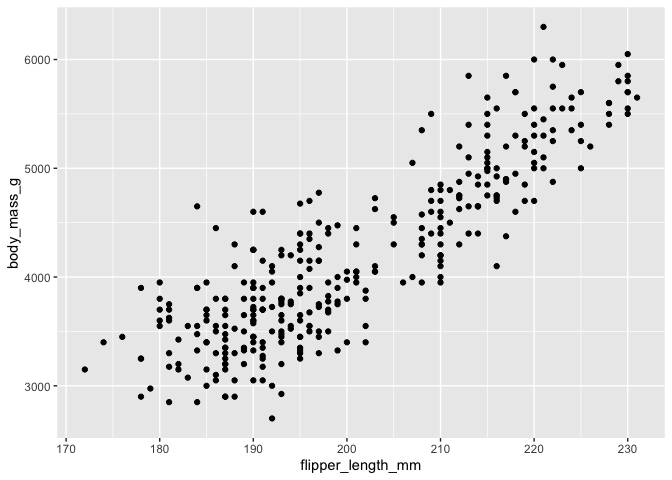
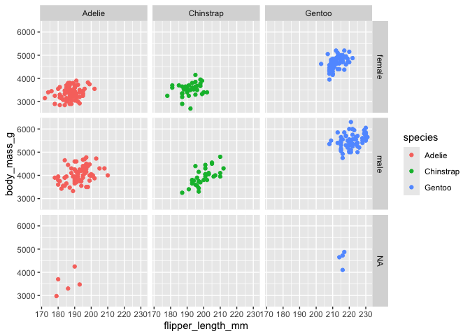

Sources: [R Tutorial on
W3Schools](https://w3schools.tech/tutorial/r/index) and [Google Data
Analytics](https://www.coursera.org/professional-certificates/google-data-analytics)
Course 7. I also added a few notes while taking JHU’s [Genomic Data
Science
Specialization](https://www.coursera.org/specializations/genomic-data-science).

Date created: 2025-04-21

---

- [RStudio](#rstudio)
- [R Basics](#r-basics)
  - [Variables](#variables)
    - [Finding variables](#finding-variables)
  - [Data structure overview](#data-structure-overview)
  - [Operators](#operators)
    - [Arithmetic](#arithmetic)
    - [Relational](#relational)
    - [Logical](#logical)
    - [Miscellaneous](#miscellaneous)
  - [Conditional and loop control statements](#conditional-and-loop-control-statements)
  - [Functions](#functions)
    - [Defining a function](#defining-a-function)
  - [Strings](#strings)
  - [Vectors](#vectors)
  - [Lists](#lists)
  - [Matrices](#matrices)
  - [Arrays](#arrays)
  - [Factor](#factor)
  - [Packages](#packages)
  - [Data frames](#data-frames)
- [Course Notes](#course-notes)
  - [Dealing with data in R](#dealing-with-data-in-r)
    - [‘ToothGrowth’ exploration](#toothgrowth-exploration)
    - [‘diamonds’ exploration](#diamonds-exploration)
    - [Other quick overviews, cleaning, and organization of data](#other-quick-overviews-cleaning-and-organization-of-data)
  - [Visualization in R](#visualization-in-r)
    - [Basic grammar for plotting in ggplot2](#basic-grammar-for-plotting-in-ggplot2)
    - [More about aesthetics](#more-about-aesthetics)
    - [More about geom functions](#more-about-geom-functions)
    - [Facets, labels and annotations](#facets-labels-and-annotations)
    - [Saving our viz](#saving-our-viz)

---

## RStudio

‘Tools’ menu -&gt; **‘Keyboard Shortcuts Help’ (Alt + Shift + K)**

-   4 panes, ‘View’ menu -&gt; ‘Panes’ -&gt; ‘Show All Panes’.

    -   The ‘History’ pane on the right allows us to copy any executed
        line directly to the console by double-clicking it.

    -   When we have questions about a function/package, type a question
        mark before it (eg. `?print`) to return a page in the ‘Help’
        pane.

## R Basics

### Variables

-   To assign values, the typical way is via `<-` rather than `=` (the
    latter passes arguments to functions, though it can also be used for
    assignment).

    -   You can also assign multiple variables in one line:
        `x <- y <- z <- 10`

    -   There’s even the ‘right assignment’: `20 -> y`.

-   Add an L to explicitly assign an integer value. `my_integer <- 42L`;
    `my_number <- 42.5` (“numeric” types are floats that contain
    decimals).

-   `rnorm(n)` returns n random numbers.

-   To check what type of data a variable holds, use the `class()`
    function. Note that Boolean types are called “logical”.

<!-- -->

    test <- TRUE
    random = rnorm(3)
    print(class(test))

    ## [1] "logical"

    print(random)

    ## [1]  1.5545639 -0.5276335  0.1268885

    print(class(random))

    ## [1] "numeric"

#### Finding variables

-   The `ls()` function lists all variables in ur current environment.

-   To check if a specific variable exists, use the `exists()` function.

-   The `rm()` function removes variables.

<!-- -->

    print(ls())

    ## [1] "random" "test"

    rm(list = ls()) # Remove all and start with a clean state. Caution!!!
    print(ls())

    ## character(0)

### Data structure overview

-   Vectors: `c(x, y, z, ...)`. Simplest and most fundamental data
    structures in R, each containing a single piece of data of the
    **same type**, use `[]` to access.

<!-- -->

    x = c(1,3,5)
    names(x) = letters[4:6] # We can name the elements of a vector object.
    print(x)

    ## d e f 
    ## 1 3 5

    print(x[c('d','f')])

    ## d f 
    ## 1 5

-   Lists can contain **different types of data**. The feeling is sort
    of like `dict` in Python as we get to name the elements (like having
    keys for values). We can also directly create a list without having
    the elements named:
    `my_first_list <- list("apple", 42, TRUE, c(1, 2, 3))`.

<!-- -->

    my_list <- list(
      name = "Alice",
      age = 30,
      likes = c("pizza", "coding", "cats")
    )

    print(my_list[2]) # Returns a separated list

    ## $age
    ## [1] 30

    # VALUES of elements are accessed using [[]] or $.
    print(my_list$name)  

    ## [1] "Alice"

    print(paste(my_list[[2]],"since the index in R starts from 1!!!!! not 0!!!!"))  

    ## [1] "30 since the index in R starts from 1!!!!! not 0!!!!"

    # paste() or paste0() are for concatenation of strings; note that the former inserts spaces between elements.
    print(my_list[["likes"]][2])  

    ## [1] "coding"

    print(paste("also", my_list[[3]][2]))  

    ## [1] "also coding"

-   Matrices: rows and columns **all filled with the same type of
    data**.

<!-- -->

    my_matrix <- matrix(1:9, nrow = 3, ncol = 3)
    print(my_matrix[2, 3])

    ## [1] 8

    # Set rownames
    rownames(my_matrix) = letters[1:3]
    print(my_matrix)

    ##   [,1] [,2] [,3]
    ## a    1    4    7
    ## b    2    5    8
    ## c    3    6    9

    print(my_matrix['a',]) # Returns a *vector*

    ## [1] 1 4 7

    print(my_matrix['a', , drop=FALSE]) # Returns a *matrix* with only one row.

    ##   [,1] [,2] [,3]
    ## a    1    4    7

-   Arrays: stacked matrices. Note that the values from the specified
    sequence are arranged vertically down the column!! Or we can add
    argument `byrow = True`.

<!-- -->

    my_array <- array(2:13, dim = c(2,3,2))
    print(my_array)

    ## , , 1
    ## 
    ##      [,1] [,2] [,3]
    ## [1,]    2    4    6
    ## [2,]    3    5    7
    ## 
    ## , , 2
    ## 
    ##      [,1] [,2] [,3]
    ## [1,]    8   10   12
    ## [2,]    9   11   13

    print(my_array[1,2,2])

    ## [1] 10

-   Factors: a data structure that stores **categorical data** where the
    data values are limited and usually based on a finite group. Think
    of them as **labels**.

<!-- -->

    sizes <- factor(c("small", "medium", "large", "medium", "small"))
    print(sizes)

    ## [1] small  medium large  medium small 
    ## Levels: large medium small

    print(levels(sizes))

    ## [1] "large"  "medium" "small"

-   Data frames: unlike matrices (store the same type of data), they are
    capable of holding **different types of data in each column**. Rlly
    just a list where each element in the list is of the same length (an
    example that illustrates this can be seen in one code chunk below
    with `as.list(df)`)

<!-- -->

    students <- data.frame(
      name = c("Alice", "Bob", "Charlie"),
      age = c(22, 25, 23),
      age2 = c(22, "25", 23),  # Testing whether the same column allows for different data types. Ooooh so it coerces to <chr> automatically.
      grade = c("A", "B", "A")
    )

    print(students)

    ##      name age age2 grade
    ## 1   Alice  22   22     A
    ## 2     Bob  25   25     B
    ## 3 Charlie  23   23     A

    print(students$age)

    ## [1] 22 25 23

    print(students$age2)

    ## [1] "22" "25" "23"

    print(students[['name']]) # Can also be accessed like this, same as lists. Column-oriented. 

    ## [1] "Alice"   "Bob"     "Charlie"

    print(students[students$age >=23, ])

    ##      name age age2 grade
    ## 2     Bob  25   25     B
    ## 3 Charlie  23   23     A

    # If we omit comma here, R treats it as column subsetting, not row subsetting!!! (since we use [rows, columns] to access elements)
    print(students[students$age >=23])

    ##   age age2
    ## 1  22   22
    ## 2  25   25
    ## 3  23   23

-   Regarding the output of `print(students[students$age >=23])`: it is
    actually interpreted as `students[, c(FALSE, TRUE, TRUE)]` so
    instead of rows the columns with index 2 and 3 are selected OvO!

    -   Recall that a column in a spreadsheet can be considered as a
        feature/attribute. So it’s pretty intuitive for this default
        indexing (by column -&gt; by **header**!!).

-   We can use the `as.something()` function to convert between data
    structures. Or use the more general `as(object, "data_structure)`
    function inside the `methods` package.

<!-- -->

    print(as.matrix(students))

    ##      name      age  age2 grade
    ## [1,] "Alice"   "22" "22" "A"  
    ## [2,] "Bob"     "25" "25" "B"  
    ## [3,] "Charlie" "23" "23" "A"

    print(as.list(students))

    ## $name
    ## [1] "Alice"   "Bob"     "Charlie"
    ## 
    ## $age
    ## [1] 22 25 23
    ## 
    ## $age2
    ## [1] "22" "25" "23"
    ## 
    ## $grade
    ## [1] "A" "B" "A"

    library(methods)
    as(students, "matrix")

    ##      name      age  age2 grade
    ## [1,] "Alice"   "22" "22" "A"  
    ## [2,] "Bob"     "25" "25" "B"  
    ## [3,] "Charlie" "23" "23" "A"

------------------------------------------------------------------------

<figure>

<figcaption aria-hidden="true">Screenshot from w3schools</figcaption>
</figure>

------------------------------------------------------------------------

### Operators

#### Arithmetic

-   Modulus: `%%`

-   Integer division: `%/%`

-   Exponentiation: `^`

#### Relational

Same as Python.

#### Logical

-   Element-wise AND:

<!-- -->

    c(TRUE, FALSE, TRUE) & c(TRUE, TRUE, FALSE)

    ## [1]  TRUE FALSE FALSE

-   Likewise, element-wise OR:

<!-- -->

    c(TRUE, TRUE, FALSE) | c(FALSE, TRUE, FALSE)

    ## [1]  TRUE  TRUE FALSE

#### Miscellaneous

R also has some special operators that don’t fit neatly into the other
categories.

    # Checks if an element is in a vector (similar to Python but with % around)
    5 %in% c(1, 3, 5)

    ## [1] TRUE

    "cat" %in% c("goose", "duck")

    ## [1] FALSE

    # Creates a sequence. Unlike Python you can't specify the stride since it's either 1 (or -1 for descending sequences). (To explicitly customize the stride, use the function seq(from, to , by = stride) via the 'by' argument.)
    1:5

    ## [1] 1 2 3 4 5

    class(1:5)

    ## [1] "integer"

    # Matrix multiplication
    matrix(1:4, 2, 2) %*% matrix(5:8, 2, 2)

    ##      [,1] [,2]
    ## [1,]   23   31
    ## [2,]   34   46

    matrix(1:4, 2, 2)

    ##      [,1] [,2]
    ## [1,]    1    3
    ## [2,]    2    4

    # Again, note that when creating a matrix, the values are arranged vertically. 

### Conditional and loop control statements

ok the way these are written is so extremely similar to Java (except no
semicolons)

    a <- -2L
    b <- FALSE
    if (a >= 0 & b) {
      print("1")
    } else if (!b) {
      print("2")
    } else if (a < 0) {
      print("3")
    } else {
      print("4")
    }

    ## [1] "2"

-   `switch` statement: a more readable alternative to a long
    `if-else if` chain. And it’s even more succinct in R with no
    `break`s!!!

<!-- -->

    day <- '1'
    switch(day,
      '1' = "Monday",
      '5' = "Friday",
    )

    ## [1] "Monday"

-   R has a nifty function `ifelse()` that combines an `if-else`
    statement into **a single line**:

<!-- -->

    x <- 10
    ifelse(x > 5, "Greater than 5", "Not greater than 5")

    ## [1] "Greater than 5"

-   `next`: skips the rest of the current iteration and moves directly
    to the next iteration of the loop. **Equivalent of `continue`**.

-   `repeat`: equivalent of `while True`. Accompanied by `break`.

<!-- -->

    for (i in 1:10) {
      if (i %% 3 == 0) {
        next
      }
      print(i)
    }

    ## [1] 1
    ## [1] 2
    ## [1] 4
    ## [1] 5
    ## [1] 7
    ## [1] 8
    ## [1] 10

    count <- 0
    repeat {
      count <- count + 1
      if (count > 5) {
        break
      }
    }
    print(paste0("count = ",count))

    ## [1] "count = 6"

### Functions

#### Defining a function

    func_name <- function(argumen1, argumen2) {
      return_value1 <- c(argumen2, argumen1)
    }

    # calling it
    test <- func_name(1,2)
    test

    ## [1] 2 1

R only evaluates arguments when they’re actually used in the function
(‘lazy evaluation’). Eg.

    lazy_function <- function(x, y) {
      print("I'm working!")
      return(x)
    }
    result <- lazy_function(5, stop("This won't run!")) 

    ## [1] "I'm working!"

    # passing an error-causing stop() function as the second argument
    print(result)

    ## [1] 5

    # our function runs without issues because it never uses the second argument

### Strings

-   Concat by `paste()` and `paste0()`.

-   String extraction is also done by `[start_index:end_index]`.

-   Return the length: `nchar(string)`

<!-- -->

    a <- "a b c"
    print(nchar(a))

    ## [1] 5

    print(nchar("abc"))

    ## [1] 3

-   Change the case: `toupper(string)` and `tolower(string)`

-   Find and replace: `gsub(find_value, replacement, target_string)`

<!-- -->

    gsub("cats", "dogs", "I like cats")

    ## [1] "I like dogs"

    gsub("cats", "dogs", "I like ") # whoa so no error message if value not found

    ## [1] "I like "

### Vectors

-   The `:` operator returns a sequence of integers

<!-- -->

    seq1 = 1:3
    seq2 = c(1,2,3)
    print(seq1)

    ## [1] 1 2 3

    print(class(seq1))

    ## [1] "integer"

    print(class(seq2))

    ## [1] "numeric"

-   `seq(from, to, other keyword arguments...)`, like `arange()` and
    `linspace()`. Note again that keyword arguments are passed by `=`.

-   `rep(value_to_be_repeated, other keyword arguments...)` for
    repeating values.

<!-- -->

    seq3 <- seq(1, 5, by=2)
    seq4 <- seq(1, 5, length.out=3)
    seq3

    ## [1] 1 3 5

    seq4

    ## [1] 1 3 5

    # Repeating a single value
    repeat_five <- rep(5, times = 3)
    print(repeat_five)

    ## [1] 5 5 5

    # Repeating a vector
    repeat_vector <- rep(c(1, 2), times = 3)
    print(repeat_vector)

    ## [1] 1 2 1 2 1 2

    # Repeating each element
    repeat_each <- rep(c(1, 2), each = 3)
    print(repeat_each)

    ## [1] 1 1 1 2 2 2

-   *Negative indexing* in R is used to *exclude elements* rather than
    accessing from the end.

<!-- -->

    a <- c("a", "b", "c")
    print(a[-2])

    ## [1] "a" "c"

-   **You can also use logical vectors to access elements**, as shown in
    the data frame code chunk above.

<!-- -->

    print(a[a != "b"]) # a[TRUE, FALSE, TRUE]

    ## [1] "a" "c"

-   Vector arithmetic operations are done element-wise. If the lengths don’t match, R will **‘recycle’ the shorter vector by *repeating* it to match the length of the longer one**.

    -   **This is not the same as broadcasting in numpy**, which allows
        the input arrays to have different numbers of *dimensions* but
        not incompatible shapes (except when one of the input is 1) in the
        *same dimension* (compared right to left; padding with 1s on the left if needed). So vector recycling in R
        is more flexible.

-   `sort()` sorts the vector in ascending order; `rev()` reverses the
    order of elements.

### Lists

-   Merging lists:

<!-- -->

    list1 <- list(a = 1, b = 2)
    # We can even throw functions into a list
    list2 <- list(c = 3, d = 4, e = mean) 
    merged_list <- c(list1, list2)
    print(merged_list)

    ## $a
    ## [1] 1
    ## 
    ## $b
    ## [1] 2
    ## 
    ## $c
    ## [1] 3
    ## 
    ## $d
    ## [1] 4
    ## 
    ## $e
    ## function (x, ...) 
    ## UseMethod("mean")
    ## <bytecode: 0x136c4e648>
    ## <environment: namespace:base>

-   `unlist()`: converts/flattens the list into named vectors.

<!-- -->

    print(list1)

    ## $a
    ## [1] 1
    ## 
    ## $b
    ## [1] 2

    print(unlist(list1))

    ## a b 
    ## 1 2

    # Reset the name for list1 to illustrate 'partial matching' 
    names(list1) = c('number','another_number')
    print(list1$n) # Partial matching

    ## [1] 1

    # This can be so confusing (and dangerous when the names start in the same way)
    names(list1) = c('number','number_another')
    print(list1$n) # Outputs NULL.

    ## NULL

-   `lapply(list, func_name)`: applies a function to all elements of a
    list (mapping). `sapply` simplifies the output. We can apply these
    functions for data frames as well since they are basically just
    lists whose elements are all of the same length.

<!-- -->

    list3 = lapply(list(c(1,2),c(3,4),c(5,6,7,9)), max)
    print(list3) # Still a list 

    ## [[1]]
    ## [1] 2
    ## 
    ## [[2]]
    ## [1] 4
    ## 
    ## [[3]]
    ## [1] 9

    print(unlist(list3))

    ## [1] 2 4 9

    print(sapply(list3, max)) # Directly simplified as a vector

    ## [1] 2 4 9

### Matrices

-   `t()` for transposing the matrix.

<!-- -->

    # the second and third arguments are nrow and ncol; distinguish that from the argument when creating an array: it's a *single* argument that specifies the *dimension*. 
    a_matrix <- matrix(c(10, 20, 30, 40, 50, 60), 2, 3) 
    print(a_matrix)

    ##      [,1] [,2] [,3]
    ## [1,]   10   30   50
    ## [2,]   20   40   60

    # what happens if no comma when indexing
    print(a_matrix[2]) # ok so the second element; this is different from data frame

    ## [1] 20

    print(a_matrix[2,])

    ## [1] 20 40 60

    print(a_matrix[,2])

    ## [1] 30 40

    print(t(a_matrix))

    ##      [,1] [,2]
    ## [1,]   10   20
    ## [2,]   30   40
    ## [3,]   50   60

### Arrays

*n*-dimensional (whereas data frames can only be *2D*); **all elements
must be the same type** eg. all numeric or all character.

We can give names/labels to the indices of different dimensions. (note
that these arguments passed to the function aren’t strictly keyword
arguments; explicitly, they’re `dim()` (i.e., the shape) for the second
argument and `dimnames()` for the third argument.)

    # Creating an array with named indices
    student_scores <- array(
      c(85, 90, 78, 92, 88, 76, 95, 87, 82),
      c(3, 3),
      list(
        c("Alice", "Bob", "Charlie"),
        c("Math", "Science", "English")
      )
    )
    print(student_scores)

    ##         Math Science English
    ## Alice     85      92      95
    ## Bob       90      88      87
    ## Charlie   78      76      82

    # Updating a single score
    student_scores["Charlie", "English"] <- 89
    print(student_scores["Charlie", "English"]) 

    ## [1] 89

    # Updating an entire row
    student_scores["Alice", ] <- c(91, 93, 97)
    print(student_scores) 

    ##         Math Science English
    ## Alice     91      93      97
    ## Bob       90      88      87
    ## Charlie   78      76      89

-   Array functions/methods:

    -   `dim()` and `dimnames()`: these two are not only keyword
        arguments when creating an array using `array()`, but also
        functions to get the corresponding parameters for a given array.

    -   `length(array)`: returns the total number of elements

    -   `apply(array, axis, func_name)`: applies a function (eg. those
        aggregate functions (is this a SQL term? nvm)) over **the
        specified axis** rather than element-wise. Regarding the second
        argument (axis), 1 for by row, etc.

    -   `sweep(array, axis, aggregated_func(array))`: sweeps out array
        summaries/aggregations.

    -   `aperm(array, permutation_vector, resize = TRUE)`: permutes the
        dimensions of an array. It rearranges the order of the
        dimensions of an array based on a specified permutation vector
        (`resize = TRUE` by default).

<!-- -->

    arr <- array(1:24, dim = c(2, 3, 4))
    # Permute dimensions (it's swapping the first and second dimensions rather than specifying the new shape!!)
    result <- aperm(arr, perm = c(2, 1, 3))
    dim(result)  # See? It's swapped.

    ## [1] 3 2 4

    arr

    ## , , 1
    ## 
    ##      [,1] [,2] [,3]
    ## [1,]    1    3    5
    ## [2,]    2    4    6
    ## 
    ## , , 2
    ## 
    ##      [,1] [,2] [,3]
    ## [1,]    7    9   11
    ## [2,]    8   10   12
    ## 
    ## , , 3
    ## 
    ##      [,1] [,2] [,3]
    ## [1,]   13   15   17
    ## [2,]   14   16   18
    ## 
    ## , , 4
    ## 
    ##      [,1] [,2] [,3]
    ## [1,]   19   21   23
    ## [2,]   20   22   24

    result

    ## , , 1
    ## 
    ##      [,1] [,2]
    ## [1,]    1    2
    ## [2,]    3    4
    ## [3,]    5    6
    ## 
    ## , , 2
    ## 
    ##      [,1] [,2]
    ## [1,]    7    8
    ## [2,]    9   10
    ## [3,]   11   12
    ## 
    ## , , 3
    ## 
    ##      [,1] [,2]
    ## [1,]   13   14
    ## [2,]   15   16
    ## [3,]   17   18
    ## 
    ## , , 4
    ## 
    ##      [,1] [,2]
    ## [1,]   19   20
    ## [2,]   21   22
    ## [3,]   23   24

### Factor

**A date type**. Representing **categories**.

    # Create a vector of collected pet preferences
    pets <- c("Dog", "Cat", "Dog", "Fish", "Cat", "Dog", "Hamster")
    # Convert the vector to a factor
    pet_factor <- factor(pets)
    # Factor is a data type
    print(class(pets))

    ## [1] "character"

    print(class(pet_factor))

    ## [1] "factor"

    # Print the factor/categories
    print(pet_factor)

    ## [1] Dog     Cat     Dog     Fish    Cat     Dog     Hamster
    ## Levels: Cat Dog Fish Hamster

    # Get a summary of the factor: returns the count of how many times each level appears in our factor. 
    summary(pet_factor)

    ##     Cat     Dog    Fish Hamster 
    ##       2       3       1       1

**Levels** are the *unique categories* in the factor. Initially, R
alphabetically orders the levels. We can reorder it by:

    print(levels(pet_factor))

    ## [1] "Cat"     "Dog"     "Fish"    "Hamster"

    pet_factor <- factor(pet_factor, levels = c("Dog", "Cat", "Fish", "Hamster"))
    print(levels(pet_factor))

    ## [1] "Dog"     "Cat"     "Fish"    "Hamster"

Generating factor levels (**ordered** factors (`level1 < level2`) have
data types as `<ord>`)

    # Generate a sequence of months (month.abb is a built-in R constant) to create a factor of month abbreviations
    months <- factor(month.abb)
    print(levels(months))

    ##  [1] "Apr" "Aug" "Dec" "Feb" "Jan" "Jul" "Jun" "Mar" "May" "Nov" "Oct" "Sep"

    # Create a factor with custom levels and specify the **order** we want the levels to be.
    temperatures <- factor(c("Cold", "Hot", "Mild", "Hot", "Cold"),
                           levels = c("Cold", "Mild", "Hot"),
                           ordered = TRUE)
    print(temperatures)

    ## [1] Cold Hot  Mild Hot  Cold
    ## Levels: Cold < Mild < Hot

    class(temperatures)

    ## [1] "ordered" "factor"

-   Factor functions:

    -   `nlevels()`: get the number of levels (i.e., unique categories
        in a factor).

    -   `as.numeric()`: convert a factor to numeric (based on level
        order).

    -   `as.character()`: convert a factor to character.

    -   `table()`: create a frequency table of a factor.

    -   `droplevels()`: remove *unused levels* from a factor.

### Packages

Besides Base R packages (“base” in column ‘Priority’ when running
`installed.packages()`), other unloaded packages (shown as “recommended”
in that column) require `library(package_name)` for a new session. After
that, we can see the package in ‘System Library’ of the ‘Packages’ pane
ticked. Click on the package name there to access the Help page.

-   `available.packages()` shows packages available on CRAN (*the
    Comprehensive R Archive Network*, just the place where we downloaded
    R), which ensures that any R content not from Base R meets the
    required quality standards to be open to the public.

-   Installing: use `install.packages("package_name")`. This command
    installs directly from CRAN. (When installing a package manually,
    first download it to the path and then
    `install.packages("path/to/package_file.tar.gz", repos = NULL, type = "source")`)

-   Loading. Conflicts happen when packages have functions with the same
    names as other functions. The last package loaded is the one whose
    functions will be used over others.

-   `old.packages()` checks for outdated packages

-   `remove.packages("package_name")` uninstalls a package

-   `packageVersion("package_name")` checks the version of a package

-   `update.packages()` will update **all** ur packages (which will take
    a while), so use `install.packages("package_name")` **again** to
    update that one.

### Data frames

-   Creating a df (*always have header rows (column names)!!!*)

<!-- -->

    rm(list = ls())
    students <- data.frame(
      name = c("Alice", "Bob", "Charlie"),
      age = c(22, 25, 23),
      grade = c("A", "B", "A-")
    )
    print(students)

    ##      name age grade
    ## 1   Alice  22     A
    ## 2     Bob  25     B
    ## 3 Charlie  23    A-

-   Changing a column to factor-typed (also practicing to **access a
    column by its name/header and modify it**)

<!-- -->

    students$grade <- factor(students$grade)

-   Getting the **structure** and **summary** of our data frame:

    -   **Here it calls rows ‘observations’ and columns ‘variables’.**
        Recall the records/fields notation.

<!-- -->

    # Notice how 'grade' is now a factor with 3 levels.
    str(students) # Stands for internal 'str'ucture not string

    ## 'data.frame':    3 obs. of  3 variables:
    ##  $ name : chr  "Alice" "Bob" "Charlie"
    ##  $ age  : num  22 25 23
    ##  $ grade: Factor w/ 3 levels "A","A-","B": 1 3 2

    summary(students) # Provides an overview of each column.

    ##      name                age        grade 
    ##  Length:3           Min.   :22.00   A :1  
    ##  Class :character   1st Qu.:22.50   A-:1  
    ##  Mode  :character   Median :23.00   B :1  
    ##                     Mean   :23.33         
    ##                     3rd Qu.:24.00         
    ##                     Max.   :25.00

    # summarize(students) this one (from dplyr rather than base R) is usually for grouped df after `group_by()` and allows for custom calculations!!! DISTINGUISH!!

-   Extract and expand data

**Note that `cbind()` and `rbind()` are also used to add columns or rows
(through a vector) to a matrix or an array, not just to a df (which
requires binding of a df object).**

    # Get multiple columns
    print(students[, c("name", "age")])

    ##      name age
    ## 1   Alice  22
    ## 2     Bob  25
    ## 3 Charlie  23

    # Add a new column
    students$height <- c(165, 180, 175)

    # Add a new row (similar to the rbind() function for rows, columns/new variables can also be added by cbind() in addition to $)
    new_student <- data.frame(name = "David", age = 24, grade = "B+", height = 178)
    students <- rbind(students, new_student)
    print(students)

    ##      name age grade height
    ## 1   Alice  22     A    165
    ## 2     Bob  25     B    180
    ## 3 Charlie  23    A-    175
    ## 4   David  24    B+    178

    print(sapply(students,class))

    ##        name         age       grade      height 
    ## "character"   "numeric"    "factor"   "numeric"

-   **Merging** two data frames (equivalent to `INNER JOIN` but you
    don’t specify the overlapped column on which matching is based),
    ‘INNER’ since apparently ‘Kiara’ isn’t merged as the ‘name’ column
    isn’t matched between the two data frames)

<!-- -->

    student_ids <- data.frame(
      name = c("Charlie", "Bob", "Alice", "David", "Kiara"),
      student_id = c("1a", "1b", "1c", "1d", "not_anyone_here")
    )
    students <- merge(students, student_ids)
    print(students)

    ##      name age grade height student_id
    ## 1   Alice  22     A    165         1c
    ## 2     Bob  25     B    180         1b
    ## 3 Charlie  23    A-    175         1a
    ## 4   David  24    B+    178         1d

-   **Melting** and **casting** data.

<!-- -->

    #install.packages("reshape2")
    library(reshape2)

    melted_students <- melt(students, id.vars = 'name')

    ## Warning: attributes are not identical across measure variables; they will be
    ## dropped

    melted_students2 <- melt(students, id.vars = 'student_id')

    ## Warning: attributes are not identical across measure variables; they will be
    ## dropped

    print(melted_students)

    ##       name   variable value
    ## 1    Alice        age    22
    ## 2      Bob        age    25
    ## 3  Charlie        age    23
    ## 4    David        age    24
    ## 5    Alice      grade     A
    ## 6      Bob      grade     B
    ## 7  Charlie      grade    A-
    ## 8    David      grade    B+
    ## 9    Alice     height   165
    ## 10     Bob     height   180
    ## 11 Charlie     height   175
    ## 12   David     height   178
    ## 13   Alice student_id    1c
    ## 14     Bob student_id    1b
    ## 15 Charlie student_id    1a
    ## 16   David student_id    1d

    print(melted_students2)

    ##    student_id variable   value
    ## 1          1c     name   Alice
    ## 2          1b     name     Bob
    ## 3          1a     name Charlie
    ## 4          1d     name   David
    ## 5          1c      age      22
    ## 6          1b      age      25
    ## 7          1a      age      23
    ## 8          1d      age      24
    ## 9          1c    grade       A
    ## 10         1b    grade       B
    ## 11         1a    grade      A-
    ## 12         1d    grade      B+
    ## 13         1c   height     165
    ## 14         1b   height     180
    ## 15         1a   height     175
    ## 16         1d   height     178

    casted_students <- dcast(melted_students, variable ~ name)
    print(casted_students)

    ##     variable Alice Bob Charlie David
    ## 1        age    22  25      23    24
    ## 2      grade     A   B      A-    B+
    ## 3     height   165 180     175   178
    ## 4 student_id    1c  1b      1a    1d

-   Other data frame methods:

    -   `head(df)` shows the first 6 rows of the data frame (so similar
        to pandas); `tail(df)` shows the last 6 rows of the data frame.

    -   `nrow(df)` counts the number of rows; `ncol(df)` counts the
        number of columns.

    -   `names(df)` gets the column names; `colnames(df)` is another way
        to get or set column names. `rownames(df)` gets or sets row
        names. (df rownames must be unique!!)

    -   `dim(df)` returns the shape (rows and columns).

-   With `df <- read.csv("file_name.csv")`, R can read a .csv file and
    store it in a data frame variable.

    -   After installing and loading the *xlsx* package, we can also
        read an Excel file and store it as a data frame.

-   Writing a data frame into a .csv:
    `write.csv(df_variable, "new_file_name.csv")`

    -   `row.names = FALSE` excludes row names from the output;
        `quote = FALSE` prevents quoting of strings, `na = "NA"`
        specifies how to represent missing values.

    -   `write.xlsx()` writes to an Excel file.

------------------------------------------------------------------------

## Course Notes

**Tidyverse**: a system of packages with a common design philosophy for
data manipulation, exploration and visualization (pretty much the entire
data analysis process).

-   Check for updates by `tidyverse_update()`. (Output:
    `All tidyverse packages up-to-date`)

-   9 core tidyverse packages.

    -   4 of them are an essential part of the workflow for data
        analysts: **ggplot2**, **dplyr** (data manipulation, eg.
        `select` for variables and `filter` for conditions), **tidyr**
        (cleaning), **readr** (importing data, eg. `read_csv` (uhh the
        same as pandas), combined with a column specification that
        ensures appropriate data type conversions (usually done
        automatically by readr)).

I feel like some workflow involving this package follows a similar logic
to SQL queries :O

### Dealing with data in R

**Tibbles**: streamlined data frames, but-

-   Never changes the data types of the input (eg. you can’t convert the
    vector to a factor).

-   Never changes the names of the variables (i.e., column names).

-   Never creates row names.

-   Makes printing easier (automatically set to only pull up the first
    10 rows and as many columns as fit on screen).

**Pipe**: a tool in R for expressing **a sequence of multiple
operations** (so just like `Pipeline()` in sklearn), represented with
`%>%` (*cmd + Shift + m*). It’s used to apply the output of one function
to another function.

(**Most data manipulation functions in tidyverse are `inplace=False`**!!
so remember to assign back if you want to have the original one edited.)

**Bias function**: we can quantify bias by comparing the actual outcome
of our data and the predicted outcome using `bias()` from the
‘SimDesign’ package. Basically it finds the average amount that the
actual outcome is greater than the predicted outcome. If the model is
unbiased, the outcome should be pretty close to zero.

**Pivoting**: using the `pivot_longer()` and `pivot_wider()` functions
from the `tidyr` package to solve data reshaping tasks (like
transforming between wide data and long data). They improve the
usability of the `gather()` and `spread()` functions, as these two don’t
have very intuitive names and arguments.

-   `pivot_longer()`: reshapes data from wide to long format by
    gathering columns into key-value pairs.

<!-- -->

    data_long <- pivot_longer(
      data = df,
      cols = c("Jan", "Feb", "Mar"),  # Columns to pivot
      names_to = "Month",
      values_to = "Revenue"
    )

-   `pivot_wider()`: reshapes data from long to wide format by spreading
    key-value pairs into columns.

<!-- -->

    data_wide <- pivot_wider(
      data = df_long,
      names_from = "Month",     # Column to spread into new columns
      values_from = "Revenue"   # Values to fill the new columns
    )

#### ‘ToothGrowth’ exploration

    library(tidyverse)

    ## ── Attaching core tidyverse packages ──────────────────────── tidyverse 2.0.0 ──
    ## ✔ dplyr     1.1.4     ✔ readr     2.1.5
    ## ✔ forcats   1.0.0     ✔ stringr   1.5.1
    ## ✔ ggplot2   3.5.2     ✔ tibble    3.2.1
    ## ✔ lubridate 1.9.4     ✔ tidyr     1.3.1
    ## ✔ purrr     1.0.4     
    ## ── Conflicts ────────────────────────────────────────── tidyverse_conflicts() ──
    ## ✖ dplyr::filter() masks stats::filter()
    ## ✖ dplyr::lag()    masks stats::lag()
    ## ℹ Use the conflicted package (<http://conflicted.r-lib.org/>) to force all conflicts to become errors

    # To load an already installed dataset
    data(ToothGrowth)
    # view(ToothGrowth) this one's annoying so i'm annotating it
    names(ToothGrowth)

    ## [1] "len"  "supp" "dose"

    # Function from the dplyr package for data manipulation
    # filter() to return only rows with VC doses of exactly 0.5.
    filtered_tg <- filter(ToothGrowth, dose == 0.5)

    # Sort rows in ascending order by the values of the column in the second argument (in this case 'len')
    arrange(filtered_tg, len)

    ##     len supp dose
    ## 1   4.2   VC  0.5
    ## 2   5.2   VC  0.5
    ## 3   5.8   VC  0.5
    ## 4   6.4   VC  0.5
    ## 5   7.0   VC  0.5
    ## 6   7.3   VC  0.5
    ## 7   8.2   OJ  0.5
    ## 8   9.4   OJ  0.5
    ## 9   9.7   OJ  0.5
    ## 10  9.7   OJ  0.5
    ## 11 10.0   VC  0.5
    ## 12 10.0   OJ  0.5
    ## 13 11.2   VC  0.5
    ## 14 11.2   VC  0.5
    ## 15 11.5   VC  0.5
    ## 16 14.5   OJ  0.5
    ## 17 15.2   OJ  0.5
    ## 18 16.5   OJ  0.5
    ## 19 17.6   OJ  0.5
    ## 20 21.5   OJ  0.5

    # A nested function `arrange(filter(ToothGrowth, dose == 0.5), len)` would do the same tasks.

    # So would a pipe. It automatically applies the dataset to each step. First it calls the dataset, filters it, and then sorts it (to distinguish the previous execution, the pipe here sorts it in **descending order** (note the parameter!!!)). BAM! 
    sorted_filtered_tg <- ToothGrowth %>% 
      filter(dose == 0.5) %>% 
      arrange(desc(len))
    print(sorted_filtered_tg)

    ##     len supp dose
    ## 1  21.5   OJ  0.5
    ## 2  17.6   OJ  0.5
    ## 3  16.5   OJ  0.5
    ## 4  15.2   OJ  0.5
    ## 5  14.5   OJ  0.5
    ## 6  11.5   VC  0.5
    ## 7  11.2   VC  0.5
    ## 8  11.2   VC  0.5
    ## 9  10.0   VC  0.5
    ## 10 10.0   OJ  0.5
    ## 11  9.7   OJ  0.5
    ## 12  9.7   OJ  0.5
    ## 13  9.4   OJ  0.5
    ## 14  8.2   OJ  0.5
    ## 15  7.3   VC  0.5
    ## 16  7.0   VC  0.5
    ## 17  6.4   VC  0.5
    ## 18  5.8   VC  0.5
    ## 19  5.2   VC  0.5
    ## 20  4.2   VC  0.5

    grouped_tg <- ToothGrowth %>% 
      filter(dose == 0.5) %>% 
      group_by(supp) %>% 
      summarize(mean_len = mean(len, na.rm = T)) 
    grouped_tg

    ## # A tibble: 2 × 2
    ##   supp  mean_len
    ##   <fct>    <dbl>
    ## 1 OJ       13.2 
    ## 2 VC        7.98

#### ‘diamonds’ exploration

    data(diamonds)
    # View(diamonds) this can be super large and annoying so we only view the first six rows
    head(diamonds)

    ## # A tibble: 6 × 10
    ##   carat cut       color clarity depth table price     x     y     z
    ##   <dbl> <ord>     <ord> <ord>   <dbl> <dbl> <int> <dbl> <dbl> <dbl>
    ## 1  0.23 Ideal     E     SI2      61.5    55   326  3.95  3.98  2.43
    ## 2  0.21 Premium   E     SI1      59.8    61   326  3.89  3.84  2.31
    ## 3  0.23 Good      E     VS1      56.9    65   327  4.05  4.07  2.31
    ## 4  0.29 Premium   I     VS2      62.4    58   334  4.2   4.23  2.63
    ## 5  0.31 Good      J     SI2      63.3    58   335  4.34  4.35  2.75
    ## 6  0.24 Very Good J     VVS2     62.8    57   336  3.94  3.96  2.48

    colnames(diamonds)

    ##  [1] "carat"   "cut"     "color"   "clarity" "depth"   "table"   "price"  
    ##  [8] "x"       "y"       "z"

    # We can also use the dplyr func mutate() to make changes to columns in our df. 
    # It creates new columns that are *functions of existing variables*, or modifies (if the assigned name is the same as an existing column) and delete columns (by setting their value to NULL).
    mutate(diamonds, carat_100=carat*100)

    ## # A tibble: 53,940 × 11
    ##    carat cut       color clarity depth table price     x     y     z carat_100
    ##    <dbl> <ord>     <ord> <ord>   <dbl> <dbl> <int> <dbl> <dbl> <dbl>     <dbl>
    ##  1  0.23 Ideal     E     SI2      61.5    55   326  3.95  3.98  2.43        23
    ##  2  0.21 Premium   E     SI1      59.8    61   326  3.89  3.84  2.31        21
    ##  3  0.23 Good      E     VS1      56.9    65   327  4.05  4.07  2.31        23
    ##  4  0.29 Premium   I     VS2      62.4    58   334  4.2   4.23  2.63        29
    ##  5  0.31 Good      J     SI2      63.3    58   335  4.34  4.35  2.75        31
    ##  6  0.24 Very Good J     VVS2     62.8    57   336  3.94  3.96  2.48        24
    ##  7  0.24 Very Good I     VVS1     62.3    57   336  3.95  3.98  2.47        24
    ##  8  0.26 Very Good H     SI1      61.9    55   337  4.07  4.11  2.53        26
    ##  9  0.22 Fair      E     VS2      65.1    61   337  3.87  3.78  2.49        22
    ## 10  0.23 Very Good H     VS1      59.4    61   338  4     4.05  2.39        23
    ## # ℹ 53,930 more rows

#### Other quick overviews, cleaning, and organization of data

    library(palmerpenguins)

    ## 
    ## Attaching package: 'palmerpenguins'

    ## The following objects are masked from 'package:datasets':
    ## 
    ##     penguins, penguins_raw

    library(skimr)
    skim_without_charts(penguins)

<table>
<caption>Data summary</caption>
<tbody>
<tr class="odd">
<td style="text-align: left;">Name</td>
<td style="text-align: left;">penguins</td>
</tr>
<tr class="even">
<td style="text-align: left;">Number of rows</td>
<td style="text-align: left;">344</td>
</tr>
<tr class="odd">
<td style="text-align: left;">Number of columns</td>
<td style="text-align: left;">8</td>
</tr>
<tr class="even">
<td style="text-align: left;">_______________________</td>
<td style="text-align: left;"></td>
</tr>
<tr class="odd">
<td style="text-align: left;">Column type frequency:</td>
<td style="text-align: left;"></td>
</tr>
<tr class="even">
<td style="text-align: left;">factor</td>
<td style="text-align: left;">3</td>
</tr>
<tr class="odd">
<td style="text-align: left;">numeric</td>
<td style="text-align: left;">5</td>
</tr>
<tr class="even">
<td style="text-align: left;">________________________</td>
<td style="text-align: left;"></td>
</tr>
<tr class="odd">
<td style="text-align: left;">Group variables</td>
<td style="text-align: left;">None</td>
</tr>
</tbody>
</table>

Data summary

**Variable type: factor**

<table>
<colgroup>
<col style="width: 16%" />
<col style="width: 12%" />
<col style="width: 16%" />
<col style="width: 9%" />
<col style="width: 10%" />
<col style="width: 33%" />
</colgroup>
<thead>
<tr class="header">
<th style="text-align: left;">skim_variable</th>
<th style="text-align: right;">n_missing</th>
<th style="text-align: right;">complete_rate</th>
<th style="text-align: left;">ordered</th>
<th style="text-align: right;">n_unique</th>
<th style="text-align: left;">top_counts</th>
</tr>
</thead>
<tbody>
<tr class="odd">
<td style="text-align: left;">species</td>
<td style="text-align: right;">0</td>
<td style="text-align: right;">1.00</td>
<td style="text-align: left;">FALSE</td>
<td style="text-align: right;">3</td>
<td style="text-align: left;">Ade: 152, Gen: 124, Chi: 68</td>
</tr>
<tr class="even">
<td style="text-align: left;">island</td>
<td style="text-align: right;">0</td>
<td style="text-align: right;">1.00</td>
<td style="text-align: left;">FALSE</td>
<td style="text-align: right;">3</td>
<td style="text-align: left;">Bis: 168, Dre: 124, Tor: 52</td>
</tr>
<tr class="odd">
<td style="text-align: left;">sex</td>
<td style="text-align: right;">11</td>
<td style="text-align: right;">0.97</td>
<td style="text-align: left;">FALSE</td>
<td style="text-align: right;">2</td>
<td style="text-align: left;">mal: 168, fem: 165</td>
</tr>
</tbody>
</table>

**Variable type: numeric**

<table style="width:100%;">
<colgroup>
<col style="width: 19%" />
<col style="width: 10%" />
<col style="width: 14%" />
<col style="width: 8%" />
<col style="width: 7%" />
<col style="width: 7%" />
<col style="width: 8%" />
<col style="width: 8%" />
<col style="width: 7%" />
<col style="width: 7%" />
</colgroup>
<thead>
<tr class="header">
<th style="text-align: left;">skim_variable</th>
<th style="text-align: right;">n_missing</th>
<th style="text-align: right;">complete_rate</th>
<th style="text-align: right;">mean</th>
<th style="text-align: right;">sd</th>
<th style="text-align: right;">p0</th>
<th style="text-align: right;">p25</th>
<th style="text-align: right;">p50</th>
<th style="text-align: right;">p75</th>
<th style="text-align: right;">p100</th>
</tr>
</thead>
<tbody>
<tr class="odd">
<td style="text-align: left;">bill_length_mm</td>
<td style="text-align: right;">2</td>
<td style="text-align: right;">0.99</td>
<td style="text-align: right;">43.92</td>
<td style="text-align: right;">5.46</td>
<td style="text-align: right;">32.1</td>
<td style="text-align: right;">39.23</td>
<td style="text-align: right;">44.45</td>
<td style="text-align: right;">48.5</td>
<td style="text-align: right;">59.6</td>
</tr>
<tr class="even">
<td style="text-align: left;">bill_depth_mm</td>
<td style="text-align: right;">2</td>
<td style="text-align: right;">0.99</td>
<td style="text-align: right;">17.15</td>
<td style="text-align: right;">1.97</td>
<td style="text-align: right;">13.1</td>
<td style="text-align: right;">15.60</td>
<td style="text-align: right;">17.30</td>
<td style="text-align: right;">18.7</td>
<td style="text-align: right;">21.5</td>
</tr>
<tr class="odd">
<td style="text-align: left;">flipper_length_mm</td>
<td style="text-align: right;">2</td>
<td style="text-align: right;">0.99</td>
<td style="text-align: right;">200.92</td>
<td style="text-align: right;">14.06</td>
<td style="text-align: right;">172.0</td>
<td style="text-align: right;">190.00</td>
<td style="text-align: right;">197.00</td>
<td style="text-align: right;">213.0</td>
<td style="text-align: right;">231.0</td>
</tr>
<tr class="even">
<td style="text-align: left;">body_mass_g</td>
<td style="text-align: right;">2</td>
<td style="text-align: right;">0.99</td>
<td style="text-align: right;">4201.75</td>
<td style="text-align: right;">801.95</td>
<td style="text-align: right;">2700.0</td>
<td style="text-align: right;">3550.00</td>
<td style="text-align: right;">4050.00</td>
<td style="text-align: right;">4750.0</td>
<td style="text-align: right;">6300.0</td>
</tr>
<tr class="odd">
<td style="text-align: left;">year</td>
<td style="text-align: right;">0</td>
<td style="text-align: right;">1.00</td>
<td style="text-align: right;">2008.03</td>
<td style="text-align: right;">0.82</td>
<td style="text-align: right;">2007.0</td>
<td style="text-align: right;">2007.00</td>
<td style="text-align: right;">2008.00</td>
<td style="text-align: right;">2009.0</td>
<td style="text-align: right;">2009.0</td>
</tr>
</tbody>
</table>

    glimpse(penguins)

    ## Rows: 344
    ## Columns: 8
    ## $ species           <fct> Adelie, Adelie, Adelie, Adelie, Adelie, Adelie, Adel…
    ## $ island            <fct> Torgersen, Torgersen, Torgersen, Torgersen, Torgerse…
    ## $ bill_length_mm    <dbl> 39.1, 39.5, 40.3, NA, 36.7, 39.3, 38.9, 39.2, 34.1, …
    ## $ bill_depth_mm     <dbl> 18.7, 17.4, 18.0, NA, 19.3, 20.6, 17.8, 19.6, 18.1, …
    ## $ flipper_length_mm <int> 181, 186, 195, NA, 193, 190, 181, 195, 193, 190, 186…
    ## $ body_mass_g       <int> 3750, 3800, 3250, NA, 3450, 3650, 3625, 4675, 3475, …
    ## $ sex               <fct> male, female, female, NA, female, male, female, male…
    ## $ year              <int> 2007, 2007, 2007, 2007, 2007, 2007, 2007, 2007, 2007…

    str(penguins) # 'str' here stands for structure, not string!!

    ## tibble [344 × 8] (S3: tbl_df/tbl/data.frame)
    ##  $ species          : Factor w/ 3 levels "Adelie","Chinstrap",..: 1 1 1 1 1 1 1 1 1 1 ...
    ##  $ island           : Factor w/ 3 levels "Biscoe","Dream",..: 3 3 3 3 3 3 3 3 3 3 ...
    ##  $ bill_length_mm   : num [1:344] 39.1 39.5 40.3 NA 36.7 39.3 38.9 39.2 34.1 42 ...
    ##  $ bill_depth_mm    : num [1:344] 18.7 17.4 18 NA 19.3 20.6 17.8 19.6 18.1 20.2 ...
    ##  $ flipper_length_mm: int [1:344] 181 186 195 NA 193 190 181 195 193 190 ...
    ##  $ body_mass_g      : int [1:344] 3750 3800 3250 NA 3450 3650 3625 4675 3475 4250 ...
    ##  $ sex              : Factor w/ 2 levels "female","male": 2 1 1 NA 1 2 1 2 NA NA ...
    ##  $ year             : int [1:344] 2007 2007 2007 2007 2007 2007 2007 2007 2007 2007 ...

    # Using pipe
    penguins %>% 
      select(species, island) %>% 
      rename(iSLaNd_NeW=island)

    ## # A tibble: 344 × 2
    ##    species iSLaNd_NeW
    ##    <fct>   <fct>     
    ##  1 Adelie  Torgersen 
    ##  2 Adelie  Torgersen 
    ##  3 Adelie  Torgersen 
    ##  4 Adelie  Torgersen 
    ##  5 Adelie  Torgersen 
    ##  6 Adelie  Torgersen 
    ##  7 Adelie  Torgersen 
    ##  8 Adelie  Torgersen 
    ##  9 Adelie  Torgersen 
    ## 10 Adelie  Torgersen 
    ## # ℹ 334 more rows

    # rename_with() similarly renames columns, but allows a function to be applied the the column names:
    rename_with(penguins, tolower)

    ## # A tibble: 344 × 8
    ##    species island    bill_length_mm bill_depth_mm flipper_length_mm body_mass_g
    ##    <fct>   <fct>              <dbl>         <dbl>             <int>       <int>
    ##  1 Adelie  Torgersen           39.1          18.7               181        3750
    ##  2 Adelie  Torgersen           39.5          17.4               186        3800
    ##  3 Adelie  Torgersen           40.3          18                 195        3250
    ##  4 Adelie  Torgersen           NA            NA                  NA          NA
    ##  5 Adelie  Torgersen           36.7          19.3               193        3450
    ##  6 Adelie  Torgersen           39.3          20.6               190        3650
    ##  7 Adelie  Torgersen           38.9          17.8               181        3625
    ##  8 Adelie  Torgersen           39.2          19.6               195        4675
    ##  9 Adelie  Torgersen           34.1          18.1               193        3475
    ## 10 Adelie  Torgersen           42            20.2               190        4250
    ## # ℹ 334 more rows
    ## # ℹ 2 more variables: sex <fct>, year <int>

    adelie_penguins <- penguins %>% filter(species == "Adelie")
    adelie_penguins

    ## # A tibble: 152 × 8
    ##    species island    bill_length_mm bill_depth_mm flipper_length_mm body_mass_g
    ##    <fct>   <fct>              <dbl>         <dbl>             <int>       <int>
    ##  1 Adelie  Torgersen           39.1          18.7               181        3750
    ##  2 Adelie  Torgersen           39.5          17.4               186        3800
    ##  3 Adelie  Torgersen           40.3          18                 195        3250
    ##  4 Adelie  Torgersen           NA            NA                  NA          NA
    ##  5 Adelie  Torgersen           36.7          19.3               193        3450
    ##  6 Adelie  Torgersen           39.3          20.6               190        3650
    ##  7 Adelie  Torgersen           38.9          17.8               181        3625
    ##  8 Adelie  Torgersen           39.2          19.6               195        4675
    ##  9 Adelie  Torgersen           34.1          18.1               193        3475
    ## 10 Adelie  Torgersen           42            20.2               190        4250
    ## # ℹ 142 more rows
    ## # ℹ 2 more variables: sex <fct>, year <int>

    library(janitor)

    ## 
    ## Attaching package: 'janitor'

    ## The following objects are masked from 'package:stats':
    ## 
    ##     chisq.test, fisher.test

    # Keeps column names consistent
    clean_names(penguins)

    ## # A tibble: 344 × 8
    ##    species island    bill_length_mm bill_depth_mm flipper_length_mm body_mass_g
    ##    <fct>   <fct>              <dbl>         <dbl>             <int>       <int>
    ##  1 Adelie  Torgersen           39.1          18.7               181        3750
    ##  2 Adelie  Torgersen           39.5          17.4               186        3800
    ##  3 Adelie  Torgersen           40.3          18                 195        3250
    ##  4 Adelie  Torgersen           NA            NA                  NA          NA
    ##  5 Adelie  Torgersen           36.7          19.3               193        3450
    ##  6 Adelie  Torgersen           39.3          20.6               190        3650
    ##  7 Adelie  Torgersen           38.9          17.8               181        3625
    ##  8 Adelie  Torgersen           39.2          19.6               195        4675
    ##  9 Adelie  Torgersen           34.1          18.1               193        3475
    ## 10 Adelie  Torgersen           42            20.2               190        4250
    ## # ℹ 334 more rows
    ## # ℹ 2 more variables: sex <fct>, year <int>

    # By adding a minus sign, it also sorts in desc order. Then we can save the new table in another df
    penguins2 <- penguins %>% arrange(-bill_length_mm)
    # Aggregating data, and use summarize() according to groups: summarize each group down to one row, with additional columns for each of the specified summary statistics (in this case, the mean and maximum of bill length.)
    penguins %>% group_by(island, species) %>% drop_na() %>% summarize(mean_bill_len = mean(bill_length_mm), max_bill_len = max(bill_length_mm))

    ## `summarise()` has grouped output by 'island'. You can override using the
    ## `.groups` argument.

    ## # A tibble: 5 × 4
    ## # Groups:   island [3]
    ##   island    species   mean_bill_len max_bill_len
    ##   <fct>     <fct>             <dbl>        <dbl>
    ## 1 Biscoe    Adelie             39.0         45.6
    ## 2 Biscoe    Gentoo             47.6         59.6
    ## 3 Dream     Adelie             38.5         44.1
    ## 4 Dream     Chinstrap          48.8         58  
    ## 5 Torgersen Adelie             39.0         46

    penguins %>% mutate(body_mass_kg = body_mass_g/1000, flipper_length_m = flipper_length_mm/1000)

    ## # A tibble: 344 × 10
    ##    species island    bill_length_mm bill_depth_mm flipper_length_mm body_mass_g
    ##    <fct>   <fct>              <dbl>         <dbl>             <int>       <int>
    ##  1 Adelie  Torgersen           39.1          18.7               181        3750
    ##  2 Adelie  Torgersen           39.5          17.4               186        3800
    ##  3 Adelie  Torgersen           40.3          18                 195        3250
    ##  4 Adelie  Torgersen           NA            NA                  NA          NA
    ##  5 Adelie  Torgersen           36.7          19.3               193        3450
    ##  6 Adelie  Torgersen           39.3          20.6               190        3650
    ##  7 Adelie  Torgersen           38.9          17.8               181        3625
    ##  8 Adelie  Torgersen           39.2          19.6               195        4675
    ##  9 Adelie  Torgersen           34.1          18.1               193        3475
    ## 10 Adelie  Torgersen           42            20.2               190        4250
    ## # ℹ 334 more rows
    ## # ℹ 4 more variables: sex <fct>, year <int>, body_mass_kg <dbl>,
    ## #   flipper_length_m <dbl>

    # Separating columns and uniting them (just testing the function,,, i know splitting 'species' doesn't make sense at all QvQ)
    adelie_penguins <- separate(adelie_penguins, species, into=c("sp","ecies"), sep='l') # 'l' gets eaten (but don't worry- we'll get it back right after unite() via the same separator)
    adelie_penguins

    ## # A tibble: 152 × 9
    ##    sp    ecies island bill_length_mm bill_depth_mm flipper_length_mm body_mass_g
    ##    <chr> <chr> <fct>           <dbl>         <dbl>             <int>       <int>
    ##  1 Ade   ie    Torge…           39.1          18.7               181        3750
    ##  2 Ade   ie    Torge…           39.5          17.4               186        3800
    ##  3 Ade   ie    Torge…           40.3          18                 195        3250
    ##  4 Ade   ie    Torge…           NA            NA                  NA          NA
    ##  5 Ade   ie    Torge…           36.7          19.3               193        3450
    ##  6 Ade   ie    Torge…           39.3          20.6               190        3650
    ##  7 Ade   ie    Torge…           38.9          17.8               181        3625
    ##  8 Ade   ie    Torge…           39.2          19.6               195        4675
    ##  9 Ade   ie    Torge…           34.1          18.1               193        3475
    ## 10 Ade   ie    Torge…           42            20.2               190        4250
    ## # ℹ 142 more rows
    ## # ℹ 2 more variables: sex <fct>, year <int>

    # unite() is just in the reverse order
    unite(adelie_penguins, 'species', sp, ecies, sep='l')

    ## # A tibble: 152 × 8
    ##    species island    bill_length_mm bill_depth_mm flipper_length_mm body_mass_g
    ##    <chr>   <fct>              <dbl>         <dbl>             <int>       <int>
    ##  1 Adelie  Torgersen           39.1          18.7               181        3750
    ##  2 Adelie  Torgersen           39.5          17.4               186        3800
    ##  3 Adelie  Torgersen           40.3          18                 195        3250
    ##  4 Adelie  Torgersen           NA            NA                  NA          NA
    ##  5 Adelie  Torgersen           36.7          19.3               193        3450
    ##  6 Adelie  Torgersen           39.3          20.6               190        3650
    ##  7 Adelie  Torgersen           38.9          17.8               181        3625
    ##  8 Adelie  Torgersen           39.2          19.6               195        4675
    ##  9 Adelie  Torgersen           34.1          18.1               193        3475
    ## 10 Adelie  Torgersen           42            20.2               190        4250
    ## # ℹ 142 more rows
    ## # ℹ 2 more variables: sex <fct>, year <int>

### Visualization in R

Anscombe’s quartet: four datasets (‘sets’) that have nearly identical
summary statistics. But just looking at the summary statistics and
concluding that these four datasets are the same can be very misleading.
-&gt; we now visualize the data

    library(Tmisc)

    data(quartet)
    head(quartet) 

    ##   set  x    y
    ## 1   I 10 8.04
    ## 2   I  8 6.95
    ## 3   I 13 7.58
    ## 4   I  9 8.81
    ## 5   I 11 8.33
    ## 6   I 14 9.96

    summary(quartet) # Four data'set's: the quartet. So we group them and see the summary statistics

    ##   set           x            y         
    ##  I  :11   Min.   : 4   Min.   : 3.100  
    ##  II :11   1st Qu.: 7   1st Qu.: 6.117  
    ##  III:11   Median : 8   Median : 7.520  
    ##  IV :11   Mean   : 9   Mean   : 7.501  
    ##           3rd Qu.:11   3rd Qu.: 8.748  
    ##           Max.   :19   Max.   :12.740

    quartet %>% group_by(set) %>% summarize(mean(x),sd(x),mean(y),sd(y),cor(x,y)) # Identical summary statistics

    ## # A tibble: 4 × 6
    ##   set   `mean(x)` `sd(x)` `mean(y)` `sd(y)` `cor(x, y)`
    ##   <fct>     <dbl>   <dbl>     <dbl>   <dbl>       <dbl>
    ## 1 I             9    3.32      7.50    2.03       0.816
    ## 2 II            9    3.32      7.50    2.03       0.816
    ## 3 III           9    3.32      7.5     2.03       0.816
    ## 4 IV            9    3.32      7.50    2.03       0.817

    ggplot(quartet,aes(x,y)) + geom_point() + geom_smooth(method=lm,se=FALSE) + facet_wrap(~set) # Apparently they aren't identical.

    ## `geom_smooth()` using formula = 'y ~ x'

\#### ggplot2

‘gg’ stands for ‘grammar of graphics’.

**Core concepts**:

-   Geoms: the geometric object used to represent the data.

-   Aesthetics: visual properties of the variables we have chosen from
    our data in the ‘geoms’ step (eg. x, y, color, shape, size, alpha).

-   Facets: let you display smaller groups, or subsets, of ur data.

-   Labels and annotations

#### Basic grammar for plotting in ggplot2

1.  Every ggplot2 plot starts with the ggplot(data) function, by running
    this single function we create an empty plot.

2.  We use the **plus sign** `+` to add **layers** (by choosing a *geom*
    (`geom_function()`) to represent our data) to our plot. Plots are
    built through combinations of layers.

3.  `mapping=aes` specifies what *aesthetics* to use for the plot. It
    defines the **mapping between ur data and ur plot**. Mapping means
    matching up a specific variable in the dataset with a specific
    aesthetic in the plot. *We choose what variables from our dataset to
    use*, they can be mapped to the axes (like in our example) and to
    the color, size, shape, etc.

-   (Note that in the example above for the ‘quartet’ dataset,
    `aes(x, y)` is set in `ggplot()`, and it becomes the default mapping
    for all subsequent layers (i.e., geom\_point(), geom\_smooth()). Use
    local aes() in a specific geom if that layer needs unique mappings
    (eg. specific colors). This avoids repetition and ensures
    consistency across layers.)

<!-- -->

    # Using the penguins dataset

    ggplot(penguins) +
      geom_point(mapping=aes(x=flipper_length_mm,y=body_mass_g)) # Using a scatter plot (geom_point) to plot the relationship between flipper length and body mass.

    ## Warning: Removed 2 rows containing missing values or values outside the scale range
    ## (`geom_point()`).

#### More about aesthetics

Rn we can’t tell which data points represent which species of penguins.
To solve this we can map a new variable (species) to a new aesthetic,
here we’ve chosen color: `color=species` (changing the visual property
‘color’ to ‘shape’, ‘size’ or transparency ‘alpha’ would also work). It
even automatically gives a legend. Awwww

    ggplot(penguins) +
      geom_point(mapping=aes(x=flipper_length_mm,y=body_mass_g,color=species,shape=species))

    ## Warning: Removed 2 rows containing missing values or values outside the scale range
    ## (`geom_point()`).

If we don’t want to map a variable to the color property but just aim to
change the color overall, move the `color=` argument **outside** the
`mapping=aes()` function as a separate argument of the
`geom_function()`.

    ggplot(penguins) +
      geom_point(mapping=aes(x=flipper_length_mm,y=body_mass_g,shape=species),color="pink")

    ## Warning: Removed 2 rows containing missing values or values outside the scale range
    ## (`geom_point()`).

#### More about geom functions

We add another layer this time.

    ggplot(penguins) +
      geom_smooth(mapping=aes(x=flipper_length_mm,y=body_mass_g),color="pink") +
      geom_point(mapping=aes(x=flipper_length_mm,y=body_mass_g,alpha=species))

    ## Warning: Using alpha for a discrete variable is not advised.

    ## `geom_smooth()` using method = 'loess' and formula = 'y ~ x'

    ## Warning: Removed 2 rows containing non-finite outside the scale range
    ## (`stat_smooth()`).

    ## Warning: Removed 2 rows containing missing values or values outside the scale range
    ## (`geom_point()`).

We want to draw a separate smooth line for each species.

    ggplot(penguins) +
      geom_smooth(mapping=aes(x=flipper_length_mm,y=body_mass_g,linetype=species),color="blue")

    ## `geom_smooth()` using method = 'loess' and formula = 'y ~ x'

    ## Warning: Removed 2 rows containing non-finite outside the scale range
    ## (`stat_smooth()`).

`geom_jitter` also plots a scatter plot, but then it adds a small amount
of random noise (on the x-axis) to each point. **Jittering** helps us
deal with over-plotting, which happens when points in a plot overlap
with each other.

    ggplot(penguins) +
      geom_jitter(mapping=aes(x=flipper_length_mm,y=body_mass_g,alpha=species))

    ## Warning: Using alpha for a discrete variable is not advised.

    ## Warning: Removed 2 rows containing missing values or values outside the scale range
    ## (`geom_point()`).

Now we explore bar charts using the ‘diamonds’ dataset. Note that we did
not map a variable to the y-axis, since when we use `geom_bar` **R
automatically counts how many times each x-value appears in the data**.
Here, ‘cut’ is a variable containing *ordered factors* with 5 levels.

    ggplot(diamonds) +
      geom_bar(mapping=aes(x=cut, fill=clarity)) # When we map a *new variable* to 'fill', it will display a stacked bar chart. 

#### Facets, labels and annotations

**Facets**: displays subsets. Two functions:

-   `facet_wrap` lets us create a separate plot for a single variable.

<!-- -->

    ggplot(penguins) +
      geom_point(mapping=aes(x=flipper_length_mm,y=body_mass_g,color=species)) +
      facet_wrap(~species)

    ## Warning: Removed 2 rows containing missing values or values outside the scale range
    ## (`geom_point()`).

    ggplot(diamonds) +
      geom_bar(mapping=aes(x=color, fill=cut)) +
      facet_wrap(~cut)

The **tilde `~` symbol** appears all the time. In R, it’s used as a
*formula* syntax to define a relationship between **variables** (eg.
y~x). See below for two variables!

-   `facet_grid()` allows us to facet the plot with **two variables**.
    It splits the plot into facets vertically by values of the first
    variable and horizontally by values of the second variable (since
    it’s `y~x`)

<!-- -->

    ggplot(penguins) +
      geom_point(mapping=aes(x=flipper_length_mm,y=body_mass_g,color=species)) +
      facet_grid(sex~species)

    ## Warning: Removed 2 rows containing missing values or values outside the scale range
    ## (`geom_point()`).

    # Also applicable for a single variable as well
    ggplot(penguins) +
      geom_point(mapping=aes(x=flipper_length_mm,y=body_mass_g,color=species)) +
      facet_grid(~sex)

    ## Warning: Removed 2 rows containing missing values or values outside the scale range
    ## (`geom_point()`).

**Labels**: titles, subtitles, captions; placed **outside** of the grid.

`+ labs(title="",subtitle="",caption="")`

**Annotations**: place text **inside** the grid. So you have to specify
the position within the grid. `+ annotate(geom, x=_, y=_, label="")`

    ggplot(penguins) +
      geom_jitter(mapping=aes(x=flipper_length_mm,y=body_mass_g,color=species)) + 
      labs(title="Palmer Penguins",subtitle="Body Mass vs. Flipper Length",caption="Data collected by Dr. Kristen Gorman") + 
      annotate(geom="text", x=210, y=3900, label="The Gentoos are the largest",color="darkblue",size=5,fontface="bold",angle=25)

    ## Warning: Removed 2 rows containing missing values or values outside the scale range
    ## (`geom_point()`).

You can even store the plot as a variable, and add layers (also via `+`)
on the variable afterwards.

    p <- ggplot(penguins) +
      geom_jitter(mapping=aes(x=flipper_length_mm,y=body_mass_g,color=species)) 

    p + labs(title="Stored as a variable!")

    ## Warning: Removed 2 rows containing missing values or values outside the scale range
    ## (`geom_point()`).

#### Saving our viz

-   ‘Export’ option in Plots panel.

-   `ggsave("file_name")`: defaults to **saving the last plot** that you
    displayed and **uses the size of the current graphics device**.

<!-- -->

    ggsave("20250422test.png")

    ## Saving 7 x 5 in image

    ## Warning: Removed 2 rows containing missing values or values outside the scale range
    ## (`geom_point()`).

<figure>

<figcaption aria-hidden="true">The output: 20250422test.png</figcaption>
</figure>

Note that its size is adjusted according to the current device rather
than the preview shown under each code chunk.

`˖°𖥔 ݁ ˖⋅˚₊ The end!!!! ~(=^･ω･^)ﾍ >ﾟ let's go bioinformatics whoo hooo)`
